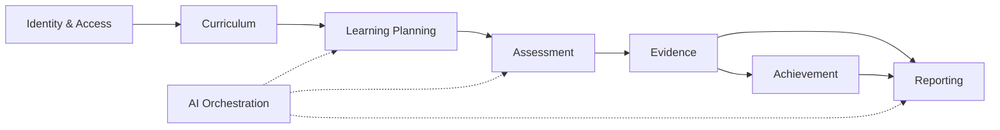

# NUSA Platform — Architecture Freeze v2 + API Contract Freeze + AI Coding Guardrails

**Version**: 2.0  
**Date**: June 2026  
**Status**: LOCKED — FINAL SOURCE OF TRUTH FOR AI IMPLEMENTATION  
**Supersedes**: `docs/foundation/16_ARCHITECTURE_FREEZE.md` (v1 declaration only; v2 is the executable specification)  
**Alignment**: MVP Wave 1 Modular Monolith — DDD Lite — Layered Architecture

---

## Document Authority

This document is the **single executable source of truth** for:

- Backend AI agents (Go services, repositories, handlers)
- Frontend AI agents (React + TypeScript screens)
- QA AI agents (test case generation)
- DevOps AI agents (deployment, observability)

**Forbidden architectural patterns (MVP Wave 1):** CQRS, Event Sourcing, Event Store, Read Models, Projection Infrastructure, Command Bus, Query Bus, Generic Repository Pattern, Microservice Decomposition, Saga Framework, Workflow Engine Expansion, Analytics Domain, Competency Intelligence Domain, Digital Twin, Lifelong Learning Record.

**Required architecture style:** Modular Monolith, DDD Lite, Layered Architecture:

```text
Handler → Service → Repository → PostgreSQL
```

---

# PART 1 — Architecture Freeze v2

## 1.1 Bounded Context Map

MVP Wave 1 defines **six operational domains** (plus AI Orchestration as cross-cutting infrastructure, not a business domain).

### Domain: Identity & Access

| Aspect | Definition |
|--------|------------|
| **Responsibility** | Authentication, authorization, user/school/role management, tenant isolation |
| **Aggregate Roots** | `User`, `School`, `Role` |
| **Entities** | `User`, `School`, `Role`, `Permission`, `RefreshToken` |
| **Value Objects** | `Email`, `PermissionString` (`resource:ACTION`), `AuthContext` |
| **Domain Services** | `PermissionResolver`, `SchoolBoundaryValidator` |
| **Ownership Boundaries** | Platform owns roles/permissions schema; schools own their users; SYSTEM_ADMIN owns cross-tenant admin |

### Domain: Learning Planning

| Aspect | Definition |
|--------|------------|
| **Responsibility** | TP Set, ATP Set, Modul Ajar Set generation, review, approval; curriculum-to-classroom planning pipeline |
| **Aggregate Roots** | `TPSet`, `ATPSet`, `ModulAjarSet` |
| **Entities** | `TP`, `ATP`, `ModulAjar` (child entities within sets) |
| **Value Objects** | `WorkflowStatus`, `GenerationSource`, `KKTPCriteria` (embedded in TP) |
| **Domain Services** | `WorkflowTransitionService`, `SetVersioningService` |
| **Ownership Boundaries** | Teacher owns artifacts they generate; school scope via `user.school_id`; SYSTEM_ADMIN read-only cross-school |

### Domain: Assessment

| Aspect | Definition |
|--------|------------|
| **Responsibility** | Assessment design linked to TP (with snapshots), rubric management, workflow |
| **Aggregate Roots** | `Assessment`, `Rubric` |
| **Entities** | `Assessment`, `Rubric` |
| **Value Objects** | `AssessmentType`, `RubricType`, `WorkflowStatus`, `TPSnapshot` |
| **Domain Services** | `AssessmentSnapshotService` (captures TP version + success criteria at creation) |
| **Ownership Boundaries** | Teacher owns assessments they create; school isolation via creator's school |

**Critical invariant (Sprint 3A):** Assessment references `tp_id` + `tp_version_no` + `success_criteria_snapshot`, NOT `modul_ajar_id`.

### Domain: Evidence

| Aspect | Definition |
|--------|------------|
| **Responsibility** | Student learning evidence collection, rubric linking, evaluation lifecycle |
| **Aggregate Roots** | `Evidence` |
| **Entities** | `Evidence`, `Evaluation` (child), `EvaluationFeedbackHistory` |
| **Value Objects** | `EvidenceType`, `EvidenceStatus`, `PerformanceLevel`, `PerformanceScores` |
| **Domain Services** | `EvaluationRevisionService` |
| **Ownership Boundaries** | Teacher who collected evidence; student data scoped to school |

### Domain: Achievement

| Aspect | Definition |
|--------|------------|
| **Responsibility** | **Runtime computed** competency progress and achievement summaries from evaluations |
| **Aggregate Roots** | None (not persisted — domain service only) |
| **Entities** | N/A |
| **Value Objects** | `AchievementSummary`, `CompetencyProgress`, `ClassAchievement` |
| **Domain Services** | `AchievementService` (read-only computation) |
| **Ownership Boundaries** | Derived from evidence/evaluations within school boundary |

### Domain: Reporting

| Aspect | Definition |
|--------|------------|
| **Responsibility** | Narrative report generation, approval, achievement integration |
| **Aggregate Roots** | `NarrativeReport` |
| **Entities** | `NarrativeReport` |
| **Value Objects** | `ReportLanguage`, `ReportPeriod`, `WorkflowStatus` |
| **Domain Services** | `ReportAchievementIntegrator` |
| **Ownership Boundaries** | Teacher owns reports they create; school-scoped student/class references |

### Domain: Curriculum (Reference Data)

| Aspect | Definition |
|--------|------------|
| **Responsibility** | National curriculum hierarchy (Subject → Phase → Element → Subelement → CP), CP import |
| **Aggregate Roots** | `CP` (reference aggregate); hierarchy entities are reference data |
| **Entities** | `CurriculumSubject`, `CurriculumPhase`, `CurriculumElement`, `CurriculumSubelement`, `CP` |
| **Value Objects** | `CurriculumCode`, `TimeAllocation` |
| **Domain Services** | `CPImportService` |
| **Ownership Boundaries** | SYSTEM_ADMIN manages curriculum; all schools read ACTIVE version |

### Bounded Context Interaction Map



---

## 1.2 Aggregate Design

### TPSet

| Field | Definition |
|-------|------------|
| **Aggregate Root** | `TPSet` |
| **Entities** | `TP` (items within set) |
| **Invariants** | One active DRAFT/UNDER_REVIEW set per CP+version_no; unique `(cp_id, version_no)`; set must contain ≥1 TP before approval |
| **Business Rules** | Status transitions: DRAFT → UNDER_REVIEW → APPROVED \| REJECTED → ARCHIVED; only SCHOOL_ADMIN/SYSTEM_ADMIN approves; AI generation sets `generation_source=AI_GENERATED` |
| **Consistency Boundary** | TP items created/deleted only within same transaction as set operations |

### TP (Item within TPSet)

| Field | Definition |
|-------|------------|
| **Aggregate Root** | No — child of TPSet |
| **Entities** | Self |
| **Invariants** | `sequence_number` unique per `tp_set_id`; `success_criteria` (KKTPCriteria) required when set submitted for review; version fields: `version_no`, `is_current_version`, `parent_version_id` |
| **Business Rules** | Approved TP is immutable; revision creates new row with incremented `version_no`, prior row `is_current_version=false` |
| **Consistency Boundary** | Modified only through TPSet service |

### ATPSet

| Field | Definition |
|-------|------------|
| **Aggregate Root** | `ATPSet` |
| **Entities** | `ATP` |
| **Invariants** | Unique `(tp_set_id, version_no)`; ATPSet requires APPROVED TPSet reference |
| **Business Rules** | Cannot generate ATP from non-APPROVED TPSet; status workflow identical to TPSet |
| **Consistency Boundary** | ATP items belong to single ATPSet |

### ModulAjarSet

| Field | Definition |
|-------|------------|
| **Aggregate Root** | `ModulAjarSet` |
| **Entities** | `ModulAjar` |
| **Invariants** | Unique `(atp_set_id, version_no)`; requires APPROVED ATPSet |
| **Business Rules** | `week` ≥ 1 per ModulAjar; links to ATP item |
| **Consistency Boundary** | ModulAjar items belong to single ModulAjarSet |

### Assessment

| Field | Definition |
|-------|------------|
| **Aggregate Root** | `Assessment` |
| **Entities** | Self |
| **Invariants** | Must reference `tp_id` with `tp_version_no` snapshot; `success_criteria_snapshot` immutable after creation; `assessment_type` ∈ {FORMATIVE, SUMMATIVE} |
| **Business Rules** | Snapshot captured at creation from current TP; approved assessment immutable; revision via new version row |
| **Consistency Boundary** | Single assessment owns its rubrics (separate aggregate, linked by FK) |

### Rubric

| Field | Definition |
|-------|------------|
| **Aggregate Root** | `Rubric` |
| **Entities** | Self |
| **Invariants** | One current rubric per assessment (`is_current_version=true`); `rubric_type` ∈ {ANALYTIC, HOLISTIC} |
| **Business Rules** | Requires existing assessment; approval workflow |
| **Consistency Boundary** | Linked to single assessment |

### Evidence

| Field | Definition |
|-------|------------|
| **Aggregate Root** | `Evidence` |
| **Entities** | `Evaluation` (children) |
| **Invariants** | Must reference valid `assessment_id`; `evidence_type` ∈ {STUDENT_WORK, ASSESSMENT_RESULT, OBSERVATION}; status progression: COLLECTED → LINKED → EVALUATED |
| **Business Rules** | Evaluations created only for LINKED+ evidence; one current evaluation per evidence (`is_current_version=true`) |
| **Consistency Boundary** | Evaluations modified only through Evidence service |

### Evaluation

| Field | Definition |
|-------|------------|
| **Aggregate Root** | No — child of Evidence |
| **Entities** | Self, `EvaluationFeedbackHistory` |
| **Invariants** | `total_score` ≤ `max_score`; `performance_level` derived from scores; `revision_no` monotonic per evidence |
| **Business Rules** | Revision creates new evaluation row, marks prior `is_current_version=false`; feedback history appended on change |
| **Consistency Boundary** | Within Evidence aggregate transaction |

### NarrativeReport

| Field | Definition |
|-------|------------|
| **Aggregate Root** | `NarrativeReport` |
| **Entities** | Self |
| **Invariants** | Requires `student_id`, `class_id`, `report_period`, `language`; version tracking like other artifacts |
| **Business Rules** | Achievement data refreshed via `refresh-achievement` endpoint; approved reports immutable |
| **Consistency Boundary** | Single report per student+period+version combination |

---

## 1.3 Resource Ownership Matrix

| Entity | Owner | School Scope | Access Scope | Lifecycle Owner |
|--------|-------|--------------|--------------|-----------------|
| `schools` | SYSTEM_ADMIN | N/A (tenant root) | SYSTEM_ADMIN CRUD; SCHOOL_ADMIN read own | SYSTEM_ADMIN |
| `users` | School / Platform | `school_id` required for SCHOOL_ADMIN, TEACHER | SYSTEM_ADMIN all; SCHOOL_ADMIN own school; TEACHER self | SCHOOL_ADMIN / SYSTEM_ADMIN |
| `roles` | Platform | Global | SYSTEM_ADMIN manage | SYSTEM_ADMIN |
| `permissions` | Platform | Global | SYSTEM_ADMIN manage | SYSTEM_ADMIN |
| `refresh_tokens` | User | Per user | User + auth service | Auth service |
| `curriculum_*` | Platform | Global read | SYSTEM_ADMIN write; all roles read | SYSTEM_ADMIN |
| `cp` | Platform | Global read | SYSTEM_ADMIN import; all roles read | SYSTEM_ADMIN |
| `tp_sets`, `tp` | Teacher (creator) | Via `generated_by`/`user_id` → school | Creator RW; SCHOOL_ADMIN approve; SYSTEM_ADMIN read all | Teacher + approver |
| `atp_sets`, `atp` | Teacher | School via user | Same as TP | Teacher + approver |
| `modul_ajar_sets`, `modul_ajar` | Teacher | School via user | Same as TP | Teacher + approver |
| `assessments`, `rubrics` | Teacher | School via user | Creator RW; SCHOOL_ADMIN approve | Teacher + approver |
| `evidences`, `evaluations` | Teacher | School via user + student | Creator RW; linked to assessment school | Teacher |
| `narrative_reports` | Teacher | School via student/class | Creator RW; SCHOOL_ADMIN approve | Teacher + approver |
| `audit_logs` | Platform | Cross-tenant | SYSTEM_ADMIN read; write via system | Platform |
| `ai_generation_logs` | Platform | Per generation | Creator read own; SYSTEM_ADMIN all | AI Orchestration |

---

## 1.4 Unified Versioning Architecture

Applies to artifact entities with `version_no`, `is_current_version`, `parent_version_id` (or revision model for evaluations).

### Version Triggers

| Trigger | Applies To |
|---------|------------|
| Teacher edits approved artifact content | TP, Assessment, Rubric, NarrativeReport |
| Teacher requests regeneration (AI) | TPSet, ATPSet, ModulAjarSet (new set version) |
| Teacher revises evaluation feedback | Evaluation (revision_no increment) |
| SCHOOL_ADMIN rejects with reason | All workflow artifacts (new draft version or return to DRAFT) |

### Version Increment Rules

| Entity | Increment Strategy |
|--------|-------------------|
| **Set entities** (TPSet, ATPSet, ModulAjarSet) | New set row: `version_no = MAX(version_no) + 1` per parent key |
| **TP items** | New TP row: `version_no++`, `parent_version_id = old.id`, old `is_current_version=false` |
| **Assessment, Rubric, NarrativeReport** | Same row-replacement pattern as TP |
| **Evaluation** | `revision_no++` within same evidence; `is_current_version` flag swap |

### Historical Preservation Rules

- Prior versions are **never deleted** — `is_current_version=false` retains history
- Downstream snapshots (assessment `tp_version_no`, `success_criteria_snapshot`) preserve point-in-time truth
- Approved artifacts are **immutable** — edits create new version
- Narrative reports are historical records — never retroactively changed by curriculum updates

### Current Version Rules

- Queries default to `is_current_version = true` unless history explicitly requested
- Only one current version per logical artifact chain
- Set approval applies to entire set at current `version_no`

### Audit Requirements

| Event | Required Audit Fields |
|-------|----------------------|
| Version created | `created_at`, `created_by`/`user_id`, `parent_version_id` |
| Approval | `approved_by`, `approved_at`, `status` |
| Rejection | `audit_logs` entry with reason |
| Evaluation revision | `evaluation_feedback_history` row |

---

## 1.5 Evidence Storage Architecture

### Supported Formats

| Type | MVP Support | Storage |
|------|-------------|---------|
| Text / structured JSON | Yes | `evidences.evidence_data` JSONB |
| Images (JPEG, PNG, WebP) | Yes | MinIO object + JSONB metadata reference |
| PDF documents | Yes | MinIO object + JSONB metadata reference |
| Audio/Video | Deferred | Wave 2 |

### Validation Rules

- Max file size: **10 MB** per upload (MVP)
- Allowed MIME types: `image/jpeg`, `image/png`, `image/webp`, `application/pdf`
- Filename sanitized; no path traversal
- `evidence_data` schema:

```json
{
  "description": "string, required",
  "files": [
    {
      "object_key": "schools/{school_id}/evidence/{evidence_id}/{uuid}.{ext}",
      "original_filename": "string",
      "mime_type": "string",
      "size_bytes": 0,
      "uploaded_at": "ISO8601"
    }
  ],
  "metadata": {}
}
```

### Object Storage Strategy

- **Engine**: MinIO (S3-compatible)
- **Bucket**: `nusa-evidence` (per environment)
- **Key pattern**: `schools/{school_id}/evidence/{evidence_id}/{file_uuid}.{ext}`
- **Access**: Pre-signed URLs, 15-minute expiry, generated server-side only
- **No public buckets**

### Metadata Model

- File metadata in `evidence_data.files[]`
- Relational link: `evidences.assessment_id`, `evidences.student_id`, `evidences.user_id`
- Optional `rubric_id`, `linked_criteria` after linking phase

### Security Controls

- Upload requires authenticated teacher with `assessment:CREATE`
- School boundary validated on assessment → user → school chain
- Virus scan: deferred Wave 2; MVP validates MIME + extension
- Pre-signed URLs scoped to requesting user's school

### Lifecycle Rules

| Status | Meaning | Transitions |
|--------|---------|-------------|
| COLLECTED | Evidence recorded | → LINKED |
| LINKED | Rubric criteria linked | → EVALUATED |
| EVALUATED | Evaluation completed | Terminal |

- Object storage files deleted only when evidence record soft-deleted (Wave 2); MVP: no hard delete

---

## 1.6 Observability Architecture

### Structured Logging

- Format: JSON lines to stdout
- Required fields: `timestamp`, `level`, `request_id`, `user_id`, `school_id`, `module`, `action`, `duration_ms`, `error`
- Library: Go `slog` or structured wrapper in `internal/middleware`
- Log levels: DEBUG (dev), INFO (prod default), WARN, ERROR

### Metrics

| Metric | Type | Labels |
|--------|------|--------|
| `http_requests_total` | Counter | method, path, status |
| `http_request_duration_seconds` | Histogram | method, path |
| `db_query_duration_seconds` | Histogram | operation, table |
| `ai_generation_total` | Counter | agent, status |
| `ai_generation_duration_seconds` | Histogram | agent |
| `auth_login_total` | Counter | status |

### Tracing

- MVP: `X-Request-ID` propagation (implemented)
- Wave 2: OpenTelemetry distributed tracing
- All handlers attach `request_id` to context

### Health Checks

| Endpoint | Purpose | Checks |
|----------|---------|--------|
| `GET /health` | Liveness | Process alive |
| `GET /ready` | Readiness | PostgreSQL ping, RabbitMQ connection |
| `GET /version` | Build info | Version string, git commit (CI injected) |

### Operational Alerts

| Alert | Condition | Severity |
|-------|-----------|----------|
| API error rate | 5xx > 1% over 5min | High |
| DB connection failure | `/ready` fails 3x | Critical |
| AI queue backlog | RabbitMQ depth > 100 | Medium |
| Auth failure spike | 401 > 50/min per IP | Medium |
| Disk usage (MinIO) | > 80% | Medium |

---

## 1.7 Architecture Decision Records

### ADR-001: Authorization Model

**Context:** MVP requires role-based access with school isolation for multi-tenant Indonesian schools.

**Decision:** Custom JWT (HS256) with RBAC via `resource:ACTION` permission strings embedded in JWT claims. Three roles: `SYSTEM_ADMIN`, `SCHOOL_ADMIN`, `TEACHER`. Middleware: `AuthMiddleware` → `RequirePermission` / `RequireRole` → `RequireSchoolAccess`.

**Alternatives Considered:** Keycloak/OAuth2 (deferred — operational complexity); attribute-based access control (deferred).

**Consequences:** Simple deployment; permission matrix must be maintained in code + DB; no OIDC federation in MVP.

**Rationale:** ADR-006 alignment; 20-day MVP constraint; full control over education-specific permissions.

### ADR-002: Versioning Model

**Context:** Approved curriculum artifacts must remain historically accurate when teachers revise or curriculum changes.

**Decision:** Row-based versioning with `version_no`, `is_current_version`, `parent_version_id`. Set-level versioning for generation sessions (TPSet, ATPSet, ModulAjarSet). Point-in-time snapshots on Assessment (`tp_version_no`, `success_criteria_snapshot`).

**Alternatives Considered:** Event sourcing (forbidden); temporal tables only (insufficient for approval workflow).

**Consequences:** Storage growth; clear query patterns; no event replay infrastructure needed.

**Rationale:** MVP-friendly immutability without event store complexity.

### ADR-003: Evidence Storage

**Context:** Student evidence includes files (photos, PDFs) and structured metadata.

**Decision:** Hybrid — JSONB `evidence_data` in PostgreSQL + binary files in MinIO with pre-signed URL access.

**Alternatives Considered:** PostgreSQL BYTEA (poor scalability); external CDN (unnecessary for MVP).

**Consequences:** Two storage systems to manage; school-scoped object keys enforce isolation.

**Rationale:** Aligns with existing compose stack; separates query metadata from blob storage.

### ADR-004: Multi-Tenant Isolation

**Context:** Multiple schools share one platform instance.

**Decision:** Shared database, shared schema, row-level isolation via `users.school_id`. All education artifacts scoped through creator's school. SYSTEM_ADMIN has `school_id=NULL` with explicit bypass only for admin operations.

**Alternatives Considered:** Schema-per-tenant; database-per-tenant (deferred — ops overhead).

**Consequences:** Every query must include school boundary check; risk of leakage if checks omitted.

**Rationale:** PostgreSQL single-DB ADR-004 alignment; simplest MVP multi-tenancy.

### ADR-005: Reporting Integration

**Context:** Narrative reports should reflect student achievement from evaluations.

**Decision:** `AchievementService` computes runtime summaries; `narrative_reports.achievement_data` JSONB cached on report with `last_achievement_calculated_at`; explicit `refresh-achievement` endpoint.

**Alternatives Considered:** Persisted achievement aggregate (deferred — Competency Intelligence domain excluded); real-time join on every read (performance).

**Consequences:** Achievement may be stale until refresh; no Competency Graph.

**Rationale:** MVP reporting without future-domain infrastructure.

### ADR-006: Audit Logging

**Context:** Education compliance requires traceability of approvals and changes.

**Decision:** Centralized `audit_logs` table + per-entity `created_at`/`updated_at`/`approved_by`/`approved_at` + `evaluation_feedback_history` for evaluation revisions.

**Alternatives Considered:** Full event sourcing (forbidden); entity-only audit fields (insufficient for cross-entity actions).

**Consequences:** Application must explicitly write audit entries on state transitions.

**Rationale:** Pragmatic audit without event store.

---

# PART 2 — Database Freeze

## 2.1 Complete ERD — Table Inventory

### Authentication & Administration

#### `schools`
- **PK:** `id` UUID
- **Unique:** `code`
- **Indexes:** `idx_schools_code`, `idx_schools_is_active`
- **Columns:** `id`, `name`, `code`, `address`, `phone`, `email`, `is_active`, `created_at`, `updated_at`

#### `users`
- **PK:** `id`
- **FK:** `role_id → roles(id)`, `school_id → schools(id)`, `created_by → users(id)`, `updated_by → users(id)`
- **Unique:** `email`
- **Indexes:** `idx_users_email`, `idx_users_role_id`, `idx_users_school_id`, `idx_users_is_active`
- **Columns:** `id`, `email`, `password_hash`, `name`, `role_id`, `school_id`, `is_active`, `failed_login_attempts`, `locked_until`, `created_at`, `updated_at`, `created_by`, `updated_by`

#### `roles`
- **PK:** `id`
- **Unique:** `name`
- **Indexes:** `idx_roles_name`, `idx_roles_is_active`

#### `permissions`
- **PK:** `id`
- **FK:** `role_id → roles(id)`
- **Unique:** `(role_id, resource, action)`
- **Indexes:** `idx_permissions_role_id`, `idx_permissions_resource`

#### `refresh_tokens`
- **PK:** `id`
- **FK:** `user_id → users(id)` ON DELETE CASCADE
- **Unique:** `token`
- **Indexes:** `idx_refresh_tokens_user_id`, `idx_refresh_tokens_token`, `idx_refresh_tokens_expires_at`

#### `audit_logs`
- **PK:** `id`
- **FK:** `user_id → users(id)`
- **Indexes:** `idx_audit_logs_user_id`, `idx_audit_logs_entity_type`, `idx_audit_logs_entity_id`, `idx_audit_logs_created_at`

#### `ai_generation_logs`
- **PK:** `id`
- **FK:** `user_id → users(id)`
- **Indexes:** on `user_id`, `agent_type`, `status`, `created_at`

### Curriculum (Reference)

#### `curriculum_subjects`
- **PK:** `id`
- **Unique:** `code`
- **Indexes:** `idx_curriculum_subjects_code`, `idx_curriculum_subjects_is_active`

#### `curriculum_phases`
- **PK:** `id`
- **Unique:** `code`

#### `curriculum_elements`
- **PK:** `id`
- **FK:** `subject_id → curriculum_subjects(id)` CASCADE, `phase_id → curriculum_phases(id)` CASCADE
- **Unique:** `(subject_id, phase_id, code)`

#### `curriculum_subelements`
- **PK:** `id`
- **FK:** `element_id → curriculum_elements(id)` CASCADE
- **Unique:** `(element_id, code)`

#### `cp`
- **PK:** `id`
- **FK:** `subject_id`, `phase_id`, `element_id`, `subelement_id` (all CASCADE), `imported_by → users(id)`
- **Unique:** `(subject_id, phase_id, element_id, subelement_id, code)`
- **Indexes:** all FK columns, `code`, `version`, `is_active`

### Learning Planning

#### `tp_sets`
- **PK:** `id`
- **FK:** `cp_id → cp(id)` CASCADE, `generated_by → users(id)`, `approved_by → users(id)`, `ai_generation_id → ai_generation_logs(id)`
- **Unique:** `(cp_id, version_no)`

#### `tp`
- **PK:** `id`
- **FK:** `tp_set_id → tp_sets(id)` CASCADE, `cp_id`, `subject_id`, `phase_id`, `element_id`, `subelement_id` CASCADE, `user_id → users(id)`, `parent_version_id → tp(id)`
- **Indexes:** `tp_set_id`, `sequence_number`, hierarchy FKs, `success_criteria` GIN, `version_no`, `is_current_version`

#### `atp_sets`
- **PK:** `id`
- **FK:** `tp_set_id → tp_sets(id)` CASCADE
- **Unique:** `(tp_set_id, version_no)`

#### `atp`
- **PK:** `id`
- **FK:** `atp_set_id → atp_sets(id)` CASCADE, `tp_id → tp(id)` CASCADE, `user_id → users(id)`

#### `modul_ajar_sets`
- **PK:** `id`
- **FK:** `atp_set_id → atp_sets(id)` CASCADE
- **Unique:** `(atp_set_id, version_no)`

#### `modul_ajar`
- **PK:** `id`
- **FK:** `modul_ajar_set_id → modul_ajar_sets(id)` CASCADE, `atp_id → atp(id)` CASCADE

### Assessment

#### `assessments`
- **PK:** `id`
- **FK:** `tp_id → tp(id)` CASCADE, `user_id → users(id)`, `approved_by → users(id)`, `parent_version_id → assessments(id)`
- **Indexes:** `tp_id`, `(tp_id, tp_version_no)`, `success_criteria_snapshot` GIN
- **Note:** `modul_ajar_id` REMOVED in migration 000003

#### `rubrics`
- **PK:** `id`
- **FK:** `assessment_id → assessments(id)` CASCADE, `user_id → users(id)`, `parent_version_id → rubrics(id)`

#### `evidences`
- **PK:** `id`
- **FK:** `assessment_id → assessments(id)` CASCADE, `user_id → users(id)`, `rubric_id → rubrics(id)`

#### `evaluations`
- **PK:** `id`
- **FK:** `rubric_id → rubrics(id)` CASCADE, `evidence_id → evidences(id)` CASCADE, `user_id → users(id)`, `parent_revision_id → evaluations(id)`
- **Indexes:** `(evidence_id, revision_no)`, `(student_id, evidence_id, revision_no DESC)`

#### `evaluation_feedback_history`
- **PK:** `id`
- **FK:** `evaluation_id → evaluations(id)` CASCADE, `changed_by → users(id)`

### Reporting

#### `narrative_reports`
- **PK:** `id`
- **FK:** `user_id → users(id)`, `approved_by → users(id)`, `parent_version_id → narrative_reports(id)`
- **Columns (post-000005):** `achievement_summary_id`, `achievement_data`, `last_achievement_calculated_at`, `class_id`

### Wave 2 Tables (Schema Reserved, Not MVP Migration)

- `curriculum_versions` — per `23_CURRICULUM_VERSIONING_ARCHITECTURE.md`
- `workflow_history` — per foundation doc 14
- `school_curriculum_history`

---

## 2.2 Relationship Matrix

| Parent | Child | Cardinality |
|--------|-------|-------------|
| schools | users | One-to-Many |
| roles | users | One-to-Many |
| roles | permissions | One-to-Many |
| users | refresh_tokens | One-to-Many |
| curriculum_subjects | curriculum_elements | One-to-Many |
| curriculum_phases | curriculum_elements | One-to-Many |
| curriculum_elements | curriculum_subelements | One-to-Many |
| cp | tp_sets | One-to-Many |
| tp_sets | tp | One-to-Many |
| tp_sets | atp_sets | One-to-Many |
| tp | atp | One-to-Many |
| atp_sets | modul_ajar_sets | One-to-Many |
| atp | modul_ajar | One-to-Many |
| tp | assessments | One-to-Many |
| assessments | rubrics | One-to-Many |
| assessments | evidences | One-to-Many |
| rubrics | evidences | One-to-Many (optional) |
| evidences | evaluations | One-to-Many |
| evaluations | evaluation_feedback_history | One-to-Many |
| users | narrative_reports | One-to-Many |

---

## 2.3 Delete Strategy Matrix

| Relationship | Strategy | Rationale |
|--------------|----------|-----------|
| curriculum hierarchy → child | CASCADE | Reference tree integrity |
| cp → tp_sets | CASCADE | Sets belong to CP |
| tp_sets → tp | CASCADE | Items belong to set |
| tp → assessments | CASCADE | Assessments invalid without TP |
| assessments → evidences | CASCADE | Evidence belongs to assessment |
| evidences → evaluations | CASCADE | Evaluations belong to evidence |
| users → refresh_tokens | CASCADE | Session cleanup on user delete |
| rubrics → evaluations | CASCADE | Evaluations require rubric |
| schools → users | RESTRICT | Cannot delete school with users |
| users → tp_sets (generated_by) | RESTRICT | Preserve audit trail |
| approved artifacts | SOFT DELETE (status=ARCHIVED) | Historical preservation |
| audit_logs | RESTRICT | Never cascade delete audit |

---

## 2.4 Multi-Tenant Isolation Rules

### School Ownership
- Every TEACHER and SCHOOL_ADMIN has non-null `school_id`
- SYSTEM_ADMIN has null `school_id`
- All artifact queries filter: `user.school_id = :auth_school_id` OR `auth.role = SYSTEM_ADMIN`

### Tenant Boundaries
- No cross-school reads for TEACHER/SCHOOL_ADMIN
- Student IDs are school-scoped strings (external SIS integration deferred)
- MinIO keys include `school_id`

### Cross-Tenant Access
- **Forbidden** for TEACHER and SCHOOL_ADMIN
- SYSTEM_ADMIN: read-only audit access; write only for schools/users/curriculum

### System Admin Exceptions
- School CRUD
- User CRUD across schools
- Curriculum import
- Role/permission management
- Global read for support/audit

---

## 2.5 Migration Freeze

| # | Migration | Purpose | Affected Tables | Rollback | Risk |
|---|-----------|---------|-----------------|----------|------|
| 000001 | init_schema | Auth foundation, UUID v7, schools, users, roles | schools, users, roles, permissions, refresh_tokens, ai_generation_logs | down.sql | Low |
| 000002 | education_domain | Full curriculum + planning + assessment + reporting | All education tables, audit_logs | down.sql | Medium |
| 000003 | success_criteria_assessment | TP success_criteria; assessment→tp_id; evaluation revisions | tp, assessments, evaluations | down.sql | **High** — data migration |
| 000004 | evaluation_revision | is_current_version, parent_revision_id, feedback_history table | evaluations, evaluation_feedback_history | down.sql | Medium |
| 000005 | achievement_reports | Achievement columns on narrative_reports | narrative_reports | down.sql | Low |
| 000006 | tp_versioning | TP version fields | **tp** (fix: migration references `tps` — must target `tp`) | down.sql | Medium |
| 000007 | assessment_snapshot | Expanded TP snapshot on assessments | assessments | down.sql | Low |
| 000008 | curriculum_versions (planned) | curriculum_version_id on hierarchy | curriculum_*, cp, schools | TBD | Medium |
| 000009 | narrative_class_id (planned) | class_id on narrative_reports if missing | narrative_reports | TBD | Low |
| 000010 | workflow_history (planned) | Workflow transition audit | workflow_history | TBD | Low |

**Known fix required:** Migration `000006` references table `tps`; canonical table name is `tp`.

---

# PART 3 — API Contract Freeze

## 3.1 API Standards

### URL Convention
- Base: `/api/v1`
- Public auth: `/api/v1/public/auth/*`
- Protected: `/api/v1/*` with `Authorization: Bearer <access_token>`
- Resource naming: kebab-case plural (`tp-sets`, `narrative-reports`)
- IDs: UUID in path (`:id`)

### Status Code Standards

| Code | Usage |
|------|-------|
| 200 | Successful GET, PUT, PATCH |
| 201 | Successful POST creating resource |
| 204 | Successful DELETE or logout |
| 400 | Malformed request |
| 401 | Missing/invalid token |
| 403 | Valid token, insufficient permission or school boundary |
| 404 | Resource not found (or not visible in tenant) |
| 409 | Conflict (duplicate version, invalid state transition) |
| 422 | Validation failure |
| 429 | Rate limit exceeded |
| 500 | Internal server error |

### Error Standards

All errors use envelope:

```json
{
  "success": false,
  "error": {
    "code": "ERROR_CODE",
    "message": "Human-readable message",
    "details": {}
  },
  "timestamp": "2026-06-09T12:00:00Z"
}
```

### Pagination Standards

Query params: `page` (1-based, default 1), `limit` (default 20, max 100)

Response meta:

```json
{
  "success": true,
  "data": { "items": [], "pagination": { "page": 1, "limit": 20, "total": 150, "total_pages": 8 } },
  "timestamp": "..."
}
```

### Sorting Standards

`sort=field` (asc), `sort=-field` (desc). Allowed fields documented per endpoint.

### Filtering Standards

Query params match exposed fields: `status`, `cp_id`, `student_id`, `assessment_id`, etc.

### Idempotency Rules

- `POST` create: not idempotent — use client-generated UUID only when documented
- `POST .../approve`: idempotent — second call returns 409 if already approved
- `POST .../refresh-achievement`: idempotent — overwrites cached achievement_data
- AI generation `POST`: **not idempotent** — creates new generation job; use `Idempotency-Key` header (Wave 2)

---

## 3.2 Standard Error Contract

### Universal Error Model

```json
{
  "code": "ASSESSMENT_NOT_FOUND",
  "message": "Assessment not found",
  "details": { "assessment_id": "uuid" }
}
```

### Common Error Codes

| Code | HTTP | Description |
|------|------|-------------|
| `INVALID_CREDENTIALS` | 401 | Login failed |
| `INVALID_REFRESH_TOKEN` | 401 | Refresh token invalid/expired |
| `TOKEN_EXPIRED` | 401 | Access token expired |
| `UNAUTHORIZED` | 401 | No token |
| `FORBIDDEN` | 403 | Permission denied |
| `SCHOOL_BOUNDARY_VIOLATION` | 403 | Cross-tenant access |
| `VALIDATION_ERROR` | 422 | Request validation failed |
| `NOT_FOUND` | 404 | Generic not found |
| `USER_NOT_FOUND` | 404 | User not found |
| `SCHOOL_NOT_FOUND` | 404 | School not found |
| `CP_NOT_FOUND` | 404 | CP not found |
| `TP_SET_NOT_FOUND` | 404 | TP Set not found |
| `TP_NOT_FOUND` | 404 | TP not found |
| `ATP_SET_NOT_FOUND` | 404 | ATP Set not found |
| `ASSESSMENT_NOT_FOUND` | 404 | Assessment not found |
| `RUBRIC_NOT_FOUND` | 404 | Rubric not found |
| `EVIDENCE_NOT_FOUND` | 404 | Evidence not found |
| `EVALUATION_NOT_FOUND` | 404 | Evaluation not found |
| `REPORT_NOT_FOUND` | 404 | Narrative report not found |
| `INVALID_STATE_TRANSITION` | 409 | Workflow violation |
| `ALREADY_APPROVED` | 409 | Duplicate approval |
| `VERSION_CONFLICT` | 409 | Concurrent version edit |
| `RATE_LIMIT_EXCEEDED` | 429 | Too many requests |
| `AI_GENERATION_FAILED` | 500 | AI agent error |
| `INTERNAL_ERROR` | 500 | Unhandled error |

---

## 3.3 Endpoint Catalog

**Canonical auth paths** (implementation truth): `/api/v1/public/auth/login`, `/api/v1/public/auth/refresh`

### Identity & Access

#### POST `/api/v1/public/auth/login`
- **Permission:** None
- **Request:** `{ "email": "string", "password": "string" }`
- **Response 200:** `{ user, tokens: { access_token, refresh_token, token_type, expires_in } }`
- **Validation:** email required valid; password min 8
- **Business Rules:** lockout after 5 failures for 15min
- **Errors:** `INVALID_CREDENTIALS`, `ACCOUNT_LOCKED`

#### POST `/api/v1/public/auth/refresh`
- **Permission:** None
- **Request:** `{ "refresh_token": "string" }`
- **Response 200:** new token pair; old refresh token revoked
- **Errors:** `INVALID_REFRESH_TOKEN`

#### POST `/api/v1/auth/logout`
- **Permission:** Authenticated
- **Response 200:** success; all user refresh tokens deleted

#### GET `/api/v1/auth/me`
- **Permission:** Authenticated
- **Response 200:** current user with role, permissions, school

#### POST `/api/v1/users` — Permission: `user:CREATE`
- **Request:** `{ email, password, name, role_id, school_id? }`
- **Response 201:** user object (no password_hash)

#### GET `/api/v1/users` — Permission: `user:READ`
- **Query:** `page`, `limit`, `school_id`, `is_active`
- **Response 200:** paginated users

#### GET `/api/v1/users/:id` — Permission: `user:READ`
#### PUT `/api/v1/users/:id` — Permission: `user:UPDATE`
#### PATCH `/api/v1/users/:id/status` — Permission: `user:UPDATE`

#### POST/GET/PUT/PATCH `/api/v1/schools/*` — Permissions: `school:CREATE|READ|UPDATE`

#### GET `/api/v1/roles`, `/api/v1/roles/:id`, `/api/v1/roles/:id/permissions` — Permission: `user:READ`
#### POST/PUT/DELETE `/api/v1/roles/*` — SYSTEM_ADMIN + `user:CREATE|UPDATE|DELETE`

---

### Curriculum

#### GET `/api/v1/curriculum/subjects`
- **Permission:** Authenticated (future: `curriculum:READ`)
- **Query:** `is_active`, `page`, `limit`
- **Response 200:** subject list

#### POST `/api/v1/curriculum/subjects` — SYSTEM_ADMIN
#### GET `/api/v1/curriculum/subjects/:id`

#### GET `/api/v1/curriculum/phases` — **Target (not yet routed)**
#### GET `/api/v1/curriculum/elements` — **Target** — Query: `subject_id`, `phase_id`
#### GET `/api/v1/curriculum/subelements` — **Target** — Query: `element_id`

#### POST `/api/v1/curriculum/cp/import` — SYSTEM_ADMIN
- **Request:** CP import payload (JSON)
- **Response 201:** import summary

#### GET `/api/v1/curriculum/cp`
- **Query:** `subject_id`, `phase_id`, `element_id`, `subelement_id`, `page`, `limit`
- **Response 200:** CP list with hierarchy codes

#### GET `/api/v1/curriculum/cp/:id`
- **Response 200:** full CP with learning_objectives, competency_standards

---

### Learning Planning

#### POST `/api/v1/learning-planning/tp-sets`
- **Permission:** `tp:CREATE`
- **Request:** `{ cp_id, version_no, generation_source, generation_reason? }`
- **Response 201:** TPSet

#### GET `/api/v1/learning-planning/tp-sets`
- **Query:** `cp_id`, `status`, `page`, `limit`

#### GET `/api/v1/learning-planning/tp-sets/:id`
- **Response 200:** TPSet with nested TP items

#### POST `/api/v1/learning-planning/tp-sets/:id/approve`
- **Permission:** `tp:APPROVE`
- **Request:** `{ reason: "string min 5" }`
- **Business Rules:** all TPs must have success_criteria; status must be UNDER_REVIEW

#### POST `/api/v1/learning-planning/tp-sets/:id/reject` — **Target**
#### POST `/api/v1/learning-planning/tp-sets/:id/archive` — **Target**

#### POST `/api/v1/learning-planning/cp/:cp_id/tp-sets/generate` — **Target (AI)**
- **Permission:** `tp:CREATE`
- **Request:** `{ generation_reason? }`
- **Response 202:** `{ job_id, tp_set_id, status: "GENERATING" }`
- **Rate limit:** 10/hour/user

#### GET `/api/v1/learning-planning/tp/:id` — **Target**
#### PUT `/api/v1/learning-planning/tp/:id` — **Target** — creates new version if approved

#### POST `/api/v1/learning-planning/atp-sets` — Permission: `tp:CREATE`
#### GET `/api/v1/learning-planning/atp-sets`
#### GET `/api/v1/learning-planning/atp-sets/:id` — **Target**
#### POST `/api/v1/learning-planning/tp-sets/:tp_set_id/atp-sets/generate` — **Target (AI)**

#### POST `/api/v1/learning-planning/modul-ajar-sets`
#### GET `/api/v1/learning-planning/modul-ajar-sets`
#### POST `/api/v1/learning-planning/atp-sets/:atp_set_id/modul-ajar-sets/generate` — **Target (AI)**

---

### Assessment

#### POST `/api/v1/assessment`
- **Permission:** `assessment:CREATE`
- **Request:**
```json
{
  "tp_id": "uuid",
  "tp_version_no": 1,
  "success_criteria_snapshot": {},
  "tp_title_snapshot": "optional",
  "tp_learning_objectives_snapshot": {},
  "tp_time_allocation_snapshot": {},
  "assessment_type": "FORMATIVE|SUMMATIVE",
  "assessment_items": {},
  "answer_key": {},
  "scoring_guidelines": {}
}
```
- **Business Rules:** snapshot captured at creation; tp must exist

#### GET `/api/v1/assessment`, GET `/api/v1/assessment/:id`
#### PUT `/api/v1/assessment/:id` — **Target** — DRAFT only
#### POST `/api/v1/assessment/:id/approve` — **Target**

#### POST `/api/v1/assessment/tp/:tp_id/generate` — **Target (AI)**

#### POST `/api/v1/assessment/rubrics`
- **Request:** `{ assessment_id, rubric_type, performance_criteria, performance_levels, scoring_guidelines }`

#### GET `/api/v1/assessment/rubrics`
#### GET `/api/v1/assessment/rubrics/:id` — **Target**
#### POST `/api/v1/assessment/assessments/:id/rubrics/generate` — **Target (AI)**

---

### Evidence

#### POST `/api/v1/assessment/evidences`
- **Permission:** `assessment:CREATE`
- **Request:**
```json
{
  "student_id": "string",
  "assessment_id": "uuid",
  "evidence_type": "STUDENT_WORK|ASSESSMENT_RESULT|OBSERVATION",
  "evidence_data": { "description": "...", "files": [] },
  "teacher_notes": "optional",
  "rubric_id": "optional uuid",
  "linked_criteria": {}
}
```

#### GET `/api/v1/assessment/evidences` — Query: `student_id`, `assessment_id`, `status`
#### GET `/api/v1/assessment/evidences/:id` — **Target**
#### PUT `/api/v1/assessment/evidences/:id` — **Target** — link rubric/criteria

#### POST `/api/v1/assessment/evidences/:id/upload` — **Target**
- **Content-Type:** `multipart/form-data`
- **Response 201:** updated evidence_data with file reference

---

### Evaluation

#### POST `/api/v1/assessment/evaluations`
- **Request:** `{ student_id, rubric_id, evidence_id, performance_scores, total_score, max_score, performance_level, teacher_feedback? }`
- **Business Rules:** evidence must be LINKED; creates revision_no=1

#### GET `/api/v1/assessment/evaluations`
#### GET `/api/v1/assessment/evaluations/history/:evidence_id`
#### GET `/api/v1/assessment/evaluations/:evaluation_id/feedback-history`
#### PUT `/api/v1/assessment/evaluations/:id` — **Target** — creates new revision

---

### Reporting

#### POST `/api/v1/reporting/narrative-reports`
- **Permission:** `reporting:READ` + create via teacher role
- **Request:** `{ student_id, class_id, report_period, language, content }`

#### GET `/api/v1/reporting/narrative-reports`, GET `.../:id`
#### PUT `/api/v1/reporting/narrative-reports/:id` — **Target**
#### POST `/api/v1/reporting/narrative-reports/:id/approve` — **Target**
#### POST `/api/v1/reporting/narrative-reports/generate` — **Target (AI)**
#### POST `/api/v1/reporting/narrative-reports/:id/refresh-achievement`
- **Response 200:** report with updated `achievement_data`

---

### Achievement (Computed)

#### GET `/api/v1/students/:id/achievement`
#### GET `/api/v1/students/:id/progress`
#### GET `/api/v1/classes/:id/achievement`
#### GET `/api/v1/reports/:id/achievement-summary`

---

### Health (Public)

#### GET `/health`, GET `/ready`, GET `/version`

---

**Implementation status legend:**
- No marker = routed in `backend/internal/router/router.go`
- **Target** = contract-defined, not yet implemented (~35% remaining per Sprint 4 roadmap)

---

## 3.4 OpenAPI Generation Rules

1. **Source of truth:** This document + `backend/docs/api/openapi.yaml`
2. **Every endpoint must have:** `operationId`, `summary`, `tags`, `security`, request body schema, response schemas for 200/201/4xx
3. **Required examples:** minimum 1 request example, 1 success response, 1 error response per endpoint
4. **Naming:** `operationId` = `{verb}{Resource}` e.g. `createTPSet`, `approveTPSet`
5. **Enums:** mirror domain constants (`WorkflowStatus`, `AssessmentType`, etc.)
6. **Regeneration:** `make openapi` from handler annotations (target) or manual sync on each API change
7. **CI gate:** OpenAPI diff must pass contract validation tests in `docs/qa/API_CONTRACT_VALIDATION_REPORT.md`

---

# PART 4 — Security Freeze

## 4.1 Authentication Model

### JWT Strategy
- Algorithm: HS256
- Access token TTL: **24 hours** (configurable via `JWT_ACCESS_EXPIRY`)
- Claims: `user_id`, `email`, `role`, `school_id`, `permissions[]`, `exp`, `iat`, `jti`

### Refresh Token Strategy
- TTL: **7 days**
- Stored in `refresh_tokens` table
- **Rotation:** each refresh revokes old token, issues new pair
- Logout deletes all refresh tokens for user

### Session Rules
- Stateless access tokens — no server-side session store
- Account lockout: 5 failed attempts → 15-minute `locked_until`
- Password: bcrypt cost factor 12
- HTTPS required in production

---

## 4.2 Authorization Model

### RBAC
- Roles: `SYSTEM_ADMIN`, `SCHOOL_ADMIN`, `TEACHER`
- Permissions: `{resource}:{ACTION}` — resources: `school`, `user`, `curriculum`, `tp`, `assessment`, `reporting`
- Actions: `CREATE`, `READ`, `UPDATE`, `DELETE`, `APPROVE`

### Resource Authorization
- Education routes MUST add permission middleware (gap: currently auth-only — **implementation required**)
- Pattern: `middleware.RequirePermission("tp:CREATE")`

### Ownership Validation
- Teachers may only modify artifacts where `user_id = auth.user_id` unless SCHOOL_ADMIN
- SCHOOL_ADMIN may approve within own school

### School Boundary Validation
- Service layer calls `SchoolBoundaryValidator` before return
- 404 (not 403) for cross-tenant resource access to prevent enumeration

---

## 4.3 Security Controls

| Control | Implementation |
|---------|----------------|
| Input Validation | Gin binding tags on DTOs; service-layer business validation |
| Output Sanitization | Never expose `password_hash`; strip internal fields |
| Mass Assignment Prevention | Explicit DTO mapping; no direct entity bind from request |
| File Upload Security | MIME whitelist, size limit, sanitized keys, pre-signed URLs |
| Rate Limiting | Login: 10/min/IP; AI: 10/hour/user (target middleware) |
| Audit Logging | `audit_logs` on auth events, approvals, admin actions |
| Secrets Management | Env vars only; never commit secrets; `.env` in `.gitignore` |

---

## 4.4 Threat Model

### High Risk

| Threat | Mitigation |
|--------|------------|
| Cross-tenant data leakage | School boundary checks in every service method |
| JWT theft | Short-ish TTL, refresh rotation, HTTPS, HttpOnly cookie option (frontend) |
| Privilege escalation | Permission middleware on all routes; role immutable by self-service |

### Medium Risk

| Threat | Mitigation |
|--------|------------|
| SQL injection | Parameterized queries only (sqlx) |
| File upload malware | MIME validation; virus scan Wave 2 |
| Brute force login | Account lockout + rate limiting |
| AI prompt injection | Input sanitization in AI orchestration layer |

### Low Risk

| Threat | Mitigation |
|--------|------------|
| CSRF | JWT in Authorization header (not cookie) for API |
| XSS | Frontend output encoding; CSP headers |
| Information disclosure in errors | Generic 500 messages in production |

---

# PART 5 — AI Coding Guardrails

## 5.1 Forbidden Patterns

| Pattern | Reason |
|---------|--------|
| CQRS | Out of MVP scope — adds unnecessary complexity |
| Event Sourcing / Event Store | Explicitly excluded |
| Generic Repository (`Repository<T>`) | Use explicit per-aggregate repositories |
| Reflection-based mapping | Use explicit mapper functions |
| Business logic in handlers | Handlers are transport only |
| Repository calling repository | Repositories are leaf nodes |
| Shared mutable global state | Use dependency injection |
| Service-to-service circular dependency | Refactor via domain service or unidirectional deps |
| Premature optimization | Profile first |
| Premature caching | No caching layer until metrics justify |
| Microservices | Modular monolith only |
| Command/Query buses | Direct service calls |
| Analytics / Competency Graph / Digital Twin code | Future domains forbidden |

---

## 5.2 Required Patterns

| Pattern | Requirement |
|---------|-------------|
| DTO Layer | All API input/output via `dto.go` or `domain/*Request`/`*Response` |
| Mapper Layer | Explicit `toEntity()`, `toResponse()` functions |
| Service Layer | All business logic and transactions |
| Repository Layer | All SQL |
| Transaction Boundaries | Service layer owns `BeginTx`/`Commit`/`Rollback` |
| OpenAPI First | Define/update contract before implementation |
| Explicit Validation | DTO binding + service business rules |
| Explicit Authorization | Service validates permissions + school boundary |

---

## 5.3 Backend Coding Rules (Go)

### Project Structure

```text
backend/
├── cmd/main.go
├── internal/
│   ├── domain/          # Shared domain types
│   ├── service/         # Cross-module services
│   ├── repository/      # Shared repos (if any)
│   ├── middleware/
│   ├── router/
│   └── database/
├── modules/{name}/
│   ├── handler.go
│   ├── service.go
│   ├── repository.go
│   ├── dto.go
│   └── entity.go
└── migrations/
```

### Naming Conventions
- Files: `snake_case.go`
- Types: `PascalCase`
- DB columns: `snake_case`
- API paths: `kebab-case`
- Errors: `ErrXxx` sentinel or `pkg/errors` wrapped

### Error Handling
- Return `(result, error)` from service/repository
- Map domain errors to HTTP status in handler
- Never expose stack traces to client

### Transaction Conventions
- One transaction per service command
- Pass `*sql.Tx` to repository methods when in transaction
- Rollback on any error; commit only at end

### Logging Conventions
- `slog.InfoContext(ctx, "message", "key", value)`
- Always include `request_id` from context

### Testing Conventions
- Unit: `*_test.go` alongside source; mock repositories
- Integration: `backend/tests/integration/` with test database
- Table-driven tests preferred

---

## 5.4 Frontend Coding Rules (React + TypeScript)

### Folder Structure

```text
frontend/src/
├── api/              # Axios clients per domain
├── features/{domain}/components/
├── pages/
├── services/queries/  # TanStack Query hooks
├── services/commands/ # Mutation hooks
├── components/       # Shared UI
├── shared/types/
└── hooks/
```

### State Management
- Server state: **TanStack Query** (required)
- Auth state: React Context (`AuthContext`)
- Local UI state: `useState`/`useReducer`
- No Redux in MVP

### TanStack Query Rules
- Query keys: `['domain', 'resource', id, filters]`
- Stale time: 30s default for lists, 5min for reference data
- Mutations invalidate related query keys
- Error handling via global `QueryClient` `onError`

### Form Validation Rules
- React Hook Form + Zod schemas
- Mirror backend validation rules
- Display server `error.code` mapped to i18n messages

### Component Rules
- Feature components in `features/`; pages compose features
- No direct `axios` in components — use query/command services
- `ProtectedRoute` wraps authenticated routes

### API Integration Rules
- Base URL from `config.ts`
- Attach `Authorization` header via Axios interceptor
- Token refresh on 401 with queue pattern
- Use canonical paths: `/api/v1/public/auth/login`

---

## 5.5 AI Implementation Workflow

**Mandatory sequence for every feature:**

```text
1. Read Architecture Freeze v2 (this document)
2. Read API Contract section for the endpoint
3. Generate DTO (request/response structs + validation tags)
4. Generate Repository (SQL + explicit mapping)
5. Generate Service (business rules + transaction + authorization)
6. Generate Handler (bind, call service, format response)
7. Generate Tests (unit + integration for happy path + auth denial)
8. Run Validation (go test, lint, OpenAPI diff, contract test)
```

**Stop conditions:**
- If aggregate boundaries unclear → re-read Part 1.2
- If permission unclear → re-read Part 4.2 + `domain/role.go`
- If schema unclear → re-read Part 2.1
- If endpoint ambiguous → do not implement; flag for architecture amendment

---

# PART 6 — Test Strategy Freeze

## Unit Test Requirements

| Layer | Coverage Target | Required Scenarios |
|-------|-----------------|-------------------|
| Domain validators | 90% | KKTPCriteria validation, workflow transitions, permission checks |
| Service | 80% | Business rules, snapshot capture, version increment, school boundary |
| Handler | 70% | Request binding, error mapping, auth middleware |
| Repository | 60% | CRUD, FK constraints (integration preferred) |

## Integration Test Requirements

### Database
- Migration up/down on clean database
- FK integrity on cascade paths
- Unique constraint violations return proper errors

### API
- Full pipeline: login → create TPSet → approve → create assessment → evidence → evaluation → report
- Pagination, filtering, sorting
- Error envelope format

### Authorization
- TEACHER cannot access other school's data
- SCHOOL_ADMIN can approve within school only
- SYSTEM_ADMIN bypass verified
- Missing permission returns 403

## Security Test Requirements

| Area | Tests |
|------|-------|
| Authentication | Invalid credentials, expired token, refresh rotation, logout invalidates refresh |
| Authorization | Each endpoint with wrong role → 403 |
| File Upload | Oversized file, invalid MIME, path traversal filename |
| Tenant Isolation | Cross-school ID access → 404 |
| SQL Injection | Parameterized query validation (existing `sql_injection_test.go`) |

## E2E Test Requirements

### Critical User Journeys (Playwright — target)

1. **Teacher login** → dashboard
2. **Curriculum browse** → select CP → generate TP Set → review → submit
3. **SCHOOL_ADMIN approve** TP Set
4. **Teacher create assessment** from approved TP with snapshot
5. **Teacher upload evidence** → link rubric → evaluate
6. **Generate narrative report** → refresh achievement → approve
7. **SCHOOL_ADMIN manage users** — create teacher, deactivate

---

# PART 7 — Implementation Readiness Checklist

A feature is **NOT allowed** to enter implementation unless all five pillars are defined for that feature.

## Per-Feature Checklist

| Gate | Criterion | Source Section |
|------|-----------|----------------|
| Architecture Defined | Aggregate, invariants, ownership documented | Part 1 |
| Database Defined | Tables, FKs, indexes, delete strategy | Part 2 |
| API Defined | Endpoint, permission, request/response, errors | Part 3 |
| Security Defined | Auth, permission, threat mitigations | Part 4 |
| Test Strategy Defined | Unit + integration scenarios listed | Part 6 |

## GO / NO-GO Criteria

### GO — Implementation Authorized When:

- [ ] This document v2 is approved and locked
- [ ] Feature appears in endpoint catalog (Part 3.3) with **Permission** and **Business Rules**
- [ ] Database tables exist in migration freeze (Part 2.5) or migration PR is ready
- [ ] No forbidden patterns required for the feature
- [ ] OpenAPI entry exists or is in same PR as implementation
- [ ] Integration test scenario identified

### NO-GO — Block Implementation When:

- [ ] Feature requires CQRS, event sourcing, microservices, or excluded domains
- [ ] API contract ambiguous (missing error codes, permission, or validation rules)
- [ ] Cross-tenant access rules undefined
- [ ] Aggregate boundaries conflict with existing migrations
- [ ] AI agent asked to "design as you go" without referencing this document

## Platform-Level GO Status (June 2026)

| Domain | Architecture | Database | API | Security | Tests | Status |
|--------|-------------|----------|-----|----------|-------|--------|
| Identity & Access | ✅ | ✅ | ✅ | ✅ | ✅ | **GO** |
| Curriculum (read/import) | ✅ | ✅ | ⚠️ partial routes | ✅ | ✅ | **GO** with gaps |
| Learning Planning | ✅ | ✅ | ⚠️ ~60% routes | ⚠️ permissions | ⚠️ | **CONDITIONAL GO** |
| Assessment | ✅ | ✅ | ⚠️ ~65% routes | ⚠️ permissions | ⚠️ | **CONDITIONAL GO** |
| Evidence | ✅ | ✅ | ⚠️ no file upload route | ⚠️ | ⚠️ | **CONDITIONAL GO** |
| Achievement | ✅ | N/A (computed) | ✅ | ✅ | ⚠️ | **GO** |
| Reporting | ✅ | ✅ | ⚠️ ~70% routes | ⚠️ | ⚠️ | **CONDITIONAL GO** |
| AI Generation endpoints | ✅ | ✅ | ❌ not routed | ⚠️ rate limit | ❌ | **NO-GO** until orchestration wired |

---

## Appendix A — Workflow Status Enum

```text
DRAFT → UNDER_REVIEW → APPROVED | REJECTED → ARCHIVED
```

## Appendix B — Permission Matrix (Canonical)

| Permission | SYSTEM_ADMIN | SCHOOL_ADMIN | TEACHER |
|------------|:---:|:---:|:---:|
| school:CREATE | ✅ | ❌ | ❌ |
| school:READ | ✅ | ✅ | ❌ |
| school:UPDATE | ✅ | ❌ | ❌ |
| user:CREATE | ✅ | ✅ | ❌ |
| user:READ | ✅ | ✅ | ❌ |
| user:UPDATE | ✅ | ✅ | ❌ |
| user:DELETE | ✅ | ✅ | ❌ |
| curriculum:READ | ✅ | ✅ | ❌ |
| curriculum:UPDATE | ✅ | ❌ | ❌ |
| curriculum:APPROVE | ✅ | ❌ | ❌ |
| tp:CREATE | ✅ | ✅ | ✅ |
| tp:READ | ✅ | ✅ | ✅ |
| tp:UPDATE | ✅ | ✅ | ✅ |
| tp:APPROVE | ✅ | ✅ | ❌ |
| assessment:CREATE | ✅ | ✅ | ✅ |
| assessment:READ | ✅ | ✅ | ✅ |
| assessment:UPDATE | ✅ | ✅ | ✅ |
| assessment:DELETE | ✅ | ❌ | ❌ |
| reporting:READ | ✅ | ✅ | ✅ |

## Appendix C — Document References

| Document | Path |
|----------|------|
| Foundation API Contract | `docs/foundation/13_API_CONTRACT.md` |
| Database Schema | `docs/foundation/14_DATABASE_SCHEMA.md` |
| Authentication Design | `docs/foundation/28_AUTHENTICATION_DESIGN.md` |
| Curriculum Versioning | `docs/foundation/23_CURRICULUM_VERSIONING_ARCHITECTURE.md` |
| Code Standards | `backend/docs/CODE_STANDARDS.md` |
| OpenAPI (partial) | `backend/docs/api/openapi.yaml` |
| Router (implementation) | `backend/internal/router/router.go` |

---

**Document Status:** LOCKED FOR AI IMPLEMENTATION  
**Architecture Freeze v2:** ACTIVE  
**Next Action:** Implement **Target** endpoints and permission middleware per Part 3.3 and Part 7 GO/NO-GO table.
