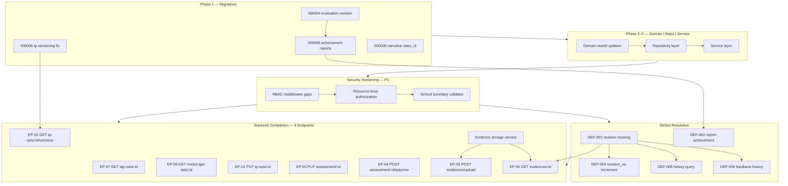

# Sprint 3.5 — Execution Sequence

**Version**: 1.0  
**Date**: June 2026  
**Status**: LOCKED — AI AGENT IMPLEMENTATION ORDER  
**Parent Documents**:
- [`NUSA_ARCHITECTURE_FREEZE_V2.md`](NUSA_ARCHITECTURE_FREEZE_V2.md)
- [`NUSA_DATABASE_SCHEMA_FREEZE_V1.md`](NUSA_DATABASE_SCHEMA_FREEZE_V1.md)
- [`NUSA_TESTING_QUALITY_GATE_FREEZE_V1.md`](NUSA_TESTING_QUALITY_GATE_FREEZE_V1.md)
- [`SPRINT_3.5_EXECUTION_PACKAGE.md`](SPRINT_3.5_EXECUTION_PACKAGE.md)

**Purpose**: Define the **safest dependency-driven implementation order** for AI agents. No duration, story point, or velocity estimates.

---

# Execution Principles

| # | Principle | Rule for AI Agents |
|---|-----------|-------------------|
| E1 | **Frozen architecture** | Do not redesign. Implement only what Architecture Freeze v2 and Schema Freeze v1 define. |
| E2 | **Dependencies before dependents** | Never implement a handler before its service, repository, domain, and migrations exist. |
| E3 | **Migrations first** | No service code that assumes columns/tables not yet migrated. |
| E4 | **Defects before dependent endpoints** | Evaluation revision (DEF-001) must complete before evidence detail (EP-06) is considered done. |
| E5 | **Security is not optional** | Resource-level authorization and school isolation are P0 — not deferred after "feature complete." |
| E6 | **One vertical slice at a time per agent** | An agent owns one work package through Phase 9 for that package before starting another. |
| E7 | **No placeholder tests** | Phase 8–9 are blocking; `assert.True(t, true)` is forbidden. |
| E8 | **No forbidden scope** | CQRS, event sourcing, projections, new domains, schema outside `000001`–`000008` are rejected. |
| E9 | **Merge order is strict** | Lower sequence numbers merge before higher. Rebase, do not merge out of order. |
| E10 | **Gate before phase advance** | Do not start Phase N+1 until Phase N validation gate passes. |

---

# Dependency Graph

## Epic-Level Dependencies



## Cross-Epic Dependency Matrix

| Work Item | Depends On | Blocks |
|-----------|------------|--------|
| **Migration 000004** | 000001–000003 applied | DEF-001, DEF-004, DEF-008, DEF-009 |
| **Migration 000005** | 000004 applied | DEF-002 |
| **Migration 000006** (corrected `tp` table) | 000002 applied | EP-02 |
| **Migration 000008** | 000005 applied | DEF-002 response completeness (class_id) |
| **DEF-001** | 000004, domain, repo base | DEF-004, DEF-008, DEF-009, EP-06 |
| **DEF-002** | 000005, AchievementService | Narrative report E2E |
| **Resource authorization** | AuthMiddleware (exists) | All school-scoped endpoints (validation) |
| **School boundary validator** | User/school repos | All EP-* integration tests S4 |
| **Evidence storage service** | `evidence_data` schema (exists) | EP-05, EP-06 |
| **EP-04 approve** | EP-03 update patterns, workflow rules | Assessment E2E |
| **EP-02 versions** | 000006, TP version query repo | TP version E2E |

## Three-Stream Interaction

```text
                    ┌─────────────────────┐
                    │  Security Hardening │
                    │  (P0: RES + SCH)  │
                    └──────────┬──────────┘
                               │ enforces on
         ┌─────────────────────┼─────────────────────┐
         ▼                     ▼                     ▼
┌─────────────────┐  ┌─────────────────┐  ┌─────────────────┐
│ Defect Resolution│  │ Backend Completion│  │ Existing Routes │
│ DEF-001…009      │  │ EP-01…EP-08      │  │ Regression      │
└────────┬────────┘  └────────┬─────────┘  └─────────────────┘
         │                      │
         └──────────┬───────────┘
                    ▼
           Integration + Security Tests
```

**Rule**: Backend Completion and Defect Resolution both **require** Security Hardening (resource + school scope) before merge. Neither stream merges without `SEC_RES_*` and `SEC_ISO_*` tests passing.

---

# Mandatory Implementation Order

Agents execute **phases sequentially**. Within a phase, follow the numbered sub-order.

---

## Phase 1 — Database Migrations

**Objective**: Database matches Schema Freeze v1 before any Go code changes.

| Order | Migration | Action | Gate |
|-------|-----------|--------|------|
| 1.1 | Verify `000001`–`000003` | Confirm applied on dev/test DB | Tables exist |
| 1.2 | `000004` evaluation revision | Apply up; verify `evaluation_feedback_history`, revision columns | `MIG_004_REV` |
| 1.3 | `000005` achievement reports | Apply up; verify `achievement_*` columns | `MIG_FWD_ALL` |
| 1.4 | `000006` tp versioning | **Fix** `tps` → `tp`; apply up | `MIG_006_TP` |
| 1.5 | `000007` assessment snapshot | Apply if not applied | Snapshot columns exist |
| 1.6 | `000008` narrative `class_id` | Apply up | `MIG_008_CLASS` |
| 1.7 | Rollback drill | Down/up `000008`→`000004` on test DB | `MIG_ROLL_ALL` |

**Stop**: Do not proceed to Phase 2 if any migration fails or Schema Freeze v1 diff fails.

---

## Phase 2 — Domain Model Updates

| Order | Package | Changes |
|-------|---------|---------|
| 2.1 | `internal/domain/assessment.go` | Confirm `Evaluation` revision fields; `EvaluationFeedbackHistory` entity |
| 2.2 | `internal/domain/reporting.go` | Confirm `achievement_*`, `class_id` on `NarrativeReport` |
| 2.3 | `internal/domain/tp.go` | Confirm `version_no`, `is_current_version`, `parent_version_id` on `TP` |
| 2.4 | `internal/domain/assessment.go` | Evidence `evidence_data` metadata types (documented JSON shape) |
| 2.5 | `internal/domain` (new) | `SchoolBoundaryValidator` interface; `ResourceAuthorizer` interface |
| 2.6 | Request/response DTOs | All Sprint 3.5 DTO structs (no handler logic) |

**Gate**: `go build ./internal/domain/...` succeeds; domain unit tests compile.

---

## Phase 3 — Repository Implementation

| Order | Repository | Methods |
|-------|------------|---------|
| 3.1 | `SchoolBoundaryRepository` helpers | `GetUserSchoolID`, scope JOIN fragments |
| 3.2 | `EvaluationRepository` | `CreateEvaluationRevision`, `GetCurrentEvaluation`, `GetEvaluationHistory`, `CreateFeedbackHistory`, `GetFeedbackHistory` |
| 3.3 | `ReportingRepository` | `UpdateAchievementData`, persist `class_id` |
| 3.4 | `TPRepository` | `UpdateTPSet`, `GetTPVersions`, `GetTPVersionHistory` |
| 3.5 | `AssessmentRepository` | `UpdateAssessment`, `UpdateAssessmentStatus` (approve) |
| 3.6 | `LearningPlanningRepository` | `GetATPSetByIDWithJoins`, `GetModulAjarSetByIDWithJoins` |
| 3.7 | `AssessmentRepository` | `GetEvidenceByIDWithJoins`, `UpdateEvidenceData` (upload metadata) |
| 3.8 | All artifact repos | Add school-scope `WHERE` via `users.school_id` join |

**Gate**: Repository integration tests against test DB pass for new methods.

---

## Phase 4 — Service Implementation

| Order | Service | Work |
|-------|---------|------|
| 4.1 | `AuthorizationService` / `SchoolBoundaryValidator` | Resource ownership + school scope checks |
| 4.2 | `EvaluationService` | **DEF-001**: revision-on-update (insert new row, flip `is_current_version`) |
| 4.3 | `EvaluationService` | **DEF-004**: `revision_no = MAX + 1` (part of 4.2 — same commit) |
| 4.4 | `EvaluationService` | **DEF-008**: `GetEvaluationHistory` |
| 4.5 | `EvaluationService` | **DEF-009**: `GetEvaluationFeedbackHistory` + append on feedback change |
| 4.6 | `ReportingService` | **DEF-002**: `RefreshReportAchievement` calls `AchievementService`, persists JSONB |
| 4.7 | `TPService` | `UpdateTPSet`, `GetTPVersionHistory` |
| 4.8 | `AssessmentService` | `UpdateAssessment` (snapshot immutability), `ApproveAssessment` |
| 4.9 | `AssessmentService` | `EvidenceStorageService` — metadata + pre-signed upload flow |
| 4.10 | `LearningPlanningService` | `GetATPSetDetail`, `GetModulAjarSetDetail` |

**Gate**: Service unit tests pass; DEF-001 revision test proves no in-place update.

---

## Phase 5 — API Handlers

| Order | Handler | Route |
|-------|---------|-------|
| 5.1 | Learning planning | `GET /api/v1/learning-planning/atp-sets/:id` (EP-07) |
| 5.2 | Learning planning | `GET /api/v1/learning-planning/modul-ajar-sets/:id` (EP-08) |
| 5.3 | Learning planning | `PUT /api/v1/learning-planning/tp-sets/:id` (EP-01) |
| 5.4 | Learning planning | `GET /api/v1/learning-planning/tp-sets/:id/versions` (EP-02) |
| 5.5 | Assessment | `PUT /api/v1/assessment/:id` (EP-03) |
| 5.6 | Assessment | `POST /api/v1/assessment/:id/approve` (EP-04) |
| 5.7 | Assessment | `POST /api/v1/assessment/evidences/upload` (EP-05) |
| 5.8 | Assessment | `GET /api/v1/assessment/evidences/:id` (EP-06) |
| 5.9 | Assessment | Fix/enhance existing `GET .../evaluations/history/:evidence_id` (DEF-008) |
| 5.10 | Assessment | Fix/enhance existing `GET .../evaluations/:id/feedback-history` (DEF-009) |
| 5.11 | Reporting | Verify/fix `POST .../narrative-reports/:id/refresh-achievement` (DEF-002) |
| 5.12 | Router | Register all new routes in `internal/router/router.go` |

**Gate**: Handlers return correct status codes on manual smoke test; compile + route registration complete.

---

## Phase 6 — Authorization Implementation

| Order | Item | Action |
|-------|------|--------|
| 6.1 | Education route middleware | Add `RequirePermission` to curriculum, learning-planning, assessment, reporting groups |
| 6.2 | Service-layer checks | Call `SchoolBoundaryValidator` on every school-scoped service method |
| 6.3 | Ownership rules | Teacher: own artifacts; SCHOOL_ADMIN: approve in school; SYSTEM_ADMIN: read audit |
| 6.4 | Cross-school response | Return **404** not 403 for cross-tenant ID access |
| 6.5 | Existing routes regression | Apply same pattern to **all** pre-existing education endpoints |

**Gate**: `SEC_RBAC_*`, `SEC_RES_*`, `SEC_ISO_*` tests pass.

---

## Phase 7 — Validation Layer

| Order | Item | Action |
|-------|------|--------|
| 7.1 | DTO binding tags | All request DTOs: `binding:"required"`, enums, min/max |
| 7.2 | Mapper layer | Explicit `toEntity` / `toResponse` — no direct entity bind from HTTP |
| 7.3 | Mass assignment | Strip `approved_by`, `is_current_version`, `school_id` from create/update DTOs |
| 7.4 | Error codes | Map validation failures to `VALIDATION_ERROR` (422) |
| 7.5 | Upload validation | MIME whitelist, 10MB max, filename sanitization (EP-05) |
| 7.6 | Workflow validation | Invalid state transitions → `INVALID_STATE_TRANSITION` (409) |

**Gate**: All `IT_EP##_S2_*` validation failure tests pass.

---

## Phase 8 — Unit Testing

| Order | Layer | Requirement |
|-------|-------|-------------|
| 8.1 | Domain | ≥ 90% on validators, permissions, workflow transitions |
| 8.2 | Service | ≥ 80% on all new/changed service methods |
| 8.3 | Middleware | ≥ 85% auth, permission, school access |
| 8.4 | Mappers/DTOs | Validation edge cases table-driven |
| 8.5 | Defect tests | `TestDEF001_*`, `TestDEF004_*`, `TestDEF002_*` |

**Gate**: G1 from Testing Quality Gate Freeze — `go test ./...` green, coverage thresholds met.

---

## Phase 9 — Integration Testing

| Order | Suite | Requirement |
|-------|-------|-------------|
| 9.1 | Migrations | `MIG_*` full forward/rollback on test DB |
| 9.2 | Defects | `IT_DEF001` through `IT_DEF009` |
| 9.3 | Endpoints | `IT_EP01_S1`–`IT_EP08_S5` (40 tests) |
| 9.4 | Security | `SEC_*` suite |
| 9.5 | Regression | `IT_REG_*` on pre-existing routes |
| 9.6 | Full flow | Replace placeholders in `full_flow_test.go` |

**Gate**: G2 + G3 from Testing Quality Gate Freeze.

---

## Phase 10 — OpenAPI Updates

| Order | Item | Action |
|-------|------|--------|
| 10.1 | `backend/docs/api/openapi.yaml` | Add EP-01 through EP-08 paths |
| 10.2 | Schemas | Request/response models match frozen DTOs |
| 10.3 | Examples | Min 1 request, 1 success, 1 error per endpoint |
| 10.4 | Lint | `npx @redocly/cli lint backend/docs/api/openapi.yaml` |

**Gate**: G5 contract gate passes.

---

## Phase 11 — Documentation Updates

| Order | Document | Action |
|-------|----------|--------|
| 11.1 | OpenAPI | Already Phase 10 — cross-reference only |
| 11.2 | `SPRINT_3.5_EXECUTION_PACKAGE.md` | Mark items complete (status only) |
| 11.3 | Migration notes | Document 000006 fix, 000008 in schema freeze if not done |
| 11.4 | Security audit log | RBAC on education routes — evidence for QA |
| 11.5 | API changelog | List 8 new endpoints + defect fixes |

**Gate**: Documentation reflects implemented state; no doc/code drift.

---

# Defect Resolution Order

## Dependency Chain

```text
Migration 000004
       │
       ▼
   DEF-001  ──────────────────────────────┐
       │                                  │
       ├──► DEF-004 (same service commit) │
       │                                  │
       ├──► DEF-008 (after 001 stable)    │
       │                                  │
       └──► DEF-009 (after 001 stable)    │
                                          │
Migration 000005                          │
       │                                  │
       ▼                                  │
   DEF-002 ◄─────────────────────────────┘
       (independent of DEF-001 chain)
```

## DEF-001 — Evaluation Revision Tracking (P0)

| Attribute | Value |
|-----------|-------|
| **Depends on** | Migration 000004, Phase 2–3 evaluation domain/repo |
| **Blocks** | DEF-004, DEF-008, DEF-009, EP-06 (evidence detail with evaluations) |
| **Implementation** | `UpdateEvaluation` inserts new row; sets prior `is_current_version = false` |
| **Must not** | UPDATE evaluation row in-place for content/feedback changes |
| **Verify with** | `IT_DEF001_EvaluationCreatesRevision` |

## DEF-004 — RevisionNo Increment (P1)

| Attribute | Value |
|-----------|-------|
| **Depends on** | DEF-001 (same code path) |
| **Blocks** | Nothing additional — merge **with** DEF-001 |
| **Implementation** | `revision_no = prior.revision_no + 1` on new row |
| **Must not** | Ship DEF-001 without DEF-004 — they are one atomic fix |
| **Verify with** | `IT_DEF004_RevisionNoIncrements` |

## DEF-008 — Evaluation History Query (P1)

| Attribute | Value |
|-----------|-------|
| **Depends on** | DEF-001 (history must exist to query) |
| **Blocks** | E2E-06 |
| **Implementation** | Fix `GetEvaluationHistory` service/repo; route exists — behavior must match contract |
| **Verify with** | `IT_DEF008_EvaluationHistoryQuery` |

## DEF-009 — Teacher Feedback History (P1)

| Attribute | Value |
|-----------|-------|
| **Depends on** | DEF-001 (feedback history rows created on change) |
| **Blocks** | E2E-06 |
| **Implementation** | Append `evaluation_feedback_history` on feedback change; fix GET handler |
| **Verify with** | `IT_DEF009_FeedbackHistoryPreserved` |

## DEF-002 — Report-Achievement Integration (P0)

| Attribute | Value |
|-----------|-------|
| **Depends on** | Migration 000005, `AchievementService` (exists), Phase 4 reporting service |
| **Blocks** | E2E-08, narrative report workspace completeness |
| **Independent of** | DEF-001 chain — **may run in parallel** after Phase 3 reporting repo |
| **Implementation** | `RefreshReportAchievement` populates `achievement_data`, `last_achievement_calculated_at` |
| **Verify with** | `IT_DEF002_ReportAchievementIntegration` |

## Defect Merge Order

```text
PR-DEF-001+004  →  PR-DEF-008  →  PR-DEF-009
        (parallel)     PR-DEF-002
```

---

# Endpoint Implementation Order

Exact sequence for AI agents implementing Backend Completion (Phases 3–5). **Do not reorder.**

| Seq | ID | Method | Path | Rationale |
|-----|-----|--------|------|-----------|
| 1 | EP-07 | GET | `/api/v1/learning-planning/atp-sets/:id` | Read-only; no new migrations; validates repo join pattern |
| 2 | EP-08 | GET | `/api/v1/learning-planning/modul-ajar-sets/:id` | Same pattern as EP-07; independent |
| 3 | EP-01 | PUT | `/api/v1/learning-planning/tp-sets/:id` | Write path; establishes workflow + auth pattern for learning planning |
| 4 | EP-02 | GET | `/api/v1/learning-planning/tp-sets/:id/versions` | Requires 000006; depends on TP repo version queries |
| 5 | EP-03 | PUT | `/api/v1/assessment/:id` | Assessment write; snapshot immutability rules |
| 6 | EP-04 | POST | `/api/v1/assessment/:id/approve` | Depends on EP-03 assessment service; approval workflow |
| 7 | EP-05 | POST | `/api/v1/assessment/evidences/upload` | Requires evidence storage service; no DEF-001 dependency |
| 8 | EP-06 | GET | `/api/v1/assessment/evidences/:id` | Joins evaluations — **requires DEF-001 complete** |

**Note**: EP-05 and EP-06 may start after Seq 4 if evidence storage service (Phase 4.9) is ready — but EP-06 merge is **blocked** until DEF-001 merges.

---

# Parallel Work Streams

## Safe Parallel Work

These streams may execute **concurrently by different agents** after shared prerequisites are met.

| Stream | Agent Focus | Prerequisite | Must Not Touch |
|--------|-------------|--------------|----------------|
| **Stream A — Migrations** | Phase 1 only | Clean DB | Application code |
| **Stream B — DEF-002** | Reporting + achievement | 000005 applied | Evaluation service |
| **Stream C — DEF-001+004** | Evaluation revision | 000004 applied | Reporting service |
| **Stream D — EP-07, EP-08** | Read-only detail endpoints | Phase 2 DTOs, Phase 3.6 repos | Assessment/evidence |
| **Stream E — EP-01, EP-03** | TP/assessment PUT | Phase 3.4–3.5 repos | Evaluation revision |
| **Stream F — EP-05** | Evidence upload | Phase 4.9 storage service | EP-06 |
| **Stream G — Security core** | Phase 4.1 + 6.1–6.2 | Phase 2 interfaces | Individual endpoint handlers |
| **Stream H — OpenAPI** | Phase 10 drafts | DTOs frozen in Phase 2 | Handler implementation |

**Safe parallel example** (after Phase 1 complete):

```text
Agent 1: DEF-001+004 (Stream C)
Agent 2: DEF-002 (Stream B)
Agent 3: EP-07 + EP-08 (Stream D)
Agent 4: SchoolBoundaryValidator (Stream G)
```

---

# Unsafe Parallel Work

**Do not run concurrently** — will cause merge conflicts, data corruption, or false "done" state.

| Conflict | Reason |
|----------|--------|
| DEF-001 + EP-06 | EP-06 tests fail until revision logic exists |
| EP-04 + EP-03 by different agents without merge | Approve depends on update service patterns |
| Migration 000004 + DEF-001 code before migration merges | Code assumes columns that do not exist |
| Two agents editing `assessment_service.go` | DEF-001, EP-03, EP-04, EP-05, EP-06 collide |
| Two agents editing `router.go` | Route registration conflicts |
| Authorization (Phase 6) skipped while merging endpoints | Security gate failure — rework |
| EP-02 before 000006 merge | Version columns missing |
| Unit tests (Phase 8) before service complete | Wasted effort; tests will churn |
| Any agent implementing CQRS/projections | Scope violation — reject |

| File | Single-Owner Rule |
|------|-------------------|
| `internal/router/router.go` | One agent at a time |
| `internal/service/assessment_service.go` | Sequential: DEF-001 → EP-03 → EP-04 → EP-05/06 |
| `modules/assessment/handler.go` | After corresponding service merges |
| `migrations/*.sql` | Phase 1 agent only |

---

# Merge Strategy

## Branch Naming

```text
s35/migration-000004-008
s35/security-resource-auth
s35/def-001-004-evaluation-revision
s35/def-002-report-achievement
s35/def-008-evaluation-history
s35/def-009-feedback-history
s35/ep-07-atp-detail
s35/ep-08-modul-ajar-detail
s35/ep-01-tp-update
s35/ep-02-tp-versions
s35/ep-03-assessment-update
s35/ep-04-assessment-approve
s35/ep-05-evidence-upload
s35/ep-06-evidence-detail
s35/phase6-auth-education-routes
s35/phase8-9-tests
s35/openapi-sprint-35
```

## Strict Merge Order

```text
1.  s35/migration-000004-008          → main
2.  s35/security-resource-auth       → main   (validator interfaces + service)
3.  s35/def-001-004-evaluation-revision → main
4.  s35/def-002-report-achievement   → main   (may parallel step 3, merge after 3 or 4 either order)
5.  s35/ep-07-atp-detail             → main
6.  s35/ep-08-modul-ajar-detail      → main
7.  s35/ep-01-tp-update              → main
8.  s35/ep-02-tp-versions            → main   (requires migration 000006 in step 1)
9.  s35/ep-03-assessment-update      → main
10. s35/ep-04-assessment-approve     → main
11. s35/ep-05-evidence-upload        → main
12. s35/def-008-evaluation-history   → main   (if not included in step 3)
13. s35/def-009-feedback-history     → main   (if not included in step 3)
14. s35/ep-06-evidence-detail        → main   (after step 3)
15. s35/phase6-auth-education-routes → main   (or fold into each EP PR — must be done before release)
16. s35/phase8-9-tests               → main
17. s35/openapi-sprint-35            → main
```

## Merge Rules

| Rule | Specification |
|------|---------------|
| **Rebase** | Each PR rebases on latest `main` before merge |
| **Squash** | One PR per work package; squash commits |
| **CI** | All gates green on PR |
| **No partial DEF-001** | Do not merge EP-06 until DEF-001 is on `main` |
| **Auth before release** | Step 15 must complete before sprint exit — may be distributed across EP PRs if each adds middleware |
| **Test PR last** | Step 16 may accompany each EP PR (preferred) or aggregate at end — never merge endpoints without tests |

---

# Validation Gates

Checkpoints **before** advancing to the next phase.

| After Phase | Gate ID | Pass Criteria | Blocker |
|-------------|---------|---------------|---------|
| 1 | VG-01 | All migrations up on test DB; rollback tested; schema matches Freeze v1 | Any migration failure |
| 2 | VG-02 | Domain compiles; no orphan DTOs | Build failure |
| 3 | VG-03 | New repo methods pass integration tests with test DB | SQL errors, missing indexes |
| 4 | VG-04 | Service unit tests pass; DEF-001 proves insert-not-update | In-place evaluation update |
| 5 | VG-05 | Routes registered; smoke HTTP 200/201 on happy path | 500 errors |
| 6 | VG-06 | `SEC_ISO_002` passes — cross-school returns 404 | Data leak |
| 7 | VG-07 | All `S2` validation tests pass | Missing validation |
| 8 | VG-08 | Coverage ≥ 80% changed packages | Coverage below threshold |
| 9 | VG-09 | All `IT_EP##_S1-S5` + `IT_DEF*` pass | Any integration failure |
| 10 | VG-10 | OpenAPI lint clean | Contract drift |
| 11 | VG-11 | Docs match implementation | Stale documentation |

**Phase advancement rule**: `VG-N` must pass before Phase `N+1` begins **for that work stream**. Global Phase 9 requires all streams through Phase 8.

---

# Sprint Exit Validation

Sprint 3.5 is **COMPLETE** only when **all** criteria below are satisfied. Binary pass/fail — no partial credit.

## Backend Completion

- [ ] **EP-01** through **EP-08** implemented and merged
- [ ] All 8 endpoints pass `IT_EP##_S1` through `IT_EP##_S5`
- [ ] Routes registered in `router.go` with correct HTTP methods

## Defect Resolution

- [ ] **DEF-001**: Evaluation revision creates new row — `IT_DEF001` passes
- [ ] **DEF-004**: `revision_no` increments — `IT_DEF004` passes
- [ ] **DEF-008**: History query returns ordered revisions — `IT_DEF008` passes
- [ ] **DEF-009**: Feedback history preserved — `IT_DEF009` passes
- [ ] **DEF-002**: Report achievement refresh populates `achievement_data` — `IT_DEF002` passes

## Security Hardening (P0)

- [ ] Resource instance-level authorization implemented in service layer
- [ ] School boundary enforcement on all education endpoints
- [ ] Education routes have `RequirePermission` middleware
- [ ] `SEC_RBAC_*`, `SEC_RES_*`, `SEC_ISO_*` suites pass
- [ ] No open **P0** security findings

## Migrations

- [ ] `000004`–`000008` applied on staging
- [ ] Forward + rollback validated (`MIG_*` suite)
- [ ] 000006 uses table `tp` not `tps`

## Testing

- [ ] Unit coverage ≥ 80% on all Sprint 3.5 changed packages
- [ ] No placeholder tests in merged code
- [ ] `go test ./...` and `go test ./tests/integration/...` green
- [ ] E2E-01 through E2E-08 pass in staging (per Testing Quality Gate Freeze)

## Contract & Docs

- [ ] OpenAPI includes all 8 endpoints with examples
- [ ] Redocly lint passes
- [ ] Phase 11 documentation updates merged

## Release Gate

- [ ] Zero open **P0** bugs in sprint scope
- [ ] Zero open **P1** bugs in sprint scope (DEF-004, 008, 009 are P1 — must be closed)
- [ ] No Release Gate **R1–R17** rejection conditions active (see Testing Quality Gate Freeze)
- [ ] Integration Readiness Matrix: 21/21 features **READY** (per Execution Package §7)

## Explicit Fail Conditions

Sprint 3.5 **fails** if any occur:

| # | Condition |
|---|-----------|
| X1 | Evaluation still updates in-place |
| X2 | Cross-school access returns 200 with data |
| X3 | Assessment `success_criteria_snapshot` mutated on update |
| X4 | EP-06 merged before DEF-001 |
| X5 | New migration outside 000001–000008 without Board approval |
| X6 | CQRS, event sourcing, or projection code merged |
| X7 | Any `IT_EP##_S*` test missing or failing |
| X8 | Education routes remain auth-only without permission middleware |

---

# AI Agent Quick Reference Card

```text
START → Phase 1 migrations (000004–000008)
     → Phase 2 domain DTOs
     → Phase 3 repositories (school scope first)
     → Phase 4 services (DEF-001 before EP-06)
     → Phase 5 handlers (EP-07 → EP-08 → EP-01 → EP-02 → EP-03 → EP-04 → EP-05 → EP-06)
     → Phase 6 authorization on ALL education routes
     → Phase 7 validation hardening
     → Phase 8 unit tests
     → Phase 9 integration tests
     → Phase 10 OpenAPI
     → Phase 11 docs
     → Sprint Exit Validation checklist
```

**When blocked**: Read dependency graph → identify unmerged prerequisite → switch to prerequisite work stream or wait for merge.

---

**Document Status**: LOCKED  
**Amendment**: Architecture Board approval required  
**Enforcement**: Merge order + Validation Gates + Sprint Exit Validation
