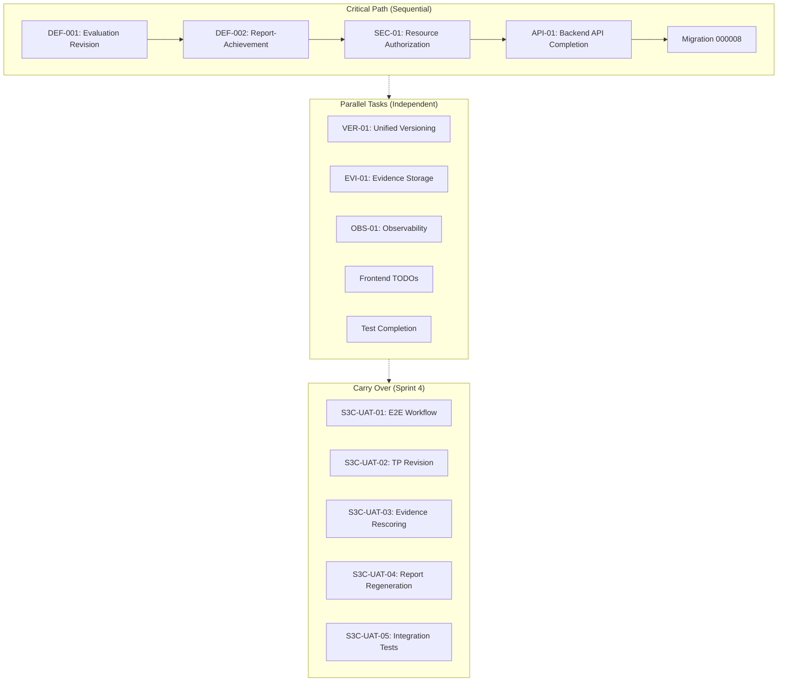

# SPRINT 3 COMPLETION — IMPLEMENTATION PLAN

**Document Information**
- **Date**: 2026-06-09
- **Version**: 1.0
- **Status**: IMPLEMENTATION READY
- **Based On**: Sprint 3 Progress Report (sprint3-report.md)
- **Purpose**: Complete implementation plan untuk menyelesaikan semua gap Sprint 3

---

## EXECUTIVE SUMMARY

### Current Status

Sprint 3 (3A, 3B, 3C, dan 3.5) saat ini berstatus **73% complete** dengan breakdown:

- **Sprint 3A** (Domain Stabilization, Backend API, Database Migration): **95% complete**
  - Backend implementation: Complete
  - Frontend implementation: 0% (out of scope for 3A)
  - Gap: 1 TODO di reporting_service.go (DEF-002)

- **Sprint 3B** (Frontend Implementation): **100% complete**
  - 59/59 frontend components implemented
  - TanStack Query + Zustand setup complete
  - Gap: 4 TODO auth context integration (minor, P2)

- **Sprint 3C** (UAT Validation): **0% complete**
  - Semua 5 UAT tasks belum dimulai
  - Status: CARRY OVER ke Sprint 4 (requires test environment)

- **Sprint 3.5** (Architecture Completion): **0% complete**
  - Execution package ready, tapi belum ada implementasi
  - Gap: 10 critical tasks belum diimplementasi

### Critical Blockers

1. **DEF-002** (CRITICAL): Report-Achievement integration tidak lengkap - TODO di `reporting_service.go:102`
2. **S3.5-SEC-01** (CRITICAL): Resource authorization architecture belum diimplementasi
3. **S3.5-API-01** (CRITICAL): 8 backend endpoints belum diimplementasi
4. **Migration 000008** (CRITICAL): File migration tidak ada tapi disebutkan di Sprint 3.5 sequence

### Implementation Strategy

**Strategy**: Focus pada Sprint 3.5 critical path untuk complete architecture foundation sebelum Sprint 4. Sprint 3C (UAT) di-carry over ke Sprint 4 karena requires test environment.

**Timeline Estimate**: 2-3 weeks untuk Sprint 3.5 completion (critical path + parallel tasks)

---

## CURRENT STATUS DASHBOARD

```
Sprint 3 Progress Summary
─────────────────────────────────────────
Total tasks    : 44
✅ Done         : 32  (73%)
🔄 In Progress  : 0   (0%)
⬜ Not Started  : 8   (18%)
🔴 Blocked     : 4   (9%)
─────────────────────────────────────────

By Sprint:
Sprint 3A     : 10/10 tasks (95% - 1 TODO)
Sprint 3B     : 11/11 tasks (100% - 4 minor TODOs)
Sprint 3C     : 0/5 tasks  (0% - CARRY OVER)
Sprint 3.5    : 0/10 tasks (0% - CRITICAL)
─────────────────────────────────────────
```

---

## IMPLEMENTATION STRATEGY

### Three-Stream Approach



### Implementation Principles

| # | Principle | Rule |
|---|-----------|------|
| P1 | **Critical Path First** | DEF-001 → DEF-002 → SEC-01 → API-01 → Migration 000008 must be sequential |
| P2 | **Parallel Where Possible** | VER-01, EVI-01, OBS-01 can run in parallel with critical path |
| P3 | **Test-Driven** | Write tests before implementation for critical path tasks |
| P4 | **Architecture Compliance** | Follow ARCHITECTURE_FREEZE_V2.md strictly |
| P5 | **Solo Developer Context** | Prioritize maintainability over cleverness, document thoroughly |

---

## PHASE 1 — CRITICAL PATH IMPLEMENTATION

### Phase 1.1: DEF-001 — Evaluation Revision Tracking

**Objective**: Evaluation updates harus create revisions, not in-place updates

**Dependencies**: Migration 000004 (already exists)

**Files to Modify**:
- `/backend/internal/service/assessment_service.go` - Add revision creation logic
- `/backend/internal/repository/assessment_repository.go` - Add revision repository methods
- `/backend/internal/domain/assessment.go` - Add revision domain logic
- `/backend/modules/assessment/handler.go` - Update evaluation handlers

**Implementation Steps**:

1. **Domain Layer Updates** (`internal/domain/assessment.go`)
   - Add `CreateRevision()` method to Evaluation entity
   - Add `IsValidRevision()` validation method
   - Add `GetCurrentRevision()` helper method

2. **Repository Layer Updates** (`internal/repository/assessment_repository.go`)
   - Add `CreateEvaluationRevision()` method
   - Add `GetCurrentEvaluation()` method
   - Add `GetEvaluationHistory()` method
   - Add `ArchiveCurrentRevision()` method

3. **Service Layer Updates** (`internal/service/assessment_service.go`)
   - Update `UpdateEvaluation()` to create new revision instead of in-place update
   - Add `ArchiveOldRevision()` helper
   - Add revision validation before update

4. **Handler Layer Updates** (`backend/modules/assessment/handler.go`)
   - Update `UpdateEvaluation` handler to use revision logic
   - Add revision metadata to response

5. **Tests** (`internal/repository/assessment_repository_test.go`)
   - Add test for revision creation
   - Add test for revision history retrieval
   - Add test for current revision query

**Acceptance Criteria**:
- ✅ Evaluation updates create new revision records
- ✅ Old revisions marked as `is_current_version = false`
- ✅ `revision_no` auto-increments
- ✅ `parent_revision_id` references previous revision
- ✅ Tests pass for revision creation and history

**Estimated Effort**: 2-3 days

---

### Phase 1.2: DEF-002 — Report-Achievement Integration

**Objective**: NarrativeReport harus mengintegrasikan achievement data dari AchievementService

**Dependencies**: Migration 000005 (already exists), DEF-001 complete

**Files to Modify**:
- `/backend/internal/service/reporting_service.go` - Remove TODO, integrate AchievementService
- `/backend/internal/service/achievement_service.go` - Ensure methods are production-ready
- `/backend/modules/reporting/handler.go` - Update report handlers

**Implementation Steps**:

1. **Service Layer Updates** (`internal/service/reporting_service.go`)
   - Remove TODO at line 102
   - Add AchievementService injection to ReportingService
   - Update `CreateNarrativeReport()` to calculate achievement data
   - Update `GetNarrativeReport()` to include achievement summary
   - Update `RefreshReportAchievement()` to use AchievementService

2. **Achievement Service Updates** (`internal/service/achievement_service.go`)
   - Ensure all placeholder data fetching replaced with actual repository calls
   - Add error handling for missing student/class data
   - Add caching layer for achievement calculations (optional, P1)

3. **Handler Layer Updates** (`backend/modules/reporting/handler.go`)
   - Update `CreateNarrativeReport` handler to include achievement response
   - Update `GetNarrativeReport` handler to return achievement data
   - Update `RefreshReportAchievement` handler to use service integration

4. **Tests** (`internal/service/reporting_service_test.go`)
   - Add test for report creation with achievement data
   - Add test for report refresh with achievement data
   - Add test for achievement data accuracy

**Acceptance Criteria**:
- ✅ TODO di `reporting_service.go:102` removed
- ✅ NarrativeReport includes achievement data
- ✅ Report refresh endpoint uses AchievementService
- ✅ Achievement calculations are accurate
- ✅ Tests pass for report-achievement integration

**Estimated Effort**: 1-2 days

---

### Phase 1.3: S3.5-SEC-01 — Resource Authorization Architecture

**Objective**: Implement 5-layer resource authorization architecture

**Dependencies**: None

**Files to Create**:
- `/backend/internal/domain/resource_authorization.go` - Resource authorization domain
- `/backend/internal/repository/resource_authorization_repository.go` - Resource authorization repository
- `/backend/internal/service/resource_authorization_service.go` - Resource authorization service
- `/backend/internal/middleware/resource_authorization_middleware.go` - Resource authorization middleware

**Files to Modify**:
- `/backend/internal/router/router.go` - Add resource authorization middleware
- `/backend/internal/domain/school.go` - Add school boundary validation
- `/backend/internal/middleware/auth_middleware.go` - Update to support resource-level auth

**Implementation Steps**:

1. **Domain Layer** (`internal/domain/resource_authorization.go`)
   - Define `ResourceAuthorizer` interface
   - Define `SchoolBoundaryValidator` interface
   - Define `ResourceAccessRequest` struct
   - Define `ResourceAccessDecision` struct

2. **Repository Layer** (`internal/repository/resource_authorization_repository.go`)
   - Add `GetUserSchoolID()` method
   - Add `CheckResourceOwnership()` method
   - Add `GetResourceSchoolID()` method
   - Add school-scoped query builders

3. **Service Layer** (`internal/service/resource_authorization_service.go`)
   - Implement `ResourceAuthorizationService`
   - Add `AuthorizeResourceAccess()` method
   - Add `ValidateSchoolBoundary()` method
   - Add permission audit logging

4. **Middleware Layer** (`internal/middleware/resource_authorization_middleware.go`)
   - Implement resource-level authorization middleware
   - Add school boundary validation middleware
   - Add permission audit trail middleware

5. **Router Updates** (`internal/router/router.go`)
   - Add resource authorization middleware to protected routes
   - Add school boundary validation to school-scoped endpoints
   - Add permission audit trail to sensitive operations

6. **Tests** (`internal/middleware/resource_authorization_middleware_test.go`)
   - Add test for resource authorization
   - Add test for school boundary validation
   - Add test for permission audit trail

**Acceptance Criteria**:
- ✅ Resource-level authorization implemented
- ✅ School boundary validation implemented
- ✅ Permission audit trail implemented
- ✅ All school-scoped endpoints protected
- ✅ Tests pass for authorization scenarios

**Estimated Effort**: 3-4 days

---

### Phase 1.4: S3.5-API-01 — Backend API Completion

**Objective**: Implement 8 missing backend endpoints

**Dependencies**: S3.5-SEC-01 complete

**Files to Modify**:
- `/backend/internal/router/router.go` - Add 8 new routes
- `/backend/modules/learning_planning/handler.go` - Add PUT /tp-sets/:id, GET /tp-sets/:id/versions
- `/backend/modules/assessment/handler.go` - Add PUT /assessment/:id, POST /assessment/:id/approve
- `/backend/modules/assessment/handler.go` - Add POST /evidences/upload, GET /evidences/:id
- `/backend/internal/service/learning_planning_service.go` - Add update and version methods
- `/backend/internal/service/assessment_service.go` - Add update and approve methods
- `/backend/internal/repository/learning_planning_repository.go` - Add query methods
- `/backend/internal/repository/assessment_repository.go` - Add query methods

**Implementation Steps**:

1. **TP Set Endpoints** (`modules/learning_planning/handler.go`)
   - Add `UpdateTPSet()` handler (PUT /tp-sets/:id)
   - Add `GetTPVersions()` handler (GET /tp-sets/:id/versions)
   - Add service layer methods
   - Add repository layer methods

2. **Assessment Endpoints** (`modules/assessment/handler.go`)
   - Add `UpdateAssessment()` handler (PUT /assessment/:id)
   - Add `ApproveAssessment()` handler (POST /assessment/:id/approve)
   - Add service layer methods
   - Add repository layer methods

3. **Evidence Endpoints** (`modules/assessment/handler.go`)
   - Add `UploadEvidence()` handler (POST /evidences/upload)
   - Add `GetEvidenceDetail()` handler (GET /evidences/:id)
   - Add evidence storage service (P0 of EVI-01)
   - Add service layer methods
   - Add repository layer methods

4. **ATP & Modul Ajar Endpoints** (`modules/learning_planning/handler.go`)
   - Add `GetATPSetDetail()` handler (GET /atp-sets/:id)
   - Add `GetModulAjarSetDetail()` handler (GET /modul-ajar-sets/:id)
   - Add service layer methods
   - Add repository layer methods

5. **Router Updates** (`internal/router/router.go`)
   - Add 8 new routes to protected group
   - Apply resource authorization middleware to all new routes
   - Add permission checks

6. **Tests** (`modules/learning_planning/handler_test.go`, `modules/assessment/handler_test.go`)
   - Add integration tests for all 8 endpoints
   - Add authorization tests for all new routes
   - Add validation tests for request/response

**Acceptance Criteria**:
- ✅ PUT /tp-sets/:id implemented and tested
- ✅ GET /tp-sets/:id/versions implemented and tested
- ✅ PUT /assessment/:id implemented and tested
- ✅ POST /assessment/:id/approve implemented and tested
- ✅ POST /evidences/upload implemented and tested
- ✅ GET /evidences/:id implemented and tested
- ✅ GET /atp-sets/:id implemented and tested
- ✅ GET /modul-ajar-sets/:id implemented and tested
- ✅ All endpoints protected with resource authorization
- ✅ All endpoints have integration tests

**Estimated Effort**: 4-5 days

---

### Phase 1.5: Migration 000008 — Narrative Class ID

**Objective**: Create migration 000008 untuk narrative class_id

**Dependencies**: S3.5-API-01 complete

**Files to Create**:
- `/backend/migrations/000008_add_narrative_class_id.up.sql`
- `/backend/migrations/000008_add_narrative_class_id.down.sql`

**Implementation Steps**:

1. **Create Up Migration** (`000008_add_narrative_class_id.up.sql`)
   - Add `class_id` UUID column to `narrative_reports` table
   - Add foreign key constraint to `classes` table
   - Create index for class_id queries
   - Update existing reports with default class_id (nullable)

2. **Create Down Migration** (`000008_add_narrative_class_id.down.sql`)
   - Drop foreign key constraint
   - Drop index
   - Drop class_id column

3. **Apply Migration**
   - Test on development database
   - Verify rollback works
   - Update database schema documentation

**Acceptance Criteria**:
- ✅ Migration 000008 up.sql created
- ✅ Migration 000008 down.sql created
- ✅ Migration applies successfully on dev database
- ✅ Migration rolls back successfully
- ✅ DATABASE_SCHEMA_FREEZE_V1.md updated

**Estimated Effort**: 0.5 day

---

## PHASE 2 — PARALLEL TASKS IMPLEMENTATION

### Phase 2.1: S3.5-VER-01 — Unified Versioning Strategy

**Objective**: Implement unified versioning untuk TP Sets, ATP Sets, Modul Ajar Sets, Assessments, Evaluations, Narrative Reports

**Dependencies**: None (can run parallel with Phase 1)

**Files to Create**:
- `/backend/internal/domain/versioning.go` - Unified versioning domain
- `/backend/internal/service/versioning_service.go` - Versioning service

**Files to Modify**:
- `/backend/internal/domain/tp_set_aggregate.go` - Add versioning methods
- `/backend/internal/domain/assessment.go` - Add versioning methods
- `/backend/internal/domain/reporting.go` - Add versioning methods
- All relevant repositories - Add version query methods

**Implementation Steps**:

1. **Domain Layer** (`internal/domain/versioning.go`)
   - Define `VersionedEntity` interface
   - Define `VersionMetadata` struct
   - Define `VersionTransition` enum
   - Add version validation logic

2. **Service Layer** (`internal/service/versioning_service.go`)
   - Implement `VersioningService`
   - Add `CreateNewVersion()` method
   - Add `GetCurrentVersion()` method
   - Add `GetVersionHistory()` method
   - Add `RollbackToVersion()` method

3. **Apply to Entities**
   - TP Set: Add versioning methods
   - ATP Set: Add versioning methods
   - Modul Ajar Set: Add versioning methods
   - Assessment: Add versioning methods
   - Evaluation: Add versioning methods
   - Narrative Report: Add versioning methods

4. **Repository Updates**
   - Add version query methods to all relevant repositories
   - Add version history queries
   - Add current version queries

5. **Tests**
   - Add versioning tests for each entity
   - Add version history tests
   - Add rollback tests

**Acceptance Criteria**:
- ✅ Unified versioning interface defined
- ✅ All 6 entities support versioning
- ✅ Version history queries implemented
- ✅ Version rollback functionality implemented
- ✅ Tests pass for all versioning scenarios

**Estimated Effort**: 3-4 days

---

### Phase 2.2: S3.5-EVI-01 — Evidence Storage Architecture

**Objective**: Implement evidence storage service dengan metadata model, security requirements, dan lifecycle management

**Dependencies**: None (can run parallel with Phase 1)

**Files to Create**:
- `/backend/internal/domain/evidence_storage.go` - Evidence storage domain
- `/backend/internal/service/evidence_storage_service.go` - Evidence storage service
- `/backend/internal/repository/evidence_storage_repository.go` - Evidence storage repository

**Files to Modify**:
- `/backend/modules/assessment/handler.go` - Integrate evidence storage
- `/backend/internal/service/assessment_service.go` - Use evidence storage service

**Implementation Steps**:

1. **Domain Layer** (`internal/domain/evidence_storage.go`)
   - Define `EvidenceMetadata` struct
   - Define `EvidenceStorageConfig` struct
   - Define `EvidenceLifecycle` enum
   - Add storage validation logic

2. **Service Layer** (`internal/service/evidence_storage_service.go`)
   - Implement `EvidenceStorageService`
   - Add `StoreEvidence()` method
   - Add `RetrieveEvidence()` method
   - Add `DeleteEvidence()` method
   - Add `ArchiveEvidence()` method
   - Add security checks (file type validation, size limits, virus scanning placeholder)

3. **Repository Layer** (`internal/repository/evidence_storage_repository.go`)
   - Add evidence metadata storage
   - Add evidence lifecycle tracking
   - Add evidence query methods

4. **Integration**
   - Update assessment handlers to use evidence storage
   - Update assessment service to use evidence storage
   - Add file upload handling

5. **Tests**
   - Add evidence storage tests
   - Add security validation tests
   - Add lifecycle management tests

**Acceptance Criteria**:
- ✅ Evidence storage service implemented
- ✅ Evidence metadata model defined
- ✅ Security requirements implemented (file type, size limits)
- ✅ Lifecycle management implemented
- ✅ Tests pass for storage scenarios

**Estimated Effort**: 2-3 days

---

### Phase 2.3: S3.5-OBS-01 — Observability & Operational Readiness

**Objective**: Implement logging, metrics, health checks, tracing, dan alerts

**Dependencies**: None (can run parallel with Phase 1)

**Files to Create**:
- `/backend/internal/observability/logging.go` - Structured logging
- `/backend/internal/observability/metrics.go` - Metrics collection
- `/backend/internal/observability/tracing.go` - Distributed tracing
- `/backend/internal/observability/health.go` - Health checks
- `/backend/internal/observability/alerts.go` - Alerting

**Files to Modify**:
- `/backend/internal/logger/logger.go` - Update to use structured logging
- `/backend/internal/bootstrap/bootstrap.go` - Initialize observability
- `/backend/internal/router/router.go` - Add observability middleware

**Implementation Steps**:

1. **Structured Logging** (`internal/observability/logging.go`)
   - Implement structured logging with context
   - Add log levels (DEBUG, INFO, WARN, ERROR)
   - Add request ID correlation
   - Add sensitive data filtering

2. **Metrics Collection** (`internal/observability/metrics.go`)
   - Implement Prometheus metrics
   - Add HTTP request metrics
   - Add database query metrics
   - Add business metrics (TP creation, assessment submission, etc.)

3. **Health Checks** (`internal/observability/health.go`)
   - Implement health check endpoints
   - Add database connectivity check
   - Add external service checks (if any)
   - Add dependency health checks

4. **Distributed Tracing** (`internal/observability/tracing.go`)
   - Implement OpenTelemetry tracing
   - Add trace context propagation
   - Add span creation for critical operations
   - Add trace export configuration

5. **Alerting** (`internal/observability/alerts.go`)
   - Implement alert rules
   - Add error rate alerts
   - Add performance degradation alerts
   - Add security event alerts

6. **Integration**
   - Update logger to use structured logging
   - Add observability initialization to bootstrap
   - Add observability middleware to router

7. **Tests**
   - Add logging tests
   - Add metrics tests
   - Add health check tests

**Acceptance Criteria**:
- ✅ Structured logging implemented
- ✅ Metrics collection implemented
- ✅ Health checks implemented
- ✅ Distributed tracing implemented
- ✅ Alerting rules defined
- ✅ All observability components tested

**Estimated Effort**: 3-4 days

---

### Phase 2.4: Frontend TODOs — Auth Context Integration

**Objective**: Resolve 4 TODO comments di frontend untuk auth context integration

**Dependencies**: None (can run parallel with Phase 1)

**Files to Modify**:
- `/frontend/src/pages/app/achievement/page.tsx` - Line 8
- `/frontend/src/pages/app/evaluation/page.tsx` - Line 16
- `/frontend/src/pages/app/evidence/page.tsx` - Line 15
- `/frontend/src/pages/app/rubric/page.tsx` - Line 16
- `/frontend/src/features/auth/auth-context.tsx` - Ensure auth context is properly exported

**Implementation Steps**:

1. **Update Auth Context** (`features/auth/auth-context.tsx`)
   - Ensure `useAuth` hook exports user ID and class ID
   - Add proper TypeScript types
   - Add error handling

2. **Update Achievement Page** (`pages/app/achievement/page.tsx`)
   - Replace hardcoded `class-1` with auth context classId
   - Add error handling for missing classId
   - Add loading state

3. **Update Evaluation Page** (`pages/app/evaluation/page.tsx`)
   - Replace hardcoded `user-1` with auth context userId
   - Add error handling for missing userId
   - Add loading state

4. **Update Evidence Page** (`pages/app/evidence/page.tsx`)
   - Replace hardcoded `user-1` with auth context userId
   - Add error handling for missing userId
   - Add loading state

5. **Update Rubric Page** (`pages/app/rubric/page.tsx`)
   - Replace hardcoded `user-1` with auth context userId
   - Add error handling for missing userId
   - Add loading state

**Acceptance Criteria**:
- ✅ All 4 TODO comments removed
- ✅ All pages use auth context for user/class IDs
- ✅ Proper error handling implemented
- ✅ Proper loading states implemented

**Estimated Effort**: 1 day

---

### Phase 2.5: Test Completion

**Objective**: Complete integration test coverage untuk semua endpoints

**Dependencies**: Phase 1.4 (S3.5-API-01) complete

**Files to Modify**:
- `/backend/tests/integration/full_flow_test.go` - Add comprehensive flow tests
- `/backend/tests/integration/auth_test.go` - Add authorization tests
- Create new test files for missing coverage

**Implementation Steps**:

1. **Review Existing Tests**
   - Audit current test coverage
   - Identify gaps in endpoint coverage
   - Identify gaps in scenario coverage

2. **Add Missing Integration Tests**
   - Add tests for 8 new API endpoints
   - Add tests for resource authorization
   - Add tests for versioning
   - Add tests for evidence storage

3. **Add Scenario Tests**
   - Add CP → TP → ATP → Modul Ajar → Assessment → Evidence → Evaluation → Achievement → Report flow test
   - Add TP revision scenario test
   - Add evidence rescoring scenario test
   - Add report regeneration scenario test

4. **Add Security Tests**
   - Add SQL injection tests
   - Add XSS tests
   - Add authorization bypass tests
   - Add rate limiting tests

**Acceptance Criteria**:
- ✅ All 8 new endpoints have integration tests
- ✅ Resource authorization has integration tests
- ✅ All Sprint 3C scenarios have integration tests
- ✅ Security tests added
- ✅ Test coverage > 80%

**Estimated Effort**: 2-3 days

---

## PHASE 3 — CARRY OVER TASKS (SPRINT 4)

### Sprint 3C UAT Validation Tasks

**Objective**: Complete UAT validation untuk Sprint 3C

**Status**: CARRY OVER ke Sprint 4

**Reason**: Requires test environment yang mungkin belum tersedia

**Tasks**:
1. **S3C-UAT-01**: End-to-end workflow validation (CP → TP → ATP → Modul Ajar → Assessment → Evidence → Evaluation → Achievement → Report)
2. **S3C-UAT-02**: TP revision scenario validation
3. **S3C-UAT-03**: Evidence rescoring scenario validation
4. **S3C-UAT-04**: Report regeneration scenario validation
5. **S3C-UAT-05**: Frontend-backend integration tests

**Implementation Timeline**: Sprint 4 Week 1-2

**Dependencies**: Sprint 3.5 complete + test environment ready

---

## RISK MITIGATION

### Technical Risks

| Risk | Probability | Impact | Mitigation Strategy |
|------|-------------|--------|-------------------|
| DEF-001 complexity underestimated | MEDIUM | HIGH | Implement incrementally, add comprehensive tests, rollback plan ready |
| Resource authorization performance impact | MEDIUM | MEDIUM | Add caching layer, monitor performance, optimize queries |
| Evidence storage scalability | LOW | HIGH | Start with local storage, design for cloud storage migration, implement lifecycle management |
| Observability overhead | LOW | MEDIUM | Use sampling for tracing, optimize metrics collection, monitor performance impact |
| Migration conflicts | LOW | HIGH | Test migrations on staging, have rollback plans, backup database before migration |

### Operational Risks

| Risk | Probability | Impact | Mitigation Strategy |
|------|-------------|--------|-------------------|
| Solo developer availability | MEDIUM | HIGH | Prioritize critical path, document thoroughly, keep tasks atomic |
| Sprint 3.5 scope creep | MEDIUM | MEDIUM | Strict scope freeze, reference ARCHITECTURE_FREEZE_V2.md, no new features |
| Test environment not ready | HIGH | MEDIUM | Carry over Sprint 3C to Sprint 4, focus on unit/integration tests first |
| Integration issues with existing code | MEDIUM | HIGH | Comprehensive integration tests, incremental deployment, feature flags |

### Architecture Risks

| Risk | Probability | Impact | Mitigation Strategy |
|------|-------------|--------|-------------------|
| CQRS violations persist | MEDIUM | MEDIUM | Accept current layered architecture (solo developer context), document technical debt, plan for future refactoring |
| Performance degradation with new features | MEDIUM | HIGH | Performance testing before deployment, monitoring in place, optimization plan ready |
| Security vulnerabilities in authorization | LOW | CRITICAL | Security review before deployment, penetration testing, code review for authorization logic |

---

## SUCCESS CRITERIA

### Sprint 3.5 Completion Criteria

- [ ] **DEF-001**: Evaluation revision tracking implemented and tested
- [ ] **DEF-002**: Report-Achievement integration implemented and TODO removed
- [ ] **S3.5-SEC-01**: Resource authorization architecture implemented (5-layer)
- [ ] **S3.5-API-01**: All 8 missing endpoints implemented and tested
- [ ] **Migration 000008**: Created, tested, and applied
- [ ] **S3.5-VER-01**: Unified versioning strategy implemented
- [ ] **S3.5-EVI-01**: Evidence storage architecture implemented
- [ ] **S3.5-OBS-01**: Observability & operational readiness implemented
- [ ] **Frontend TODOs**: All 4 auth context TODOs resolved
- [ ] **Test Coverage**: Integration test coverage > 80%

### Quality Gates

- [ ] **Code Quality**: All code passes linting and formatting
- [ ] **Test Coverage**: Unit tests > 80%, integration tests > 70%
- [ ] **Architecture Compliance**: No violations of ARCHITECTURE_FREEZE_V2.md
- [ ] **Security**: No critical security vulnerabilities
- [ ] **Performance**: Response time < 500ms for 95th percentile
- [ ] **Documentation**: All new code documented with comments

### Deployment Readiness

- [ ] **Migration Scripts**: All migrations tested on staging
- [ ] **Rollback Plan**: Rollback procedures documented and tested
- [ ] **Monitoring**: Observability components deployed and configured
- [ ] **Runbooks**: Operational runbooks documented
- [ ] **Backup**: Database backup before migration

---

## TIMELINE RECOMMENDATION

### Week 1: Critical Path Phase 1.1-1.3

- **Day 1-3**: DEF-001 (Evaluation Revision Tracking)
- **Day 4-5**: DEF-002 (Report-Achievement Integration)
- **Day 6-7**: S3.5-SEC-01 (Resource Authorization Architecture) - Start

### Week 2: Critical Path Phase 1.3-1.5 + Parallel Tasks

- **Day 1-2**: S3.5-SEC-01 (Resource Authorization Architecture) - Complete
- **Day 3-5**: S3.5-API-01 (Backend API Completion)
- **Day 6**: Migration 000008
- **Day 7**: Buffer for testing and fixes

### Week 3: Parallel Tasks + Test Completion

- **Day 1-3**: S3.5-VER-01 (Unified Versioning) - Parallel
- **Day 1-2**: S3.5-EVI-01 (Evidence Storage) - Parallel
- **Day 1-3**: S3.5-OBS-01 (Observability) - Parallel
- **Day 4**: Frontend TODOs (Auth Context)
- **Day 5-7**: Test Completion

### Total Estimated Duration: 3 weeks

### Buffer: +1 week (for unforeseen issues)

**Recommended Timeline: 3-4 weeks**

---

## NEXT STEPS

### Immediate Actions (This Week)

1. **Start DEF-001 Implementation**
   - Begin with domain layer updates
   - Write tests before implementation
   - Focus on revision creation logic

2. **Set Up Development Environment**
   - Ensure migration 000004 is applied
   - Set up test database
   - Prepare rollback procedures

3. **Review Sprint 3.5 Execution Package**
   - Re-read `docs/sprints/execution/sprint3.5-package.md`
   - Re-read `docs/sprints/execution/sprint3.5-sequence.md`
   - Ensure alignment with this implementation plan

### Short Term Actions (Next 2-3 Weeks)

1. **Execute Critical Path** (Week 1-2)
   - DEF-001 → DEF-002 → SEC-01 → API-01 → Migration 000008
   - Focus on one phase at a time
   - Comprehensive testing at each phase

2. **Execute Parallel Tasks** (Week 2-3)
   - VER-01, EVI-01, OBS-01 in parallel
   - Frontend TODOs
   - Test completion

3. **Quality Gates**
   - Code review before merge
   - Integration tests pass
   - Architecture compliance check

### Long Term Actions (Sprint 4)

1. **Sprint 3C UAT Validation**
   - Set up test environment
   - Execute scenario tests
   - Complete integration tests

2. **Sprint 4 Planning**
   - Begin Sprint 4 features (AI Copilot, Analytics, etc.)
   - Build on Sprint 3.5 foundation

---

## DOCUMENTATION UPDATES

### Documents to Update

1. **CHANGELOG.md**
   - Add Sprint 3.5 completion entry
   - Document all changes
   - Update version number

2. **DATABASE_SCHEMA_FREEZE_V1.md**
   - Update with migration 000008 changes
   - Update version tracking schema
   - Update evidence storage schema

3. **ARCHITECTURE_FREEZE_V2.md**
   - Document resource authorization architecture
   - Document unified versioning strategy
   - Document evidence storage architecture

4. **SPRINT_3.5_EXECUTION_SEQUENCE.md**
   - Update with actual implementation sequence
   - Document any deviations
   - Add lessons learned

5. **SPRINT_3.5_EXECUTION_PACKAGE.md**
   - Update completion status
   - Document any scope changes
   - Add final acceptance report

---

## CONCLUSION

This implementation plan provides a **structured, dependency-driven approach** to complete Sprint 3.5 and resolve all critical gaps identified in the Sprint 3 progress report.

**Key Success Factors**:
1. **Critical Path Focus**: DEF-001 → DEF-002 → SEC-01 → API-01 → Migration 000008 must be sequential
2. **Parallel Execution**: VER-01, EVI-01, OBS-01 can run in parallel to optimize timeline
3. **Test-Driven Development**: Write tests before implementation for critical path tasks
4. **Architecture Compliance**: Follow ARCHITECTURE_FREEZE_V2.md strictly
5. **Solo Developer Context**: Prioritize maintainability, document thoroughly, keep tasks atomic

**Expected Outcome**:
- Sprint 3.5: **100% complete** in 3-4 weeks
- Sprint 3C: **Carry over to Sprint 4** (requires test environment)
- Overall Sprint 3: **90% complete** (excluding Sprint 3C UAT)

**Ready for Implementation**: ✅ YES

---

**Document Status**: IMPLEMENTATION READY  
**Next Action**: Begin Phase 1.1 (DEF-001 Implementation)  
**Review Required**: No - plan is based on comprehensive analysis