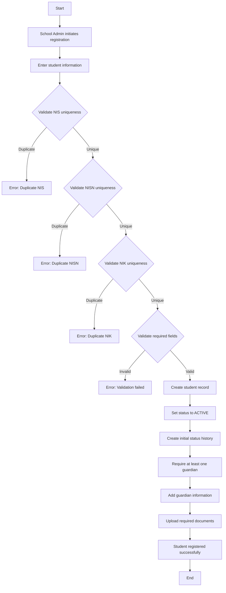
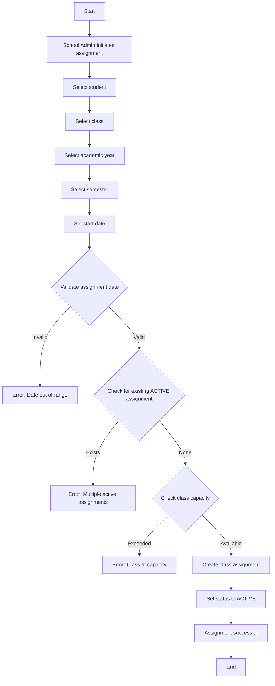
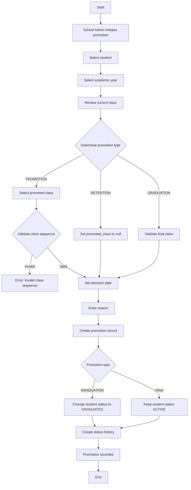
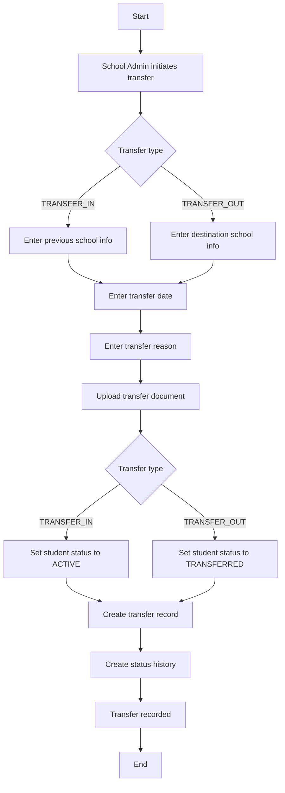
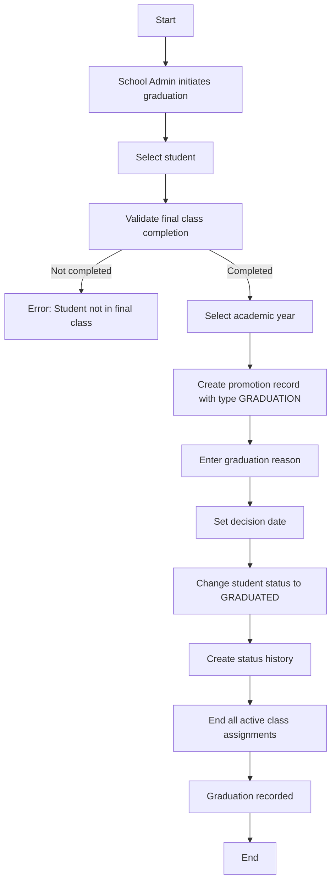

# Sprint 5 — Student Lifecycle Requirements

**Version**: 1.0  
**Date**: June 11, 2026  
**Status**: FINAL — IMPLEMENTATION READY  
**Sprint Sequence**: Sprint 5 (follows Sprint 4: Academic Foundation)  
**Architecture Alignment**: Architecture Freeze v2, DDD Lite, Layered Architecture  

---

# Executive Summary

Sprint 5 establishes the core Student Lifecycle domain for the NUSA Platform. This sprint provides complete lifecycle management of students from admission into the school until graduation, transfer, leave, or dropout. The sprint creates the single source of truth for student identity and enrollment history that later sprints (Assessment, Evidence, Achievement, Narrative Report) will consume.

**Scope**: Student Lifecycle only. Assessment, Evaluation, Achievement, Narrative Report, Learning Planning, TP, ATP, Modul Ajar, Rubric, Evidence, Academic Analytics, Dashboard Analytics, PPDB Workflow, Dapodik Integration, DTKS Integration, and Dukcapil Integration are explicitly out of scope.

**Dependencies**: Assumes Sprint 4 (Academic Foundation) provides Academic Year, Semester, Phase, Subject, Curriculum Structure, CP Repository, Profile Dimension Repository, and Academic Foundation Master Data.

---

# Table of Contents

1. [Functional Requirements](#1-functional-requirements)
2. [Business Rules](#2-business-rules)
3. [Domain Model](#3-domain-model)
4. [Database Design](#4-database-design)
5. [API Specifications](#5-api-specifications)
6. [Authorization Matrix](#6-authorization-matrix)
7. [Workflow Definitions](#7-workflow-definitions)
8. [Non-Functional Requirements](#8-non-functional-requirements)
9. [Acceptance Criteria](#9-acceptance-criteria)
10. [Out of Scope](#10-out-of-scope)

---

# 1. Functional Requirements

## 1.1 Student Profile

### FR-ST-001: Student Registration
The system shall allow School Admin to register new students with the following information:
- NIS (Nomor Induk Siswa) - school-assigned unique identifier
- NISN (Nomor Induk Siswa Nasional) - national student identifier (optional)
- NIK (Nomor Induk Kependudukan) - national ID number
- Full name
- Date of birth
- Place of birth
- Gender
- Religion
- Blood type (optional)
- Address information (street, village, district, city, province, postal code)
- Geolocation information (latitude, longitude - optional)
- Admission information (admission date, admission type, previous school)
- Contact information (phone, email - optional)
- Photo (optional)

### FR-ST-002: Student Update
The system shall allow School Admin to update student information for:
- Demographic information
- Address information
- Contact information
- Photo

Updates to NIS, NISN, NIK, and date of birth shall require special validation and audit logging.

### FR-ST-003: Student Archival
The system shall support soft archival of student records when:
- Student graduates
- Student transfers out
- Student drops out
- Student is inactive for extended period

Archived records shall be retained for audit purposes but not displayed in active student lists.

### FR-ST-004: Student Status Management
The system shall support the following student statuses:
- **ACTIVE**: Student is currently enrolled and attending
- **INACTIVE**: Student is temporarily not attending (e.g., extended leave)
- **LEAVE**: Student is on approved leave of absence
- **TRANSFERRED**: Student has transferred to another school
- **GRADUATED**: Student has completed education
- **DROPOUT**: Student has discontinued education

Status transitions shall be validated and audited.

## 1.2 Student Guardian Management

### FR-GD-001: Guardian Registration
The system shall allow School Admin to register guardians for students with:
- Full name
- Relationship type (Father, Mother, Guardian, Other)
- Contact information (phone, email)
- Address (optional - defaults to student address)
- Occupation (optional)
- Income range (optional)
- Education level (optional)

### FR-GD-002: Multiple Guardians
The system shall support multiple guardians per student with:
- Primary guardian designation
- Emergency contact designation
- Relationship priority ordering

### FR-GD-003: Guardian Update
The system shall allow School Admin to update guardian information.

### FR-GD-004: Guardian Deactivation
The system shall allow deactivation of guardian records (soft delete) when:
- Guardian relationship ends
- Guardian information is no longer valid

## 1.3 Student Document Management

### FR-DC-001: Document Upload
The system shall allow School Admin to upload documents for students:
- Family Card (Kartu Keluarga - KK)
- Birth Certificate (Akta Kelahiran)
- Transfer Letter (Surat Pindah)
- DTKS Proof (Bukti DTKS)
- Other Supporting Documents

Each document shall include:
- Document type
- File reference (stored in MinIO)
- Upload date
- Verification status (PENDING, VERIFIED, REJECTED)
- Verification notes (optional)
- Verified by (user reference)
- Verified date

### FR-DC-002: Document Replacement
The system shall allow replacement of existing documents with:
- New file upload
- Reset of verification status to PENDING
- Audit trail of document version history

### FR-DC-003: Document Verification
The system shall allow School Admin to verify documents with:
- Verification status change
- Verification notes
- Verification timestamp

Verification is manual only. No external integration.

### FR-DC-004: Document Retrieval
The system shall allow retrieval of document metadata and pre-signed URLs for file access.

## 1.4 Student Status History

### FR-SH-001: Status Change Recording
The system shall automatically record every student status change with:
- Old status
- New status
- Reason for change
- Actor (user who made the change)
- Timestamp

### FR-SH-002: History Immutability
Status history records shall never be editable. Once recorded, they shall be permanent.

### FR-SH-003: History Query
The system shall allow querying of student status history with:
- Date range filters
- Status filters
- Actor filters

## 1.5 Student Class Assignment

### FR-CA-001: Class Assignment
The system shall allow School Admin to assign students to classes with:
- Class reference
- Academic year reference
- Semester reference
- Assignment date
- Assignment status (ACTIVE, COMPLETED, MOVED)

### FR-CA-002: Single Active Assignment
A student shall have only one ACTIVE class assignment per academic year.

### FR-CA-003: Class Movement
The system shall allow moving students between classes with:
- End date for previous assignment
- Start date for new assignment
- Reason for movement
- Status change to MOVED for previous assignment

### FR-CA-004: Assignment Termination
The system shall allow ending class assignments with:
- End date
- Reason for termination
- Status change to COMPLETED

### FR-CA-005: Assignment Query
The system shall allow querying of class assignments with:
- Student filter
- Class filter
- Academic year filter
- Semester filter
- Status filter

## 1.6 Student Promotion

### FR-PR-001: Promotion Decision
The system shall allow School Admin to record promotion decisions with:
- Current class
- Promoted to class
- Promotion type (PROMOTION, RETENTION, GRADUATION)
- Academic year reference
- Decision date
- Decision reason
- Decision maker

### FR-PR-002: Class Progression
The system shall support class progression (e.g., Grade 1 → Grade 2, Grade 2 → Grade 3).

### FR-PR-003: Phase Progression
The system shall support phase progression (e.g., Fase A → Fase B, Fase B → Fase C).

### FR-PR-004: Retention Recording
The system shall allow recording retention decisions when a student is not promoted.

### FR-PR-005: Graduation Recording
The system shall allow recording graduation decisions with automatic status change to GRADUATED.

### FR-PR-006: Promotion History
The system shall maintain promotion history for audit purposes.

## 1.7 Student Transfer

### FR-TR-001: Transfer In
The system shall allow recording transfer-in students with:
- Previous school name
- Previous school NPSN (Nomor Pokok Sekolah Nasional)
- Transfer date
- Transfer reason
- Transfer document reference
- Previous class/grade

### FR-TR-002: Transfer Out
The system shall allow recording transfer-out students with:
- Destination school name
- Destination school NPSN
- Transfer date
- Transfer reason
- Transfer document reference
- Automatic status change to TRANSFERRED

### FR-TR-003: Transfer Document Management
The system shall support upload and verification of transfer documents.

### FR-TR-004: Transfer History
The system shall maintain transfer history for audit purposes.

## 1.8 Attendance Foundation

### FR-AT-001: Attendance Recording
The system shall allow Teachers to record daily attendance with:
- Student reference
- Class reference
- Date
- Attendance status (PRESENT, SICK, EXCUSED, UNEXCUSED)
- Notes (optional)
- Recorded by (teacher reference)
- Recording timestamp

### FR-AT-002: Attendance Correction
The system shall allow School Admin to correct attendance records with:
- New attendance status
- Correction reason
- Correction timestamp
- Corrected by (user reference)

### FR-AT-003: Attendance History
The system shall maintain attendance history with immutable original records and correction audit trail.

### FR-AT-004: Attendance Query
The system shall allow querying of attendance records with:
- Student filter
- Class filter
- Date range filter
- Status filter

### FR-AT-005: Attendance Summary
The system shall provide attendance summary statistics (present count, sick count, excused count, unexcused count) for specified periods.

## 1.9 Student Health Record

### FR-HL-001: Health Record Creation
The system shall allow School Admin to create health records with:
- Student reference
- Height (cm)
- Weight (kg)
- BMI (calculated)
- Measurement date
- Medical notes (optional)
- Recorded by (user reference)

### FR-HL-002: Health Record Update
The system shall allow updating health records with new measurements.

### FR-HL-003: BMI Calculation
The system shall automatically calculate BMI from height and weight using standard formula.

### FR-HL-004: Health History
The system shall maintain health record history for tracking student growth over time.

### FR-HL-005: Health Record Query
The system shall allow querying of health records with:
- Student filter
- Date range filter

---

# 2. Business Rules

## 2.1 Student Profile Business Rules

### BR-ST-001: NIS Uniqueness
NIS must be unique within a school. Duplicate NIS values shall be rejected.

### BR-ST-002: NISN Uniqueness
NISN must be unique nationally. Duplicate NISN values shall be rejected.

### BR-ST-003: NIK Uniqueness
NIK must be unique nationally. Duplicate NIK values shall be rejected.

### BR-ST-004: NIS Format
NIS must follow school-defined format (alphanumeric, max 20 characters).

### BR-ST-005: NISN Format
NISN must be exactly 10 digits.

### BR-ST-006: NIK Format
NIK must be exactly 16 digits.

### BR-ST-007: Date of Birth Validation
Date of birth must be in the past and not more than 100 years ago.

### BR-ST-008: Admission Date Validation
Admission date must not be in the future.

### BR-ST-009: Status Transition Rules
- ACTIVE can transition to INACTIVE, LEAVE, TRANSFERRED, GRADUATED, DROPOUT
- INACTIVE can transition to ACTIVE, LEAVE, TRANSFERRED, DROPOUT
- LEAVE can transition to ACTIVE, INACTIVE, TRANSFERRED, DROPOUT
- TRANSFERRED is terminal (no further transitions)
- GRADUATED is terminal (no further transitions)
- DROPOUT is terminal (no further transitions)

### BR-ST-010: Required Fields for Registration
NIS, full name, date of birth, place of birth, gender, religion, and address are required for registration.

## 2.2 Guardian Business Rules

### BR-GD-001: At Least One Guardian
Each student must have at least one active guardian.

### BR-GD-002: Primary Guardian Uniqueness
Only one guardian can be designated as primary per student.

### BR-GD-003: Emergency Contact Requirement
At least one guardian must be designated as emergency contact.

### BR-GD-004: Contact Information Validation
At least one contact method (phone or email) is required per guardian.

## 2.3 Document Business Rules

### BR-DC-001: Document Type Uniqueness
Only one current document per document type per student. Replacing a document creates a new version.

### BR-DC-002: File Size Limit
Document files must not exceed 10 MB.

### BR-DC-003: Allowed File Types
Only PDF, JPEG, PNG, and WebP file types are allowed.

### BR-DC-004: Verification Workflow
Documents start as PENDING. Only School Admin can change verification status.

### BR-DC-005: Required Documents for Enrollment
KK and Birth Certificate are required for enrollment verification.

## 2.4 Class Assignment Business Rules

### BR-CA-001: Single Active Assignment
A student cannot have more than one ACTIVE class assignment in the same academic year.

### BR-CA-002: Assignment Date Validation
Assignment date must be within the academic year and semester dates.

### BR-CA-003: Class Capacity Validation
Assignment must not exceed class capacity (if capacity is defined).

### BR-CA-004: Movement Validation
Class movement must be between classes in the same academic year.

### BR-CA-005: Termination Validation
Assignment termination must have end date after start date.

## 2.5 Promotion Business Rules

### BR-PR-001: Promotion Timing
Promotion decisions must be made at the end of an academic year.

### BR-PR-002: Class Sequence Validation
Promoted class must be the next class in sequence (e.g., Grade 1 → Grade 2).

### BR-PR-003: Phase Sequence Validation
Phase progression must follow defined phase sequence (e.g., Fase A → Fase B → Fase C).

### BR-PR-004: Graduation Validation
Graduation is only allowed from the final class/phase.

### BR-PR-005: Retention Limit
A student cannot be retained more than twice in the same phase.

## 2.6 Transfer Business Rules

### BR-TR-001: Transfer Out Status
Transfer out automatically changes student status to TRANSFERRED.

### BR-TR-002: Transfer In Status
Transfer in students start with ACTIVE status.

### BR-TR-003: Transfer Document Requirement
Transfer document is required for both transfer in and transfer out.

### BR-TR-001: NPSN Format
NPSN must be exactly 8 digits.

## 2.7 Attendance Business Rules

### BR-AT-001: Daily Recording
Attendance must be recorded once per student per day. Duplicate records shall be rejected.

### BR-AT-002: Correction Authority
Only School Admin can correct attendance records. Teachers cannot correct their own records.

### BR-AT-003: Correction Time Limit
Attendance corrections must be made within 30 days of the original recording date.

### BR-AT-004: Status Validation
Attendance status must be one of: PRESENT, SICK, EXCUSED, UNEXCUSED.

### BR-AT-005: Notes Requirement
SICK, EXCUSED, and UNEXCUSED statuses require notes explaining the absence.

## 2.8 Health Record Business Rules

### BR-HL-001: Measurement Validation
Height must be between 50 cm and 250 cm. Weight must be between 2 kg and 200 kg.

### BR-HL-002: BMI Calculation
BMI is calculated as weight (kg) / height (m)².

### BR-HL-003: Measurement Frequency
Health records can be created at any frequency, but typically once per semester.

### BR-HL-004: Medical Notes Validation
Medical notes are optional but recommended when BMI is outside healthy range.

---

# 3. Domain Model

## 3.1 Bounded Context: Student Lifecycle

### Aggregate: Student

**Aggregate Root**: `Student`

**Purpose**: Core student identity and lifecycle management

**Entities**:
- `Student` (root)
- `StudentGuardian` (child)
- `StudentDocument` (child)
- `StudentStatusHistory` (child)
- `StudentClassAssignment` (child)
- `StudentPromotion` (child)
- `StudentTransfer` (child)
- `StudentAttendance` (child)
- `StudentHealthRecord` (child)

**Value Objects**:
- `StudentID` (VARCHAR(50) - external SIS identifier)
- `NIS` (Nomor Induk Siswa)
- `NISN` (Nomor Induk Siswa Nasional)
- `NIK` (Nomor Induk Kependudukan)
- `StudentStatus` (ACTIVE, INACTIVE, LEAVE, TRANSFERRED, GRADUATED, DROPOUT)
- `Gender` (MALE, FEMALE)
- `Religion` (ISLAM, KRISTEN, KATOLIK, HINDU, BUDDHA, KONGHUCU, OTHER)
- `BloodType` (A, B, AB, O, UNKNOWN)
- `Address` (street, village, district, city, province, postal_code)
- `Geolocation` (latitude, longitude)
- `AdmissionType` (NEW, TRANSFER_IN, RE_ENROLLMENT)

**Domain Services**:
- `StudentStatusTransitionService` (validates and executes status transitions)
- `StudentClassAssignmentService` (manages class assignments with business rules)
- `StudentPromotionService` (manages promotion decisions)
- `StudentTransferService` (manages transfer processes)

**Invariants**:
- ST-INV-001: NIS must be unique within school
- ST-INV-002: NISN must be unique nationally
- ST-INV-003: NIK must be unique nationally
- ST-INV-004: Student must have at least one active guardian
- ST-INV-005: Student must have valid status transition
- ST-INV-006: Student can have only one active class assignment per academic year

**Lifecycle Rules**:
```
ACTIVE → INACTIVE → ACTIVE
ACTIVE → LEAVE → ACTIVE
ACTIVE → TRANSFERRED (terminal)
ACTIVE → GRADUATED (terminal)
ACTIVE → DROPOUT (terminal)
INACTIVE → LEAVE → TRANSFERRED/DROPOUT
LEAVE → INACTIVE → TRANSFERRED/DROPOUT
```

**Ownership Rules**:
- School Admin owns student records within their school
- System Admin has read-only access across all schools
- Teachers have read-only access to students in their assigned classes

**School Isolation Rules**:
- Student queries must include school scope filter
- Cross-school student access must return 404 (not 403)
- School scope derived from authenticated user's school_id

---

## 3.2 Entity Definitions

### Student

```go
type Student struct {
    ID              string        `json:"id" db:"id"`
    SchoolID        string        `json:"school_id" db:"school_id"`
    StudentID       string        `json:"student_id" db:"student_id"` // External SIS ID
    NIS             string        `json:"nis" db:"nis"`
    NISN            *string       `json:"nisn" db:"nisn"`
    NIK             string        `json:"nik" db:"nik"`
    FullName        string        `json:"full_name" db:"full_name"`
    DateOfBirth     time.Time     `json:"date_of_birth" db:"date_of_birth"`
    PlaceOfBirth    string        `json:"place_of_birth" db:"place_of_birth"`
    Gender          Gender        `json:"gender" db:"gender"`
    Religion        Religion      `json:"religion" db:"religion"`
    BloodType       *BloodType    `json:"blood_type" db:"blood_type"`
    Address         Address       `json:"address" db:"address"` // JSONB
    Geolocation     *Geolocation  `json:"geolocation" db:"geolocation"` // JSONB
    AdmissionDate   time.Time     `json:"admission_date" db:"admission_date"`
    AdmissionType   AdmissionType `json:"admission_type" db:"admission_type"`
    PreviousSchool  *string       `json:"previous_school" db:"previous_school"`
    Phone           *string       `json:"phone" db:"phone"`
    Email           *string       `json:"email" db:"email"`
    PhotoURL        *string       `json:"photo_url" db:"photo_url"`
    Status          StudentStatus `json:"status" db:"status"`
    CreatedBy       string        `json:"created_by" db:"created_by"`
    UpdatedBy       *string       `json:"updated_by" db:"updated_by"`
    CreatedAt       time.Time     `json:"created_at" db:"created_at"`
    UpdatedAt       time.Time     `json:"updated_at" db:"updated_at"`
}
```

### StudentGuardian

```go
type StudentGuardian struct {
    ID              string          `json:"id" db:"id"`
    StudentID       string          `json:"student_id" db:"student_id"`
    FullName        string          `json:"full_name" db:"full_name"`
    Relationship    RelationshipType `json:"relationship" db:"relationship"`
    Phone           string          `json:"phone" db:"phone"`
    Email           *string         `json:"email" db:"email"`
    Address         *Address        `json:"address" db:"address"` // JSONB
    Occupation      *string         `json:"occupation" db:"occupation"`
    IncomeRange     *string         `json:"income_range" db:"income_range"`
    EducationLevel  *string         `json:"education_level" db:"education_level"`
    IsPrimary       bool            `json:"is_primary" db:"is_primary"`
    IsEmergency     bool            `json:"is_emergency" db:"is_emergency"`
    Priority        int             `json:"priority" db:"priority"`
    IsActive        bool            `json:"is_active" db:"is_active"`
    CreatedBy       string          `json:"created_by" db:"created_by"`
    UpdatedBy       *string         `json:"updated_by" db:"updated_by"`
    CreatedAt       time.Time       `json:"created_at" db:"created_at"`
    UpdatedAt       time.Time       `json:"updated_at" db:"updated_at"`
}
```

### StudentDocument

```go
type StudentDocument struct {
    ID              string              `json:"id" db:"id"`
    StudentID       string              `json:"student_id" db:"student_id"`
    DocumentType    DocumentType        `json:"document_type" db:"document_type"`
    FileObjectKey   string              `json:"file_object_key" db:"file_object_key"`
    OriginalFileName string             `json:"original_file_name" db:"original_file_name"`
    MimeType        string              `json:"mime_type" db:"mime_type"`
    FileSizeBytes   int64               `json:"file_size_bytes" db:"file_size_bytes"`
    VerificationStatus VerificationStatus `json:"verification_status" db:"verification_status"`
    VerificationNotes *string           `json:"verification_notes" db:"verification_notes"`
    VerifiedBy      *string             `json:"verified_by" db:"verified_by"`
    VerifiedAt      *time.Time          `json:"verified_at" db:"verified_at"`
    ReplacedBy      *string             `json:"replaced_by" db:"replaced_by"` // Document ID that replaced this
    CreatedBy       string              `json:"created_by" db:"created_by"`
    CreatedAt       time.Time           `json:"created_at" db:"created_at"`
}
```

### StudentStatusHistory

```go
type StudentStatusHistory struct {
    ID          string        `json:"id" db:"id"`
    StudentID   string        `json:"student_id" db:"student_id"`
    OldStatus   StudentStatus `json:"old_status" db:"old_status"`
    NewStatus   StudentStatus `json:"new_status" db:"new_status"`
    Reason      string        `json:"reason" db:"reason"`
    ChangedBy   string        `json:"changed_by" db:"changed_by"`
    ChangedAt   time.Time     `json:"changed_at" db:"changed_at"`
}
```

### StudentClassAssignment

```go
type StudentClassAssignment struct {
    ID              string                `json:"id" db:"id"`
    StudentID       string                `json:"student_id" db:"student_id"`
    ClassID         string                `json:"class_id" db:"class_id"` // External SIS ID
    AcademicYearID  string                `json:"academic_year_id" db:"academic_year_id"`
    SemesterID      string                `json:"semester_id" db:"semester_id"`
    StartDate       time.Time             `json:"start_date" db:"start_date"`
    EndDate         *time.Time            `json:"end_date" db:"end_date"`
    Status          AssignmentStatus      `json:"status" db:"status"` // ACTIVE, COMPLETED, MOVED
    Reason          *string               `json:"reason" db:"reason"`
    CreatedBy       string                `json:"created_by" db:"created_by"`
    UpdatedBy       *string               `json:"updated_by" db:"updated_by"`
    CreatedAt       time.Time             `json:"created_at" db:"created_at"`
    UpdatedAt       time.Time             `json:"updated_at" db:"updated_at"`
}
```

### StudentPromotion

```go
type StudentPromotion struct {
    ID              string            `json:"id" db:"id"`
    StudentID       string            `json:"student_id" db:"student_id"`
    AcademicYearID  string            `json:"academic_year_id" db:"academic_year_id"`
    CurrentClassID  string            `json:"current_class_id" db:"current_class_id"`
    PromotedClassID *string           `json:"promoted_class_id" db:"promoted_class_id"`
    PromotionType   PromotionType     `json:"promotion_type" db:"promotion_type"` // PROMOTION, RETENTION, GRADUATION
    DecisionDate    time.Time         `json:"decision_date" db:"decision_date"`
    Reason          string            `json:"reason" db:"reason"`
    DecisionBy      string            `json:"decision_by" db:"decision_by"`
    CreatedAt       time.Time         `json:"created_at" db:"created_at"`
}
```

### StudentTransfer

```go
type StudentTransfer struct {
    ID                  string        `json:"id" db:"id"`
    StudentID           string        `json:"student_id" db:"student_id"`
    TransferType        TransferType  `json:"transfer_type" db:"transfer_type"` // TRANSFER_IN, TRANSFER_OUT
    SchoolName          string        `json:"school_name" db:"school_name"`
    NPSN                string        `json:"npsn" db:"npsn"`
    TransferDate        time.Time     `json:"transfer_date" db:"transfer_date"`
    Reason              string        `json:"reason" db:"reason"`
    DocumentObjectKey   *string       `json:"document_object_key" db:"document_object_key"`
    PreviousClassID     *string       `json:"previous_class_id" db:"previous_class_id"`
    CreatedBy           string        `json:"created_by" db:"created_by"`
    CreatedAt           time.Time     `json:"created_at" db:"created_at"`
}
```

### StudentAttendance

```go
type StudentAttendance struct {
    ID              string            `json:"id" db:"id"`
    StudentID       string            `json:"student_id" db:"student_id"`
    ClassID         string            `json:"class_id" db:"class_id"`
    Date            time.Time         `json:"date" db:"date"`
    Status          AttendanceStatus  `json:"status" db:"status"` // PRESENT, SICK, EXCUSED, UNEXCUSED
    Notes           *string           `json:"notes" db:"notes"`
    RecordedBy      string            `json:"recorded_by" db:"recorded_by"`
    RecordedAt      time.Time         `json:"recorded_at" db:"recorded_at"`
    CorrectedBy     *string           `json:"corrected_by" db:"corrected_by"`
    CorrectedAt     *time.Time        `json:"corrected_at" db:"corrected_at"`
    CorrectionReason *string          `json:"correction_reason" db:"correction_reason"`
    OriginalStatus  *AttendanceStatus `json:"original_status" db:"original_status"`
    CreatedAt       time.Time         `json:"created_at" db:"created_at"`
    UpdatedAt       time.Time         `json:"updated_at" db:"updated_at"`
}
```

### StudentHealthRecord

```go
type StudentHealthRecord struct {
    ID              string        `json:"id" db:"id"`
    StudentID       string        `json:"student_id" db:"student_id"`
    HeightCm        float64       `json:"height_cm" db:"height_cm"`
    WeightKg        float64       `json:"weight_kg" db:"weight_kg"`
    BMI             float64       `json:"bmi" db:"bmi"`
    MeasurementDate time.Time     `json:"measurement_date" db:"measurement_date"`
    MedicalNotes    *string       `json:"medical_notes" db:"medical_notes"`
    RecordedBy      string        `json:"recorded_by" db:"recorded_by"`
    CreatedAt       time.Time     `json:"created_at" db:"created_at"`
}
```

---

## 3.3 Value Object Definitions

### StudentStatus

```go
type StudentStatus string

const (
    StudentStatusActive     StudentStatus = "ACTIVE"
    StudentStatusInactive   StudentStatus = "INACTIVE"
    StudentStatusLeave      StudentStatus = "LEAVE"
    StudentStatusTransferred StudentStatus = "TRANSFERRED"
    StudentStatusGraduated  StudentStatus = "GRADUATED"
    StudentStatusDropout    StudentStatus = "DROPOUT"
)
```

### Gender

```go
type Gender string

const (
    GenderMale   Gender = "MALE"
    GenderFemale Gender = "FEMALE"
)
```

### Religion

```go
type Religion string

const (
    ReligionIslam     Religion = "ISLAM"
    ReligionKristen   Religion = "KRISTEN"
    ReligionKatolik   Religion = "KATOLIK"
    ReligionHindu     Religion = "HINDU"
    ReligionBuddha    Religion = "BUDDHA"
    ReligionKonghucu  Religion = "KONGHUCU"
    ReligionOther     Religion = "OTHER"
)
```

### BloodType

```go
type BloodType string

const (
    BloodTypeA  BloodType = "A"
    BloodTypeB  BloodType = "B"
    BloodTypeAB BloodType = "AB"
    BloodTypeO  BloodType = "O"
    BloodTypeUnknown BloodType = "UNKNOWN"
)
```

### Address (JSONB)

```go
type Address struct {
    Street     string `json:"street"`
    Village    string `json:"village"`
    District   string `json:"district"`
    City       string `json:"city"`
    Province   string `json:"province"`
    PostalCode string `json:"postal_code"`
}
```

### Geolocation (JSONB)

```go
type Geolocation struct {
    Latitude  float64 `json:"latitude"`
    Longitude float64 `json:"longitude"`
}
```

### AdmissionType

```go
type AdmissionType string

const (
    AdmissionTypeNew         AdmissionType = "NEW"
    AdmissionTypeTransferIn  AdmissionType = "TRANSFER_IN"
    AdmissionTypeReEnrollment AdmissionType = "RE_ENROLLMENT"
)
```

### RelationshipType

```go
type RelationshipType string

const (
    RelationshipFather   RelationshipType = "FATHER"
    RelationshipMother   RelationshipType = "MOTHER"
    RelationshipGuardian RelationshipType = "GUARDIAN"
    RelationshipOther    RelationshipType = "OTHER"
)
```

### DocumentType

```go
type DocumentType string

const (
    DocumentTypeKK           DocumentType = "KK"
    DocumentTypeBirthCert    DocumentType = "BIRTH_CERTIFICATE"
    DocumentTypeTransferLetter DocumentType = "TRANSFER_LETTER"
    DocumentTypeDTKSProof    DocumentType = "DTKS_PROOF"
    DocumentTypeOther        DocumentType = "OTHER"
)
```

### VerificationStatus

```go
type VerificationStatus string

const (
    VerificationStatusPending  VerificationStatus = "PENDING"
    VerificationStatusVerified VerificationStatus = "VERIFIED"
    VerificationStatusRejected VerificationStatus = "REJECTED"
)
```

### AssignmentStatus

```go
type AssignmentStatus string

const (
    AssignmentStatusActive    AssignmentStatus = "ACTIVE"
    AssignmentStatusCompleted AssignmentStatus = "COMPLETED"
    AssignmentStatusMoved     AssignmentStatus = "MOVED"
)
```

### PromotionType

```go
type PromotionType string

const (
    PromotionTypePromotion PromotionType = "PROMOTION"
    PromotionTypeRetention PromotionType = "RETENTION"
    PromotionTypeGraduation PromotionType = "GRADUATION"
)
```

### TransferType

```go
type TransferType string

const (
    TransferTypeIn  TransferType = "TRANSFER_IN"
    TransferTypeOut TransferType = "TRANSFER_OUT"
)
```

### AttendanceStatus

```go
type AttendanceStatus string

const (
    AttendanceStatusPresent  AttendanceStatus = "PRESENT"
    AttendanceStatusSick     AttendanceStatus = "SICK"
    AttendanceStatusExcused  AttendanceStatus = "EXCUSED"
    AttendanceStatusUnexcused AttendanceStatus = "UNEXCUSED"
)
```

---

## 3.4 Domain Invariants

### ST-INV-001: NIS Uniqueness Within School

**Rule**: NIS must be unique within a school.

**Violation**: Attempting to create or update a student with duplicate NIS within the same school.

**Domain Exception**: `DuplicateNISException`

**Test Requirement**: Must reject student creation with duplicate NIS. Must reject student update with duplicate NIS.

---

### ST-INV-002: NISN Uniqueness Nationally

**Rule**: NISN must be unique nationally.

**Violation**: Attempting to create or update a student with duplicate NISN.

**Domain Exception**: `DuplicateNISNException`

**Test Requirement**: Must reject student creation with duplicate NISN. Must reject student update with duplicate NISN.

---

### ST-INV-003: NIK Uniqueness Nationally

**Rule**: NIK must be unique nationally.

**Violation**: Attempting to create or update a student with duplicate NIK.

**Domain Exception**: `DuplicateNIKException`

**Test Requirement**: Must reject student creation with duplicate NIK. Must reject student update with duplicate NIK.

---

### ST-INV-004: At Least One Active Guardian

**Rule**: Student must have at least one active guardian.

**Violation**: Attempting to deactivate all guardians for a student.

**Domain Exception**: `AtLeastOneGuardianRequiredException`

**Test Requirement**: Must reject deactivation of the last active guardian. Must require at least one guardian on student creation.

---

### ST-INV-005: Valid Status Transition

**Rule**: Student status transitions must follow defined state machine.

**Violation**: Attempting invalid status transition.

**Domain Exception**: `InvalidStatusTransitionException`

**Test Requirement**: Must reject invalid status transitions. Must allow valid status transitions.

---

### ST-INV-006: Single Active Class Assignment

**Rule**: Student can have only one ACTIVE class assignment per academic year.

**Violation**: Attempting to create second ACTIVE assignment in same academic year.

**Domain Exception**: `MultipleActiveAssignmentException`

**Test Requirement**: Must reject second ACTIVE assignment. Must allow assignment after ending previous assignment.

---

### GD-INV-001: Primary Guardian Uniqueness

**Rule**: Only one guardian can be designated as primary per student.

**Violation**: Attempting to set second guardian as primary.

**Domain Exception**: `MultiplePrimaryGuardianException`

**Test Requirement**: Must reject second primary guardian. Must allow primary guardian change.

---

### GD-INV-002: Emergency Contact Requirement

**Rule**: At least one guardian must be designated as emergency contact.

**Violation**: Attempting to remove emergency contact designation from all guardians.

**Domain Exception**: `AtLeastOneEmergencyContactRequiredException`

**Test Requirement**: Must reject removal of emergency contact from all guardians.

---

### DC-INV-001: Document Type Uniqueness

**Rule**: Only one current document per document type per student.

**Violation**: Attempting to create second current document of same type.

**Domain Exception**: `DuplicateDocumentTypeException`

**Test Requirement**: Must reject duplicate document type. Must allow document replacement.

---

### CA-INV-001: Assignment Date Validation

**Rule**: Assignment date must be within academic year and semester dates.

**Violation**: Attempting to assign with date outside academic year/semester range.

**Domain Exception**: `AssignmentDateOutOfRangeException`

**Test Requirement**: Must reject assignment date outside range. Must allow assignment date within range.

---

### AT-INV-001: Daily Attendance Uniqueness

**Rule**: Attendance must be recorded once per student per day.

**Violation**: Attempting to create duplicate attendance record for same student and date.

**Domain Exception**: `DuplicateAttendanceException`

**Test Requirement**: Must reject duplicate attendance record. Must allow correction instead of duplicate.

---

## 3.5 Domain Exceptions

```go
// Student Exceptions
type DuplicateNISException struct {
    SchoolID string
    NIS      string
}

func (e *DuplicateNISException) Error() string {
    return fmt.Sprintf("NIS %s already exists in school %s", e.NIS, e.SchoolID)
}

type DuplicateNISNException struct {
    NISN string
}

func (e *DuplicateNISNException) Error() string {
    return fmt.Sprintf("NISN %s already exists nationally", e.NISN)
}

type DuplicateNIKException struct {
    NIK string
}

func (e *DuplicateNIKException) Error() string {
    return fmt.Sprintf("NIK %s already exists nationally", e.NIK)
}

type AtLeastOneGuardianRequiredException struct{}

func (e *AtLeastOneGuardianRequiredException) Error() string {
    return "Student must have at least one active guardian"
}

type InvalidStatusTransitionException struct {
    CurrentStatus StudentStatus
    NewStatus     StudentStatus
}

func (e *InvalidStatusTransitionException) Error() string {
    return fmt.Sprintf("Cannot transition from %s to %s", e.CurrentStatus, e.NewStatus)
}

type MultipleActiveAssignmentException struct {
    StudentID      string
    AcademicYearID string
}

func (e *MultipleActiveAssignmentException) Error() string {
    return fmt.Sprintf("Student %s already has active assignment in academic year %s", e.StudentID, e.AcademicYearID)
}

// Guardian Exceptions
type MultiplePrimaryGuardianException struct {
    StudentID string
}

func (e *MultiplePrimaryGuardianException) Error() string {
    return fmt.Sprintf("Student %s already has a primary guardian", e.StudentID)
}

type AtLeastOneEmergencyContactRequiredException struct {
    StudentID string
}

func (e *AtLeastOneEmergencyContactRequiredException) Error() string {
    return fmt.Sprintf("Student %s must have at least one emergency contact", e.StudentID)
}

// Document Exceptions
type DuplicateDocumentTypeException struct {
    StudentID    string
    DocumentType DocumentType
}

func (e *DuplicateDocumentTypeException) Error() string {
    return fmt.Sprintf("Student %s already has a %s document", e.StudentID, e.DocumentType)
}

// Class Assignment Exceptions
type AssignmentDateOutOfRangeException struct {
    AssignmentDate time.Time
    AcademicYearID string
}

func (e *AssignmentDateOutOfRangeException) Error() string {
    return fmt.Sprintf("Assignment date %s is outside academic year %s range", e.AssignmentDate, e.AcademicYearID)
}

// Attendance Exceptions
type DuplicateAttendanceException struct {
    StudentID string
    Date      time.Time
}

func (e *DuplicateAttendanceException) Error() string {
    return fmt.Sprintf("Attendance already recorded for student %s on %s", e.StudentID, e.Date)
}
```

---

# 4. Database Design

## 4.1 ERD Overview

```
students (1) ── (N) student_guardians
students (1) ── (N) student_documents
students (1) ── (N) student_status_history
students (1) ── (N) student_class_assignments
students (1) ── (N) student_promotions
students (1) ── (N) student_transfers
students (1) ── (N) student_attendance
students (1) ── (N) student_health_records

students (N) ── (1) schools
student_class_assignments (N) ── (1) academic_years
student_class_assignments (N) ── (1) semesters
student_promotions (N) ── (1) academic_years
```

## 4.2 Table Definitions

### Table: students

| Column | Type | Nullable | Default | Constraints |
|--------|------|----------|---------|-------------|
| `id` | UUID | NO | `gen_uuid_v7()` | PRIMARY KEY |
| `school_id` | UUID | NO | — | FK → `schools(id)` ON DELETE RESTRICT |
| `student_id` | VARCHAR(50) | NO | — | UNIQUE(school_id, student_id) |
| `nis` | VARCHAR(20) | NO | — | UNIQUE(school_id, nis) |
| `nisn` | VARCHAR(10) | YES | — | UNIQUE(nisn) |
| `nik` | VARCHAR(16) | NO | — | UNIQUE(nik) |
| `full_name` | VARCHAR(255) | NO | — | — |
| `date_of_birth` | DATE | NO | — | — |
| `place_of_birth` | VARCHAR(255) | NO | — | — |
| `gender` | VARCHAR(10) | NO | — | CHECK (gender IN ('MALE', 'FEMALE')) |
| `religion` | VARCHAR(20) | NO | — | CHECK (religion IN ('ISLAM', 'KRISTEN', 'KATOLIK', 'HINDU', 'BUDDHA', 'KONGHUCU', 'OTHER')) |
| `blood_type` | VARCHAR(5) | YES | — | CHECK (blood_type IN ('A', 'B', 'AB', 'O', 'UNKNOWN')) |
| `address` | JSONB | NO | — | — |
| `geolocation` | JSONB | YES | — | — |
| `admission_date` | DATE | NO | — | — |
| `admission_type` | VARCHAR(20) | NO | — | CHECK (admission_type IN ('NEW', 'TRANSFER_IN', 'RE_ENROLLMENT')) |
| `previous_school` | VARCHAR(255) | YES | — | — |
| `phone` | VARCHAR(50) | YES | — | — |
| `email` | VARCHAR(255) | YES | — | — |
| `photo_url` | TEXT | YES | — | — |
| `status` | VARCHAR(20) | NO | 'ACTIVE' | CHECK (status IN ('ACTIVE', 'INACTIVE', 'LEAVE', 'TRANSFERRED', 'GRADUATED', 'DROPOUT')) |
| `created_by` | UUID | NO | — | FK → `users(id)` |
| `updated_by` | UUID | YES | — | FK → `users(id)` |
| `created_at` | TIMESTAMPTZ | NO | `NOW()` | — |
| `updated_at` | TIMESTAMPTZ | NO | `NOW()` | — |

**Indexes:**
- `idx_students_school_id`
- `idx_students_student_id` (unique with school_id)
- `idx_students_nis` (unique with school_id)
- `idx_students_nisn` (unique)
- `idx_students_nik` (unique)
- `idx_students_status`
- `idx_students_full_name` (GIN for full-text search)
- `idx_students_admission_date`

---

### Table: student_guardians

| Column | Type | Nullable | Default | Constraints |
|--------|------|----------|---------|-------------|
| `id` | UUID | NO | `gen_uuid_v7()` | PRIMARY KEY |
| `student_id` | UUID | NO | — | FK → `students(id)` ON DELETE CASCADE |
| `full_name` | VARCHAR(255) | NO | — | — |
| `relationship` | VARCHAR(20) | NO | — | CHECK (relationship IN ('FATHER', 'MOTHER', 'GUARDIAN', 'OTHER')) |
| `phone` | VARCHAR(50) | NO | — | — |
| `email` | VARCHAR(255) | YES | — | — |
| `address` | JSONB | YES | — | — |
| `occupation` | VARCHAR(255) | YES | — | — |
| `income_range` | VARCHAR(50) | YES | — | — |
| `education_level` | VARCHAR(50) | YES | — | — |
| `is_primary` | BOOLEAN | NO | `false` | — |
| `is_emergency` | BOOLEAN | NO | `false` | — |
| `priority` | INTEGER | NO | `0` | — |
| `is_active` | BOOLEAN | NO | `true` | — |
| `created_by` | UUID | NO | — | FK → `users(id)` |
| `updated_by` | UUID | YES | — | FK → `users(id)` |
| `created_at` | TIMESTAMPTZ | NO | `NOW()` | — |
| `updated_at` | TIMESTAMPTZ | NO | `NOW()` | — |

**Indexes:**
- `idx_student_guardians_student_id`
- `idx_student_guardians_is_primary`
- `idx_student_guardians_is_emergency`
- `idx_student_guardians_is_active`

**Constraints:**
- CHECK: Only one active guardian with is_primary = true per student (application-level)
- CHECK: At least one active guardian with is_emergency = true per student (application-level)

---

### Table: student_documents

| Column | Type | Nullable | Default | Constraints |
|--------|------|----------|---------|-------------|
| `id` | UUID | NO | `gen_uuid_v7()` | PRIMARY KEY |
| `student_id` | UUID | NO | — | FK → `students(id)` ON DELETE CASCADE |
| `document_type` | VARCHAR(30) | NO | — | CHECK (document_type IN ('KK', 'BIRTH_CERTIFICATE', 'TRANSFER_LETTER', 'DTKS_PROOF', 'OTHER')) |
| `file_object_key` | TEXT | NO | — | — |
| `original_file_name` | VARCHAR(255) | NO | — | — |
| `mime_type` | VARCHAR(100) | NO | — | — |
| `file_size_bytes` | BIGINT | NO | — | CHECK (file_size_bytes <= 10485760) -- 10 MB |
| `verification_status` | VARCHAR(20) | NO | 'PENDING' | CHECK (verification_status IN ('PENDING', 'VERIFIED', 'REJECTED')) |
| `verification_notes` | TEXT | YES | — | — |
| `verified_by` | UUID | YES | — | FK → `users(id)` |
| `verified_at` | TIMESTAMPTZ | YES | — | — |
| `replaced_by` | UUID | YES | — | FK → `student_documents(id)` (self-ref) |
| `created_by` | UUID | NO | — | FK → `users(id)` |
| `created_at` | TIMESTAMPTZ | NO | `NOW()` | — |

**Indexes:**
- `idx_student_documents_student_id`
- `idx_student_documents_document_type`
- `idx_student_documents_verification_status`
- `idx_student_documents_replaced_by`

**Constraints:**
- UNIQUE: (student_id, document_type) WHERE replaced_by IS NULL (only one current document per type)

---

### Table: student_status_history

| Column | Type | Nullable | Default | Constraints |
|--------|------|----------|---------|-------------|
| `id` | UUID | NO | `gen_uuid_v7()` | PRIMARY KEY |
| `student_id` | UUID | NO | — | FK → `students(id)` ON DELETE CASCADE |
| `old_status` | VARCHAR(20) | NO | — | CHECK (old_status IN ('ACTIVE', 'INACTIVE', 'LEAVE', 'TRANSFERRED', 'GRADUATED', 'DROPOUT')) |
| `new_status` | VARCHAR(20) | NO | — | CHECK (new_status IN ('ACTIVE', 'INACTIVE', 'LEAVE', 'TRANSFERRED', 'GRADUATED', 'DROPOUT')) |
| `reason` | TEXT | NO | — | — |
| `changed_by` | UUID | NO | — | FK → `users(id)` |
| `changed_at` | TIMESTAMPTZ | NO | `NOW()` | — |

**Indexes:**
- `idx_student_status_history_student_id`
- `idx_student_status_history_changed_at`
- `idx_student_status_history_changed_by`

---

### Table: student_class_assignments

| Column | Type | Nullable | Default | Constraints |
|--------|------|----------|---------|-------------|
| `id` | UUID | NO | `gen_uuid_v7()` | PRIMARY KEY |
| `student_id` | UUID | NO | — | FK → `students(id)` ON DELETE CASCADE |
| `class_id` | VARCHAR(50) | NO | — | — |
| `academic_year_id` | UUID | NO | — | FK → `academic_years(id)` ON DELETE RESTRICT |
| `semester_id` | UUID | NO | — | FK → `semesters(id)` ON DELETE RESTRICT |
| `start_date` | DATE | NO | — | — |
| `end_date` | DATE | YES | — | — |
| `status` | VARCHAR(20) | NO | 'ACTIVE' | CHECK (status IN ('ACTIVE', 'COMPLETED', 'MOVED')) |
| `reason` | TEXT | YES | — | — |
| `created_by` | UUID | NO | — | FK → `users(id)` |
| `updated_by` | UUID | YES | — | FK → `users(id)` |
| `created_at` | TIMESTAMPTZ | NO | `NOW()` | — |
| `updated_at` | TIMESTAMPTZ | NO | `NOW()` | — |

**Indexes:**
- `idx_student_class_assignments_student_id`
- `idx_student_class_assignments_class_id`
- `idx_student_class_assignments_academic_year_id`
- `idx_student_class_assignments_semester_id`
- `idx_student_class_assignments_status`
- `idx_student_class_assignments_start_date`
- `idx_student_class_assignments_end_date`

**Constraints:**
- EXCLUDE: Only one ACTIVE assignment per student per academic_year_id (using PostgreSQL EXCLUDE constraint or application-level check)

---

### Table: student_promotions

| Column | Type | Nullable | Default | Constraints |
|--------|------|----------|---------|-------------|
| `id` | UUID | NO | `gen_uuid_v7()` | PRIMARY KEY |
| `student_id` | UUID | NO | — | FK → `students(id)` ON DELETE CASCADE |
| `academic_year_id` | UUID | NO | — | FK → `academic_years(id)` ON DELETE RESTRICT |
| `current_class_id` | VARCHAR(50) | NO | — | — |
| `promoted_class_id` | VARCHAR(50) | YES | — | — |
| `promotion_type` | VARCHAR(20) | NO | — | CHECK (promotion_type IN ('PROMOTION', 'RETENTION', 'GRADUATION')) |
| `decision_date` | DATE | NO | — | — |
| `reason` | TEXT | NO | — | — |
| `decision_by` | UUID | NO | — | FK → `users(id)` |
| `created_at` | TIMESTAMPTZ | NO | `NOW()` | — |

**Indexes:**
- `idx_student_promotions_student_id`
- `idx_student_promotions_academic_year_id`
- `idx_student_promotions_promotion_type`
- `idx_student_promotions_decision_date`

---

### Table: student_transfers

| Column | Type | Nullable | Default | Constraints |
|--------|------|----------|---------|-------------|
| `id` | UUID | NO | `gen_uuid_v7()` | PRIMARY KEY |
| `student_id` | UUID | NO | — | FK → `students(id)` ON DELETE CASCADE |
| `transfer_type` | VARCHAR(20) | NO | — | CHECK (transfer_type IN ('TRANSFER_IN', 'TRANSFER_OUT')) |
| `school_name` | VARCHAR(255) | NO | — | — |
| `npsn` | VARCHAR(8) | NO | — | CHECK (LENGTH(npsn) = 8) |
| `transfer_date` | DATE | NO | — | — |
| `reason` | TEXT | NO | — | — |
| `document_object_key` | TEXT | YES | — | — |
| `previous_class_id` | VARCHAR(50) | YES | — | — |
| `created_by` | UUID | NO | — | FK → `users(id)` |
| `created_at` | TIMESTAMPTZ | NO | `NOW()` | — |

**Indexes:**
- `idx_student_transfers_student_id`
- `idx_student_transfers_transfer_type`
- `idx_student_transfers_transfer_date`
- `idx_student_transfers_npsn`

---

### Table: student_attendance

| Column | Type | Nullable | Default | Constraints |
|--------|------|----------|---------|-------------|
| `id` | UUID | NO | `gen_uuid_v7()` | PRIMARY KEY |
| `student_id` | UUID | NO | — | FK → `students(id)` ON DELETE CASCADE |
| `class_id` | VARCHAR(50) | NO | — | — |
| `date` | DATE | NO | — | — |
| `status` | VARCHAR(20) | NO | — | CHECK (status IN ('PRESENT', 'SICK', 'EXCUSED', 'UNEXCUSED')) |
| `notes` | TEXT | YES | — | — |
| `recorded_by` | UUID | NO | — | FK → `users(id)` |
| `recorded_at` | TIMESTAMPTZ | NO | `NOW()` | — |
| `corrected_by` | UUID | YES | — | FK → `users(id)` |
| `corrected_at` | TIMESTAMPTZ | YES | — | — |
| `correction_reason` | TEXT | YES | — | — |
| `original_status` | VARCHAR(20) | YES | — | CHECK (original_status IN ('PRESENT', 'SICK', 'EXCUSED', 'UNEXCUSED')) |
| `created_at` | TIMESTAMPTZ | NO | `NOW()` | — |
| `updated_at` | TIMESTAMPTZ | NO | `NOW()` | — |

**Indexes:**
- `idx_student_attendance_student_id`
- `idx_student_attendance_class_id`
- `idx_student_attendance_date`
- `idx_student_attendance_status`
- `idx_student_attendance_recorded_by`
- UNIQUE: (student_id, date) - one attendance record per student per day

---

### Table: student_health_records

| Column | Type | Nullable | Default | Constraints |
|--------|------|----------|---------|-------------|
| `id` | UUID | NO | `gen_uuid_v7()` | PRIMARY KEY |
| `student_id` | UUID | NO | — | FK → `students(id)` ON DELETE CASCADE |
| `height_cm` | DECIMAL(5,2) | NO | — | CHECK (height_cm >= 50 AND height_cm <= 250) |
| `weight_kg` | DECIMAL(5,2) | NO | — | CHECK (weight_kg >= 2 AND weight_kg <= 200) |
| `bmi` | DECIMAL(5,2) | NO | — | — |
| `measurement_date` | DATE | NO | — | — |
| `medical_notes` | TEXT | YES | — | — |
| `recorded_by` | UUID | NO | — | FK → `users(id)` |
| `created_at` | TIMESTAMPTZ | NO | `NOW()` | — |

**Indexes:**
- `idx_student_health_records_student_id`
- `idx_student_health_records_measurement_date`

---

## 4.3 Foreign Key Strategy

| Relationship | Strategy | Rationale |
|--------------|----------|-----------|
| students → schools | RESTRICT | Cannot delete school with students |
| student_guardians → students | CASCADE | Guardians belong to student |
| student_documents → students | CASCADE | Documents belong to student |
| student_status_history → students | CASCADE | History belongs to student |
| student_class_assignments → students | CASCADE | Assignments belong to student |
| student_class_assignments → academic_years | RESTRICT | Cannot delete academic year with assignments |
| student_class_assignments → semesters | RESTRICT | Cannot delete semester with assignments |
| student_promotions → students | CASCADE | Promotions belong to student |
| student_promotions → academic_years | RESTRICT | Cannot delete academic year with promotions |
| student_transfers → students | CASCADE | Transfers belong to student |
| student_attendance → students | CASCADE | Attendance belongs to student |
| student_health_records → students | CASCADE | Health records belong to student |

---

## 4.4 Migration Plan

### Migration 000009: Add Student Lifecycle Tables

**File**: `000009_add_student_lifecycle_tables.up.sql`

```sql
-- Students table
CREATE TABLE students (
    id UUID PRIMARY KEY DEFAULT gen_uuid_v7(),
    school_id UUID NOT NULL REFERENCES schools(id) ON DELETE RESTRICT,
    student_id VARCHAR(50) NOT NULL,
    nis VARCHAR(20) NOT NULL,
    nisn VARCHAR(10),
    nik VARCHAR(16) NOT NULL,
    full_name VARCHAR(255) NOT NULL,
    date_of_birth DATE NOT NULL,
    place_of_birth VARCHAR(255) NOT NULL,
    gender VARCHAR(10) NOT NULL CHECK (gender IN ('MALE', 'FEMALE')),
    religion VARCHAR(20) NOT NULL CHECK (religion IN ('ISLAM', 'KRISTEN', 'KATOLIK', 'HINDU', 'BUDDHA', 'KONGHUCU', 'OTHER')),
    blood_type VARCHAR(5) CHECK (blood_type IN ('A', 'B', 'AB', 'O', 'UNKNOWN')),
    address JSONB NOT NULL,
    geolocation JSONB,
    admission_date DATE NOT NULL,
    admission_type VARCHAR(20) NOT NULL CHECK (admission_type IN ('NEW', 'TRANSFER_IN', 'RE_ENROLLMENT')),
    previous_school VARCHAR(255),
    phone VARCHAR(50),
    email VARCHAR(255),
    photo_url TEXT,
    status VARCHAR(20) NOT NULL DEFAULT 'ACTIVE' CHECK (status IN ('ACTIVE', 'INACTIVE', 'LEAVE', 'TRANSFERRED', 'GRADUATED', 'DROPOUT')),
    created_by UUID NOT NULL REFERENCES users(id),
    updated_by UUID REFERENCES users(id),
    created_at TIMESTAMPTZ NOT NULL DEFAULT NOW(),
    updated_at TIMESTAMPTZ NOT NULL DEFAULT NOW(),
    CONSTRAINT uq_students_school_student_id UNIQUE (school_id, student_id),
    CONSTRAINT uq_students_school_nis UNIQUE (school_id, nis),
    CONSTRAINT uq_students_nisn UNIQUE (nisn),
    CONSTRAINT uq_students_nik UNIQUE (nik)
);

CREATE INDEX idx_students_school_id ON students(school_id);
CREATE INDEX idx_students_student_id ON students(student_id);
CREATE INDEX idx_students_nis ON students(nis);
CREATE INDEX idx_students_nisn ON students(nisn);
CREATE INDEX idx_students_nik ON students(nik);
CREATE INDEX idx_students_status ON students(status);
CREATE INDEX idx_students_full_name ON students USING GIN (to_tsvector('english', full_name));
CREATE INDEX idx_students_admission_date ON students(admission_date);

-- Student guardians table
CREATE TABLE student_guardians (
    id UUID PRIMARY KEY DEFAULT gen_uuid_v7(),
    student_id UUID NOT NULL REFERENCES students(id) ON DELETE CASCADE,
    full_name VARCHAR(255) NOT NULL,
    relationship VARCHAR(20) NOT NULL CHECK (relationship IN ('FATHER', 'MOTHER', 'GUARDIAN', 'OTHER')),
    phone VARCHAR(50) NOT NULL,
    email VARCHAR(255),
    address JSONB,
    occupation VARCHAR(255),
    income_range VARCHAR(50),
    education_level VARCHAR(50),
    is_primary BOOLEAN NOT NULL DEFAULT false,
    is_emergency BOOLEAN NOT NULL DEFAULT false,
    priority INTEGER NOT NULL DEFAULT 0,
    is_active BOOLEAN NOT NULL DEFAULT true,
    created_by UUID NOT NULL REFERENCES users(id),
    updated_by UUID REFERENCES users(id),
    created_at TIMESTAMPTZ NOT NULL DEFAULT NOW(),
    updated_at TIMESTAMPTZ NOT NULL DEFAULT NOW()
);

CREATE INDEX idx_student_guardians_student_id ON student_guardians(student_id);
CREATE INDEX idx_student_guardians_is_primary ON student_guardians(is_primary);
CREATE INDEX idx_student_guardians_is_emergency ON student_guardians(is_emergency);
CREATE INDEX idx_student_guardians_is_active ON student_guardians(is_active);

-- Student documents table
CREATE TABLE student_documents (
    id UUID PRIMARY KEY DEFAULT gen_uuid_v7(),
    student_id UUID NOT NULL REFERENCES students(id) ON DELETE CASCADE,
    document_type VARCHAR(30) NOT NULL CHECK (document_type IN ('KK', 'BIRTH_CERTIFICATE', 'TRANSFER_LETTER', 'DTKS_PROOF', 'OTHER')),
    file_object_key TEXT NOT NULL,
    original_file_name VARCHAR(255) NOT NULL,
    mime_type VARCHAR(100) NOT NULL,
    file_size_bytes BIGINT NOT NULL CHECK (file_size_bytes <= 10485760),
    verification_status VARCHAR(20) NOT NULL DEFAULT 'PENDING' CHECK (verification_status IN ('PENDING', 'VERIFIED', 'REJECTED')),
    verification_notes TEXT,
    verified_by UUID REFERENCES users(id),
    verified_at TIMESTAMPTZ,
    replaced_by UUID REFERENCES student_documents(id),
    created_by UUID NOT NULL REFERENCES users(id),
    created_at TIMESTAMPTZ NOT NULL DEFAULT NOW(),
    CONSTRAINT uq_student_documents_current UNIQUE (student_id, document_type) WHERE replaced_by IS NULL
);

CREATE INDEX idx_student_documents_student_id ON student_documents(student_id);
CREATE INDEX idx_student_documents_document_type ON student_documents(document_type);
CREATE INDEX idx_student_documents_verification_status ON student_documents(verification_status);
CREATE INDEX idx_student_documents_replaced_by ON student_documents(replaced_by);

-- Student status history table
CREATE TABLE student_status_history (
    id UUID PRIMARY KEY DEFAULT gen_uuid_v7(),
    student_id UUID NOT NULL REFERENCES students(id) ON DELETE CASCADE,
    old_status VARCHAR(20) NOT NULL CHECK (old_status IN ('ACTIVE', 'INACTIVE', 'LEAVE', 'TRANSFERRED', 'GRADUATED', 'DROPOUT')),
    new_status VARCHAR(20) NOT NULL CHECK (new_status IN ('ACTIVE', 'INACTIVE', 'LEAVE', 'TRANSFERRED', 'GRADUATED', 'DROPOUT')),
    reason TEXT NOT NULL,
    changed_by UUID NOT NULL REFERENCES users(id),
    changed_at TIMESTAMPTZ NOT NULL DEFAULT NOW()
);

CREATE INDEX idx_student_status_history_student_id ON student_status_history(student_id);
CREATE INDEX idx_student_status_history_changed_at ON student_status_history(changed_at);
CREATE INDEX idx_student_status_history_changed_by ON student_status_history(changed_by);

-- Student class assignments table
CREATE TABLE student_class_assignments (
    id UUID PRIMARY KEY DEFAULT gen_uuid_v7(),
    student_id UUID NOT NULL REFERENCES students(id) ON DELETE CASCADE,
    class_id VARCHAR(50) NOT NULL,
    academic_year_id UUID NOT NULL REFERENCES academic_years(id) ON DELETE RESTRICT,
    semester_id UUID NOT NULL REFERENCES semesters(id) ON DELETE RESTRICT,
    start_date DATE NOT NULL,
    end_date DATE,
    status VARCHAR(20) NOT NULL DEFAULT 'ACTIVE' CHECK (status IN ('ACTIVE', 'COMPLETED', 'MOVED')),
    reason TEXT,
    created_by UUID NOT NULL REFERENCES users(id),
    updated_by UUID REFERENCES users(id),
    created_at TIMESTAMPTZ NOT NULL DEFAULT NOW(),
    updated_at TIMESTAMPTZ NOT NULL DEFAULT NOW()
);

CREATE INDEX idx_student_class_assignments_student_id ON student_class_assignments(student_id);
CREATE INDEX idx_student_class_assignments_class_id ON student_class_assignments(class_id);
CREATE INDEX idx_student_class_assignments_academic_year_id ON student_class_assignments(academic_year_id);
CREATE INDEX idx_student_class_assignments_semester_id ON student_class_assignments(semester_id);
CREATE INDEX idx_student_class_assignments_status ON student_class_assignments(status);
CREATE INDEX idx_student_class_assignments_start_date ON student_class_assignments(start_date);
CREATE INDEX idx_student_class_assignments_end_date ON student_class_assignments(end_date);

-- Student promotions table
CREATE TABLE student_promotions (
    id UUID PRIMARY KEY DEFAULT gen_uuid_v7(),
    student_id UUID NOT NULL REFERENCES students(id) ON DELETE CASCADE,
    academic_year_id UUID NOT NULL REFERENCES academic_years(id) ON DELETE RESTRICT,
    current_class_id VARCHAR(50) NOT NULL,
    promoted_class_id VARCHAR(50),
    promotion_type VARCHAR(20) NOT NULL CHECK (promotion_type IN ('PROMOTION', 'RETENTION', 'GRADUATION')),
    decision_date DATE NOT NULL,
    reason TEXT NOT NULL,
    decision_by UUID NOT NULL REFERENCES users(id),
    created_at TIMESTAMPTZ NOT NULL DEFAULT NOW()
);

CREATE INDEX idx_student_promotions_student_id ON student_promotions(student_id);
CREATE INDEX idx_student_promotions_academic_year_id ON student_promotions(academic_year_id);
CREATE INDEX idx_student_promotions_promotion_type ON student_promotions(promotion_type);
CREATE INDEX idx_student_promotions_decision_date ON student_promotions(decision_date);

-- Student transfers table
CREATE TABLE student_transfers (
    id UUID PRIMARY KEY DEFAULT gen_uuid_v7(),
    student_id UUID NOT NULL REFERENCES students(id) ON DELETE CASCADE,
    transfer_type VARCHAR(20) NOT NULL CHECK (transfer_type IN ('TRANSFER_IN', 'TRANSFER_OUT')),
    school_name VARCHAR(255) NOT NULL,
    npsn VARCHAR(8) NOT NULL CHECK (LENGTH(npsn) = 8),
    transfer_date DATE NOT NULL,
    reason TEXT NOT NULL,
    document_object_key TEXT,
    previous_class_id VARCHAR(50),
    created_by UUID NOT NULL REFERENCES users(id),
    created_at TIMESTAMPTZ NOT NULL DEFAULT NOW()
);

CREATE INDEX idx_student_transfers_student_id ON student_transfers(student_id);
CREATE INDEX idx_student_transfers_transfer_type ON student_transfers(transfer_type);
CREATE INDEX idx_student_transfers_transfer_date ON student_transfers(transfer_date);
CREATE INDEX idx_student_transfers_npsn ON student_transfers(npsn);

-- Student attendance table
CREATE TABLE student_attendance (
    id UUID PRIMARY KEY DEFAULT gen_uuid_v7(),
    student_id UUID NOT NULL REFERENCES students(id) ON DELETE CASCADE,
    class_id VARCHAR(50) NOT NULL,
    date DATE NOT NULL,
    status VARCHAR(20) NOT NULL CHECK (status IN ('PRESENT', 'SICK', 'EXCUSED', 'UNEXCUSED')),
    notes TEXT,
    recorded_by UUID NOT NULL REFERENCES users(id),
    recorded_at TIMESTAMPTZ NOT NULL DEFAULT NOW(),
    corrected_by UUID REFERENCES users(id),
    corrected_at TIMESTAMPTZ,
    correction_reason TEXT,
    original_status VARCHAR(20) CHECK (original_status IN ('PRESENT', 'SICK', 'EXCUSED', 'UNEXCUSED')),
    created_at TIMESTAMPTZ NOT NULL DEFAULT NOW(),
    updated_at TIMESTAMPTZ NOT NULL DEFAULT NOW(),
    CONSTRAINT uq_student_attendance_student_date UNIQUE (student_id, date)
);

CREATE INDEX idx_student_attendance_student_id ON student_attendance(student_id);
CREATE INDEX idx_student_attendance_class_id ON student_attendance(class_id);
CREATE INDEX idx_student_attendance_date ON student_attendance(date);
CREATE INDEX idx_student_attendance_status ON student_attendance(status);
CREATE INDEX idx_student_attendance_recorded_by ON student_attendance(recorded_by);

-- Student health records table
CREATE TABLE student_health_records (
    id UUID PRIMARY KEY DEFAULT gen_uuid_v7(),
    student_id UUID NOT NULL REFERENCES students(id) ON DELETE CASCADE,
    height_cm DECIMAL(5,2) NOT NULL CHECK (height_cm >= 50 AND height_cm <= 250),
    weight_kg DECIMAL(5,2) NOT NULL CHECK (weight_kg >= 2 AND weight_kg <= 200),
    bmi DECIMAL(5,2) NOT NULL,
    measurement_date DATE NOT NULL,
    medical_notes TEXT,
    recorded_by UUID NOT NULL REFERENCES users(id),
    created_at TIMESTAMPTZ NOT NULL DEFAULT NOW()
);

CREATE INDEX idx_student_health_records_student_id ON student_health_records(student_id);
CREATE INDEX idx_student_health_records_measurement_date ON student_health_records(measurement_date);
```

**File**: `000009_add_student_lifecycle_tables.down.sql`

```sql
DROP TABLE IF EXISTS student_health_records;
DROP TABLE IF EXISTS student_attendance;
DROP TABLE IF EXISTS student_transfers;
DROP TABLE IF EXISTS student_promotions;
DROP TABLE IF EXISTS student_class_assignments;
DROP TABLE IF EXISTS student_status_history;
DROP TABLE IF EXISTS student_documents;
DROP TABLE IF EXISTS student_guardians;
DROP TABLE IF EXISTS students;
```

---

# 5. API Specifications

## 5.1 API Standards

### Base URL
- Base: `/api/v1`
- Resource naming: kebab-case plural (`students`, `student-guardians`, `student-documents`)
- IDs: UUID in path (`:id`)

### Authentication
- All endpoints require authentication via JWT Bearer token
- School scope enforced via `user.school_id`

### Status Codes
- 200: Successful GET, PUT, PATCH
- 201: Successful POST creating resource
- 204: Successful DELETE
- 400: Malformed request
- 401: Missing/invalid token
- 403: Valid token, insufficient permission or school boundary
- 404: Resource not found
- 409: Conflict (duplicate NIS, NISN, NIK, invalid state transition)
- 422: Validation failure
- 500: Internal server error

### Error Response Format
```json
{
  "success": false,
  "error": {
    "code": "ERROR_CODE",
    "message": "Human-readable message",
    "details": {}
  },
  "timestamp": "2026-06-11T00:00:00Z"
}
```

### Pagination
- Query params: `page` (1-based, default 1), `limit` (default 20, max 100)
- Response meta:
```json
{
  "success": true,
  "data": { "items": [], "pagination": { "page": 1, "limit": 20, "total": 150, "total_pages": 8 } },
  "timestamp": "..."
}
```

---

## 5.2 Student Endpoints

### POST /api/v1/students
Create a new student.

**Authorization**: SCHOOL_ADMIN only

**Request Body**:
```json
{
  "student_id": "STU2026001",
  "nis": "2026001",
  "nisn": "1234567890",
  "nik": "1234567890123456",
  "full_name": "Ahmad Fauzi",
  "date_of_birth": "2010-05-15",
  "place_of_birth": "Jakarta",
  "gender": "MALE",
  "religion": "ISLAM",
  "blood_type": "A",
  "address": {
    "street": "Jl. Merdeka No. 123",
    "village": "Gambir",
    "district": "Gambir",
    "city": "Jakarta Pusat",
    "province": "DKI Jakarta",
    "postal_code": "10110"
  },
  "geolocation": {
    "latitude": -6.175392,
    "longitude": 106.827153
  },
  "admission_date": "2026-07-15",
  "admission_type": "NEW",
  "previous_school": null,
  "phone": "081234567890",
  "email": "ahmad.fauzi@example.com",
  "photo_url": null
}
```

**Response**: 201 Created
```json
{
  "success": true,
  "data": {
    "id": "uuid",
    "school_id": "uuid",
    "student_id": "STU2026001",
    "nis": "2026001",
    "nisn": "1234567890",
    "nik": "1234567890123456",
    "full_name": "Ahmad Fauzi",
    "date_of_birth": "2010-05-15",
    "place_of_birth": "Jakarta",
    "gender": "MALE",
    "religion": "ISLAM",
    "blood_type": "A",
    "address": { ... },
    "geolocation": { ... },
    "admission_date": "2026-07-15",
    "admission_type": "NEW",
    "previous_school": null,
    "phone": "081234567890",
    "email": "ahmad.fauzi@example.com",
    "photo_url": null,
    "status": "ACTIVE",
    "created_by": "uuid",
    "updated_by": null,
    "created_at": "2026-06-11T00:00:00Z",
    "updated_at": "2026-06-11T00:00:00Z"
  },
  "timestamp": "2026-06-11T00:00:00Z"
}
```

**Validation Rules**:
- `student_id`: Required, max 50 characters, unique within school
- `nis`: Required, max 20 characters, unique within school
- `nisn`: Optional, exactly 10 digits if provided, unique nationally
- `nik`: Required, exactly 16 digits, unique nationally
- `full_name`: Required, max 255 characters
- `date_of_birth`: Required, valid date, in past, not more than 100 years ago
- `place_of_birth`: Required, max 255 characters
- `gender`: Required, must be MALE or FEMALE
- `religion`: Required, must be valid religion value
- `blood_type`: Optional, must be valid blood type value if provided
- `address`: Required, valid JSONB with all required fields
- `geolocation`: Optional, valid JSONB with latitude and longitude if provided
- `admission_date`: Required, valid date, not in future
- `admission_type`: Required, must be NEW, TRANSFER_IN, or RE_ENROLLMENT
- `previous_school`: Optional, max 255 characters
- `phone`: Optional, max 50 characters
- `email`: Optional, valid email format if provided
- `photo_url`: Optional, valid URL if provided

---

### GET /api/v1/students
List students with pagination and filtering.

**Authorization**: SCHOOL_ADMIN, TEACHER (read-only)

**Query Parameters**:
- `page`: Page number (default: 1)
- `limit`: Items per page (default: 20, max: 100)
- `status`: Filter by status (ACTIVE, INACTIVE, LEAVE, TRANSFERRED, GRADUATED, DROPOUT)
- `class_id`: Filter by class assignment
- `academic_year_id`: Filter by academic year
- `search`: Search by full name or NIS

**Response**: 200 OK
```json
{
  "success": true,
  "data": {
    "items": [
      {
        "id": "uuid",
        "student_id": "STU2026001",
        "nis": "2026001",
        "full_name": "Ahmad Fauzi",
        "status": "ACTIVE",
        ...
      }
    ],
    "pagination": {
      "page": 1,
      "limit": 20,
      "total": 150,
      "total_pages": 8
    }
  },
  "timestamp": "2026-06-11T00:00:00Z"
}
```

---

### GET /api/v1/students/:id
Get a specific student by ID.

**Authorization**: SCHOOL_ADMIN, TEACHER (read-only, only if assigned to student's class)

**Response**: 200 OK
```json
{
  "success": true,
  "data": {
    "id": "uuid",
    "student_id": "STU2026001",
    "nis": "2026001",
    "full_name": "Ahmad Fauzi",
    ...
  },
  "timestamp": "2026-06-11T00:00:00Z"
}
```

---

### PUT /api/v1/students/:id
Update a student.

**Authorization**: SCHOOL_ADMIN only

**Request Body**: Same as POST, all fields optional except for immutable fields (student_id, nis, nisn, nik, date_of_birth, place_of_birth, admission_date, admission_type)

**Response**: 200 OK

**Special Validation**: Updates to NIS, NISN, NIK require additional audit logging and may require special permissions.

---

### PATCH /api/v1/students/:id/status
Update student status.

**Authorization**: SCHOOL_ADMIN only

**Request Body**:
```json
{
  "status": "GRADUATED",
  "reason": "Completed final year of education"
}
```

**Response**: 200 OK

**Validation**: Status transition must be valid per business rules. Status history is automatically recorded.

---

### DELETE /api/v1/students/:id
Soft delete a student (mark as inactive).

**Authorization**: SCHOOL_ADMIN only

**Response**: 204 No Content

**Note**: This is a soft delete. The student record is retained for audit purposes but marked as inactive. Hard delete is not allowed.

---

## 5.3 Student Guardian Endpoints

### POST /api/v1/students/:student-id/guardians
Add a guardian to a student.

**Authorization**: SCHOOL_ADMIN only

**Request Body**:
```json
{
  "full_name": "Budi Santoso",
  "relationship": "FATHER",
  "phone": "081234567890",
  "email": "budi.santoso@example.com",
  "address": { ... },
  "occupation": "PNS",
  "income_range": "5-10 Juta",
  "education_level": "S1",
  "is_primary": true,
  "is_emergency": true,
  "priority": 1
}
```

**Response**: 201 Created

**Validation**: At least one guardian must be designated as emergency contact. Only one guardian can be primary.

---

### GET /api/v1/students/:student-id/guardians
List guardians for a student.

**Authorization**: SCHOOL_ADMIN, TEACHER (read-only, only if assigned to student's class)

**Response**: 200 OK

---

### PUT /api/v1/students/:student-id/guardians/:id
Update a guardian.

**Authorization**: SCHOOL_ADMIN only

**Response**: 200 OK

---

### DELETE /api/v1/students/:student-id/guardians/:id
Deactivate a guardian (soft delete).

**Authorization**: SCHOOL_ADMIN only

**Validation**: Cannot deactivate the last active guardian. Cannot deactivate the only emergency contact.

**Response**: 204 No Content

---

## 5.4 Student Document Endpoints

### POST /api/v1/students/:student-id/documents
Upload a document for a student.

**Authorization**: SCHOOL_ADMIN only

**Request**: Multipart/form-data
- `document_type`: Document type (KK, BIRTH_CERTIFICATE, TRANSFER_LETTER, DTKS_PROOF, OTHER)
- `file`: File (max 10 MB, PDF/JPEG/PNG/WebP)

**Response**: 201 Created
```json
{
  "success": true,
  "data": {
    "id": "uuid",
    "student_id": "uuid",
    "document_type": "KK",
    "file_object_key": "schools/{school_id}/documents/{student_id}/{uuid}.pdf",
    "original_file_name": "kk_ahmad_fauzi.pdf",
    "mime_type": "application/pdf",
    "file_size_bytes": 1048576,
    "verification_status": "PENDING",
    "verification_notes": null,
    "verified_by": null,
    "verified_at": null,
    "replaced_by": null,
    "created_by": "uuid",
    "created_at": "2026-06-11T00:00:00Z"
  },
  "timestamp": "2026-06-11T00:00:00Z"
}
```

**Validation**: File size must not exceed 10 MB. File type must be allowed. Only one current document per type.

---

### GET /api/v1/students/:student-id/documents
List documents for a student.

**Authorization**: SCHOOL_ADMIN, TEACHER (read-only, only if assigned to student's class)

**Response**: 200 OK

---

### GET /api/v1/students/:student-id/documents/:id/download
Get a pre-signed URL to download a document.

**Authorization**: SCHOOL_ADMIN, TEACHER (read-only, only if assigned to student's class)

**Response**: 200 OK
```json
{
  "success": true,
  "data": {
    "download_url": "https://minio.example.com/...",
    "expires_at": "2026-06-11T00:15:00Z"
  },
  "timestamp": "2026-06-11T00:00:00Z"
}
```

---

### PUT /api/v1/students/:student-id/documents/:id/verify
Verify a document.

**Authorization**: SCHOOL_ADMIN only

**Request Body**:
```json
{
  "verification_status": "VERIFIED",
  "verification_notes": "Document verified and matches student information"
}
```

**Response**: 200 OK

---

### PUT /api/v1/students/:student-id/documents/:id/replace
Replace a document with a new file.

**Authorization**: SCHOOL_ADMIN only

**Request**: Multipart/form-data
- `file`: File (max 10 MB, PDF/JPEG/PNG/WebP)

**Response**: 200 OK

**Note**: This creates a new document record and marks the old one as replaced.

---

## 5.5 Student Status History Endpoints

### GET /api/v1/students/:student-id/status-history
Get status change history for a student.

**Authorization**: SCHOOL_ADMIN, TEACHER (read-only, only if assigned to student's class)

**Query Parameters**:
- `page`: Page number (default: 1)
- `limit`: Items per page (default: 20, max: 100)

**Response**: 200 OK
```json
{
  "success": true,
  "data": {
    "items": [
      {
        "id": "uuid",
        "student_id": "uuid",
        "old_status": "ACTIVE",
        "new_status": "GRADUATED",
        "reason": "Completed final year of education",
        "changed_by": "uuid",
        "changed_at": "2026-06-11T00:00:00Z"
      }
    ],
    "pagination": { ... }
  },
  "timestamp": "2026-06-11T00:00:00Z"
}
```

---

## 5.6 Student Class Assignment Endpoints

### POST /api/v1/students/:student-id/class-assignments
Assign a student to a class.

**Authorization**: SCHOOL_ADMIN only

**Request Body**:
```json
{
  "class_id": "CLASS2026001",
  "academic_year_id": "uuid",
  "semester_id": "uuid",
  "start_date": "2026-07-15",
  "reason": "Initial class assignment"
}
```

**Response**: 201 Created

**Validation**: Student cannot have more than one ACTIVE assignment per academic year. Assignment date must be within academic year and semester dates.

---

### GET /api/v1/students/:student-id/class-assignments
List class assignments for a student.

**Authorization**: SCHOOL_ADMIN, TEACHER (read-only, only if assigned to student's class)

**Query Parameters**:
- `academic_year_id`: Filter by academic year
- `status`: Filter by status

**Response**: 200 OK

---

### PUT /api/v1/students/:student-id/class-assignments/:id
Update a class assignment (e.g., end assignment, move to new class).

**Authorization**: SCHOOL_ADMIN only

**Request Body**:
```json
{
  "end_date": "2027-06-30",
  "status": "MOVED",
  "reason": "Student moved to different class"
}
```

**Response**: 200 OK

---

### GET /api/v1/classes/:class-id/students
List students in a class.

**Authorization**: SCHOOL_ADMIN, TEACHER (read-only, only if assigned to class)

**Query Parameters**:
- `academic_year_id`: Filter by academic year
- `semester_id`: Filter by semester
- `status`: Filter by assignment status

**Response**: 200 OK

---

## 5.7 Student Promotion Endpoints

### POST /api/v1/students/:student-id/promotions
Record a promotion decision.

**Authorization**: SCHOOL_ADMIN only

**Request Body**:
```json
{
  "academic_year_id": "uuid",
  "current_class_id": "CLASS2026001",
  "promoted_class_id": "CLASS2027001",
  "promotion_type": "PROMOTION",
  "decision_date": "2027-06-30",
  "reason": "Student meets promotion criteria"
}
```

**Response**: 201 Created

**Validation**: Promotion type must be valid. Class sequence must be valid. Graduation only allowed from final class.

---

### GET /api/v1/students/:student-id/promotions
List promotion history for a student.

**Authorization**: SCHOOL_ADMIN, TEACHER (read-only, only if assigned to student's class)

**Response**: 200 OK

---

## 5.8 Student Transfer Endpoints

### POST /api/v1/students/:student-id/transfers
Record a transfer.

**Authorization**: SCHOOL_ADMIN only

**Request Body**:
```json
{
  "transfer_type": "TRANSFER_OUT",
  "school_name": "SMA Negeri 1 Jakarta",
  "npsn": "12345678",
  "transfer_date": "2027-01-15",
  "reason": "Family relocation",
  "previous_class_id": "CLASS2026001"
}
```

**Response**: 201 Created

**Note**: TRANSFER_OUT automatically changes student status to TRANSFERRED. Transfer document can be uploaded separately.

---

### GET /api/v1/students/:student-id/transfers
List transfer history for a student.

**Authorization**: SCHOOL_ADMIN, TEACHER (read-only, only if assigned to student's class)

**Response**: 200 OK

---

### PUT /api/v1/students/:student-id/transfers/:id/document
Upload transfer document.

**Authorization**: SCHOOL_ADMIN only

**Request**: Multipart/form-data
- `file`: File (max 10 MB, PDF/JPEG/PNG/WebP)

**Response**: 200 OK

---

## 5.9 Student Attendance Endpoints

### POST /api/v1/students/:student-id/attendance
Record attendance for a student.

**Authorization**: TEACHER (for assigned classes), SCHOOL_ADMIN

**Request Body**:
```json
{
  "class_id": "CLASS2026001",
  "date": "2026-07-15",
  "status": "PRESENT",
  "notes": null
}
```

**Response**: 201 Created

**Validation**: Only one attendance record per student per day. Status must be valid. Notes required for SICK, EXCUSED, UNEXCUSED.

---

### GET /api/v1/students/:student-id/attendance
List attendance records for a student.

**Authorization**: SCHOOL_ADMIN, TEACHER (read-only, only if assigned to student's class)

**Query Parameters**:
- `class_id`: Filter by class
- `start_date`: Filter by date range start
- `end_date`: Filter by date range end
- `status`: Filter by status

**Response**: 200 OK

---

### PUT /api/v1/students/:student-id/attendance/:id/correct
Correct an attendance record.

**Authorization**: SCHOOL_ADMIN only

**Request Body**:
```json
{
  "status": "SICK",
  "correction_reason": "Student was sick, not unexcused"
}
```

**Response**: 200 OK

**Validation**: Only School Admin can correct. Correction must be within 30 days of original recording.

---

### GET /api/v1/classes/:class-id/attendance
List attendance for a class on a specific date.

**Authorization**: SCHOOL_ADMIN, TEACHER (read-only, only if assigned to class)

**Query Parameters**:
- `date`: Required, date to query
- `status`: Optional, filter by status

**Response**: 200 OK

---

### POST /api/v1/classes/:class-id/attendance/batch
Batch record attendance for all students in a class.

**Authorization**: TEACHER (for assigned classes), SCHOOL_ADMIN

**Request Body**:
```json
{
  "date": "2026-07-15",
  "attendance": [
    {
      "student_id": "uuid",
      "status": "PRESENT",
      "notes": null
    },
    {
      "student_id": "uuid",
      "status": "SICK",
      "notes": "Fever"
    }
  ]
}
```

**Response**: 201 Created

---

## 5.10 Student Health Record Endpoints

### POST /api/v1/students/:student-id/health-records
Create a health record.

**Authorization**: SCHOOL_ADMIN only

**Request Body**:
```json
{
  "height_cm": 150.5,
  "weight_kg": 45.2,
  "measurement_date": "2026-07-15",
  "medical_notes": "Healthy, no issues"
}
```

**Response**: 201 Created

**Validation**: Height must be between 50-250 cm. Weight must be between 2-200 kg. BMI is automatically calculated.

---

### GET /api/v1/students/:student-id/health-records
List health records for a student.

**Authorization**: SCHOOL_ADMIN, TEACHER (read-only, only if assigned to student's class)

**Response**: 200 OK

---

### PUT /api/v1/students/:student-id/health-records/:id
Update a health record.

**Authorization**: SCHOOL_ADMIN only

**Response**: 200 OK

---

# 6. Authorization Matrix

## 6.1 Role Definitions

### SYSTEM_ADMIN
- Full access to all schools (read-only for student data)
- Can view students across all schools
- Cannot modify student data (emergency override only with audit logging)

### SCHOOL_ADMIN
- Full access to students within their school
- Can create, update, deactivate students
- Can manage guardians, documents, class assignments, promotions, transfers
- Can correct attendance records
- Can create and update health records

### TEACHER
- Read-only access to students in their assigned classes
- Can record attendance for assigned classes
- Can view guardians, documents, status history for assigned students
- Cannot modify student lifecycle (no create/update/delete students)
- Cannot modify class assignments, promotions, transfers
- Cannot correct attendance records

## 6.2 Permission Matrix

| Resource | Action | SYSTEM_ADMIN | SCHOOL_ADMIN | TEACHER |
|----------|--------|-------------|--------------|---------|
| students | CREATE | No | Yes (own school) | No |
| students | READ | Yes (all schools) | Yes (own school) | Yes (assigned classes only) |
| students | UPDATE | No | Yes (own school) | No |
| students | DELETE | No | Yes (own school, soft delete) | No |
| students | STATUS_CHANGE | No | Yes (own school) | No |
| student_guardians | CREATE | No | Yes (own school) | No |
| student_guardians | READ | Yes (all schools) | Yes (own school) | Yes (assigned classes only) |
| student_guardians | UPDATE | No | Yes (own school) | No |
| student_guardians | DELETE | No | Yes (own school, soft delete) | No |
| student_documents | CREATE | No | Yes (own school) | No |
| student_documents | READ | Yes (all schools) | Yes (own school) | Yes (assigned classes only) |
| student_documents | VERIFY | No | Yes (own school) | No |
| student_documents | REPLACE | No | Yes (own school) | No |
| student_status_history | READ | Yes (all schools) | Yes (own school) | Yes (assigned classes only) |
| student_class_assignments | CREATE | No | Yes (own school) | No |
| student_class_assignments | READ | Yes (all schools) | Yes (own school) | Yes (assigned classes only) |
| student_class_assignments | UPDATE | No | Yes (own school) | No |
| student_promotions | CREATE | No | Yes (own school) | No |
| student_promotions | READ | Yes (all schools) | Yes (own school) | Yes (assigned classes only) |
| student_transfers | CREATE | No | Yes (own school) | No |
| student_transfers | READ | Yes (all schools) | Yes (own school) | Yes (assigned classes only) |
| student_attendance | CREATE | No | Yes (own school) | Yes (assigned classes only) |
| student_attendance | READ | Yes (all schools) | Yes (own school) | Yes (assigned classes only) |
| student_attendance | CORRECT | No | Yes (own school) | No |
| student_health_records | CREATE | No | Yes (own school) | No |
| student_health_records | READ | Yes (all schools) | Yes (own school) | Yes (assigned classes only) |
| student_health_records | UPDATE | No | Yes (own school) | No |

## 6.3 Permission Strings

For JWT claims:
- `student:CREATE` - Create student
- `student:READ` - Read student
- `student:UPDATE` - Update student
- `student:DELETE` - Delete student
- `student:STATUS_CHANGE` - Change student status
- `student_guardian:CREATE` - Create guardian
- `student_guardian:READ` - Read guardian
- `student_guardian:UPDATE` - Update guardian
- `student_guardian:DELETE` - Delete guardian
- `student_document:CREATE` - Upload document
- `student_document:READ` - Read document
- `student_document:VERIFY` - Verify document
- `student_document:REPLACE` - Replace document
- `student_status_history:READ` - Read status history
- `student_class_assignment:CREATE` - Create class assignment
- `student_class_assignment:READ` - Read class assignment
- `student_class_assignment:UPDATE` - Update class assignment
- `student_promotion:CREATE` - Create promotion
- `student_promotion:READ` - Read promotion
- `student_transfer:CREATE` - Create transfer
- `student_transfer:READ` - Read transfer
- `student_attendance:CREATE` - Record attendance
- `student_attendance:READ` - Read attendance
- `student_attendance:CORRECT` - Correct attendance
- `student_health_record:CREATE` - Create health record
- `student_health_record:READ` - Read health record
- `student_health_record:UPDATE` - Update health record

---

# 7. Workflow Definitions

## 7.1 Student Registration Flow



## 7.2 Class Assignment Flow



## 7.3 Promotion Flow



## 7.4 Transfer Flow



## 7.5 Graduation Flow



---

# 8. Non-Functional Requirements

## 8.1 Audit Trail Requirements

### NFR-AU-001: Comprehensive Audit Trail
All student lifecycle operations must be auditable with:
- Who performed the action (user_id)
- When the action was performed (timestamp)
- What action was performed (operation type)
- What data was changed (before/after values for critical fields)
- Why the action was performed (reason for status changes, corrections, etc.)

### NFR-AU-002: Immutable Audit Records
Audit records (student_status_history) must never be editable or deletable. Once recorded, they must be permanent.

### NFR-AU-003: Audit Query Performance
Audit queries must return results within 2 seconds for standard date ranges (up to 1 year).

## 8.2 Soft Delete Requirements

### NFR-SD-001: Soft Delete for Student Records
Student records must use soft delete (status change to INACTIVE) rather than hard delete. Records must be retained for audit purposes.

### NFR-SD-002: Soft Delete for Guardians
Guardian records must use soft delete (is_active = false) rather than hard delete. Records must be retained for audit purposes.

### NFR-SD-003: Document Versioning
Documents must not be hard deleted. Replaced documents must be retained with replaced_by reference.

## 8.3 Search Requirements

### NFR-SR-001: Student Search Performance
Student search by name or NIS must return results within 500 milliseconds for up to 10,000 students.

### NFR-SR-002: Full-Text Search
Student name search must support full-text search with partial matching and case insensitivity.

### NFR-SR-003: Filter Performance
Filtered queries (by status, class, academic year) must return results within 1 second for up to 10,000 records.

## 8.4 Pagination Requirements

### NFR-PR-001: Default Pagination
All list endpoints must use pagination with default page size of 20 and maximum of 100.

### NFR-PR-002: Pagination Metadata
Pagination responses must include total count and total pages for UI navigation.

### NFR-PR-003: Pagination Performance
Paginated queries must return results within 1 second regardless of page number.

## 8.5 Performance Requirements

### NFR-PF-001: API Response Time
95% of API requests must complete within 500 milliseconds for read operations and 1 second for write operations.

### NFR-PF-002: Concurrent Users
System must support at least 100 concurrent users performing student lifecycle operations without degradation.

### NFR-PF-003: Database Query Performance
All database queries must be optimized with appropriate indexes. No query should exceed 2 seconds execution time.

## 8.6 Security Requirements

### NFR-SC-001: School Isolation
All student data must be strictly isolated by school. Cross-school data access must be prevented at both application and database levels.

### NFR-SC-002: File Upload Security
Document uploads must validate file type, file size, and scan for malware (deferred to Wave 2). Files must be stored in school-scoped paths in object storage.

### NFR-SC-003: Pre-Signed URL Expiry
Pre-signed URLs for document downloads must expire within 15 minutes.

### NFR-SC-004: PII Protection
Personally identifiable information (NIK, NISN, address) must be logged only in audit trails and not exposed in error messages.

## 8.7 Data Integrity Requirements

### NFR-DI-001: Unique Constraints
Critical unique constraints (NIS, NISN, NIK) must be enforced at database level with appropriate indexes.

### NFR-DI-002: Referential Integrity
All foreign key relationships must be enforced with appropriate ON DELETE strategies.

### NFR-DI-003: Data Validation
All input data must be validated at both API layer (DTO validation) and domain layer (business rule validation).

## 8.8 Scalability Requirements

### NFR-SL-001: Horizontal Scaling
Application must support horizontal scaling for read operations (multiple API instances).

### NFR-SL-002: Database Connection Pooling
Database connection pooling must be configured to handle peak load (minimum 50 connections).

### NFR-SL-003: Object Storage Scalability
Object storage must support unlimited file storage with school-scoped organization.

---

# 9. Acceptance Criteria

## 9.1 Student Profile Acceptance Criteria

### AC-ST-001: Student Registration
- GIVEN a School Admin is logged in
- WHEN they provide valid student information
- THEN a student record is created with ACTIVE status
- AND NIS is unique within the school
- AND NISN is unique nationally (if provided)
- AND NIK is unique nationally
- AND initial status history is recorded
- AND at least one guardian is required

### AC-ST-002: Student Update
- GIVEN a School Admin is logged in
- WHEN they update student information
- THEN the student record is updated
- AND updated_at timestamp is set
- AND audit trail is maintained

### AC-ST-003: Student Status Change
- GIVEN a School Admin is logged in
- WHEN they change student status with valid reason
- THEN the status is updated
- AND status history is recorded with old status, new status, reason, actor, timestamp
- AND invalid status transitions are rejected

### AC-ST-004: Student Search
- GIVEN a School Admin or Teacher is logged in
- WHEN they search for students by name or NIS
- THEN matching results are returned within 500ms
- AND results are paginated
- AND school scope is enforced

## 9.2 Guardian Management Acceptance Criteria

### AC-GD-001: Guardian Registration
- GIVEN a School Admin is logged in
- WHEN they add a guardian to a student
- THEN the guardian record is created
- AND at least one emergency contact is required
- AND only one primary guardian is allowed

### AC-GD-002: Guardian Update
- GIVEN a School Admin is logged in
- WHEN they update guardian information
- THEN the guardian record is updated
- AND primary guardian uniqueness is maintained

### AC-GD-003: Guardian Deactivation
- GIVEN a School Admin is logged in
- WHEN they deactivate a guardian
- THEN the guardian is marked as inactive
- AND deactivation of last active guardian is rejected
- AND deactivation of only emergency contact is rejected

## 9.3 Document Management Acceptance Criteria

### AC-DC-001: Document Upload
- GIVEN a School Admin is logged in
- WHEN they upload a document
- THEN the document is stored in MinIO
- AND document metadata is recorded
- AND verification status is set to PENDING
- AND file size and type are validated

### AC-DC-002: Document Verification
- GIVEN a School Admin is logged in
- WHEN they verify a document
- THEN verification status is updated
- AND verification notes are recorded
- AND verified_by and verified_at are set

### AC-DC-003: Document Replacement
- GIVEN a School Admin is logged in
- WHEN they replace a document
- THEN a new document record is created
- AND the old document is marked as replaced
- AND verification status is reset to PENDING

## 9.4 Class Assignment Acceptance Criteria

### AC-CA-001: Class Assignment
- GIVEN a School Admin is logged in
- WHEN they assign a student to a class
- THEN the assignment is created with ACTIVE status
- AND assignment date is validated against academic year
- AND only one ACTIVE assignment per academic year is allowed

### AC-CA-002: Class Movement
- GIVEN a School Admin is logged in
- WHEN they move a student to a different class
- THEN the previous assignment is marked as MOVED
- AND a new ACTIVE assignment is created
- AND end date is set for previous assignment

### AC-CA-003: Assignment Query
- GIVEN a School Admin or Teacher is logged in
- WHEN they query class assignments
- THEN results are filtered by school scope
- AND results can be filtered by academic year, semester, status

## 9.5 Promotion Acceptance Criteria

### AC-PR-001: Promotion Recording
- GIVEN a School Admin is logged in
- WHEN they record a promotion
- THEN the promotion record is created
- AND class sequence is validated
- AND promotion type is valid

### AC-PR-002: Graduation
- GIVEN a School Admin is logged in
- WHEN they record a graduation
- THEN the promotion record is created with type GRADUATION
- AND student status is changed to GRADUATED
- AND all active class assignments are ended

### AC-PR-003: Retention
- GIVEN a School Admin is logged in
- WHEN they record a retention
- THEN the promotion record is created with type RETENTION
- AND student status remains ACTIVE

## 9.6 Transfer Acceptance Criteria

### AC-TR-001: Transfer Out
- GIVEN a School Admin is logged in
- WHEN they record a transfer out
- THEN the transfer record is created
- AND student status is changed to TRANSFERRED
- AND status history is recorded

### AC-TR-002: Transfer In
- GIVEN a School Admin is logged in
- WHEN they record a transfer in
- THEN the transfer record is created
- AND student status is set to ACTIVE
- AND previous school information is recorded

## 9.7 Attendance Acceptance Criteria

### AC-AT-001: Attendance Recording
- GIVEN a Teacher is logged in
- WHEN they record attendance for a student
- THEN the attendance record is created
- AND duplicate records for same student and date are rejected
- AND notes are required for SICK, EXCUSED, UNEXCUSED

### AC-AT-002: Attendance Correction
- GIVEN a School Admin is logged in
- WHEN they correct an attendance record
- THEN the original status is preserved
- AND correction reason is recorded
- AND correction is within 30 days of original recording

### AC-AT-003: Batch Attendance
- GIVEN a Teacher is logged in
- WHEN they record batch attendance for a class
- THEN all student attendance records are created
- AND transaction is atomic (all succeed or all fail)

## 9.8 Health Record Acceptance Criteria

### AC-HL-001: Health Record Creation
- GIVEN a School Admin is logged in
- WHEN they create a health record
- THEN the record is created
- AND BMI is automatically calculated
- AND height and weight are validated

### AC-HL-002: Health History
- GIVEN a School Admin or Teacher is logged in
- WHEN they query health records
- THEN historical records are returned
- AND results can be filtered by date range

---

# 10. Out of Scope

The following features are explicitly out of scope for Sprint 5 and will be addressed in future sprints:

## 10.1 Assessment Domain
- Assessment design and management
- Rubric creation and management
- Assessment workflow and approval
- Assessment snapshots and versioning

## 10.2 Evidence Domain
- Evidence collection and storage
- Evidence linking to assessments
- Evidence evaluation workflow

## 10.3 Achievement Domain
- Competency progress calculation
- Achievement summary computation
- Class achievement analytics
- Profile dimension scoring

## 10.4 Narrative Report Domain
- Narrative report generation
- Report approval workflow
- Achievement integration in reports

## 10.5 Learning Planning Domain
- TP (Tujuan Pembelajaran) management
- ATP (Alokasi Waktu Tujuan Pembelajaran) management
- Modul Ajar management
- Learning planning workflow

## 10.6 Academic Analytics
- Dashboard analytics
- Performance analytics
- Attendance analytics
- Health analytics

## 10.7 External Integrations
- PPDB (Penerimaan Peserta Didik Baru) workflow
- Dapodik integration
- DTKS (Data Terpadu Kesejahteraan Sosial) integration
- Dukcapil (Kependudukan dan Catatan Sipil) integration
- External API integrations

## 10.8 Advanced Features
- Student behavior tracking
- Disciplinary records
- Achievement badges and rewards
- Parent portal
- Student self-service portal
- Mobile applications

---

# Appendix A: Glossary

- **NIS**: Nomor Induk Siswa - School-assigned student identifier
- **NISN**: Nomor Induk Siswa Nasional - National student identifier
- **NIK**: Nomor Induk Kependudukan - National ID number
- **KK**: Kartu Keluarga - Family Card
- **DTKS**: Data Terpadu Kesejahteraan Sosial - Integrated Social Welfare Data
- **NPSN**: Nomor Pokok Sekolah Nasional - National School Identifier
- **Sprint**: Time-boxed development period (typically 2 weeks)
- **Aggregate**: DDD pattern for grouping related entities
- **Value Object**: DDD pattern for immutable values
- **Domain Service**: DDD pattern for business logic that doesn't belong to a single aggregate
- **Soft Delete**: Marking records as inactive instead of physically deleting them

---

# Appendix B: References

- Architecture Freeze v2: `/docs/architecture/architecture-freeze-v2.md`
- Domain Invariant Catalog: `/docs/architecture/domain-invariant-catalog.md`
- Database Schema Freeze v1: `/docs/database/database-schema-freeze-v1.md`
- Repository Modification Map: `/docs/database/repository-modification-map.md`
- Sprint 4 Roadmap: `/docs/sprints/sprint4-roadmap.md`

---

**Document Control**

| Version | Date | Author | Changes |
|---------|------|--------|---------|
| 1.0 | 2026-06-11 | AI Agent | Initial release - Complete Sprint 5 requirements |

**Approval Status**: PENDING ARCHITECTURE BOARD REVIEW

**Implementation Start**: TBD (after Sprint 4 completion)

**Estimated Duration**: 4 weeks (based on complexity and team size)
