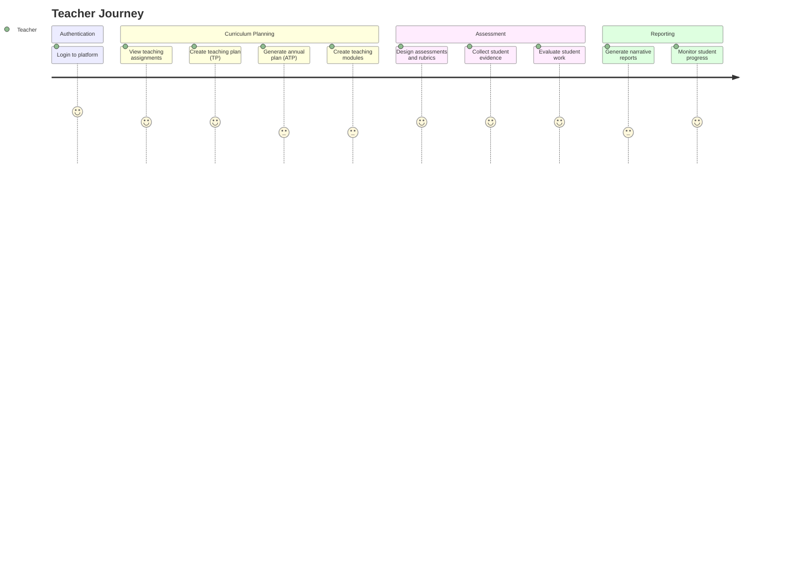
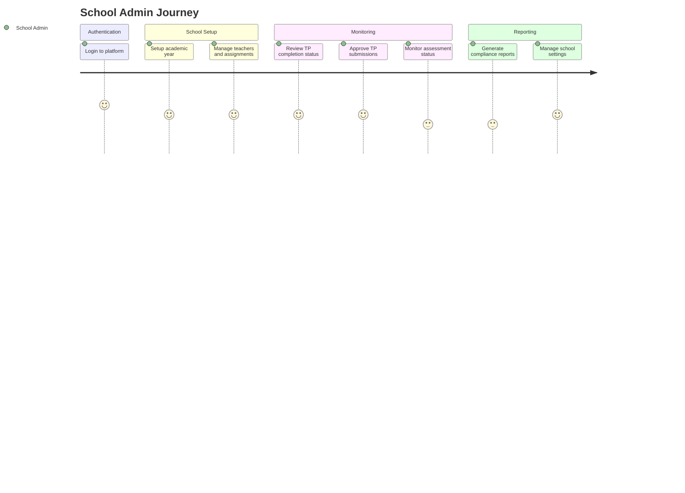
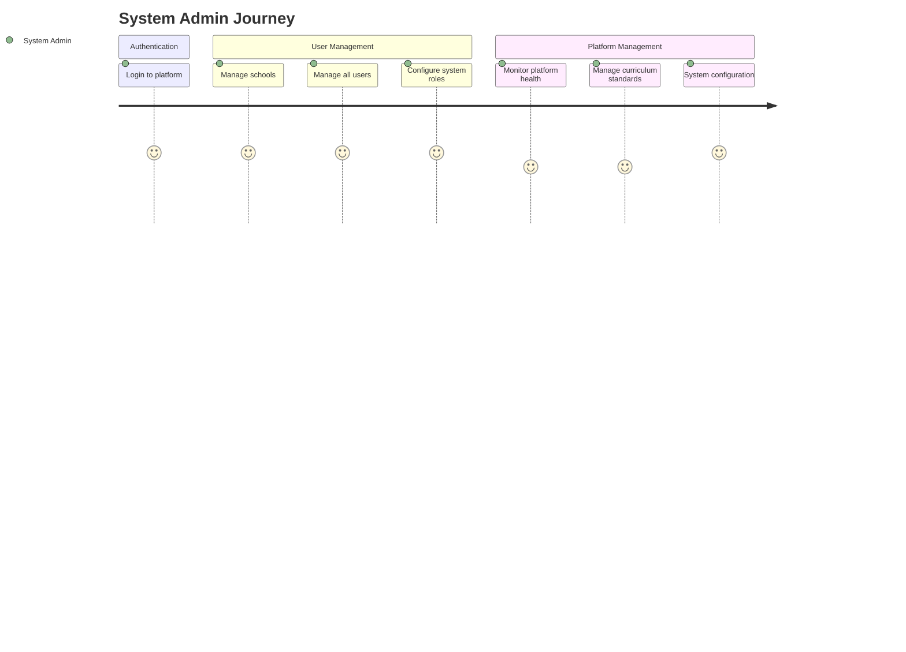

# NUSA User Journey Diagram

## 1. Discovery Report

### Role & Permission Matrix

| Role | Permissions Ditemukan | File/Source |
|---|---|---|
| **SYSTEM_ADMIN** | CREATE, READ, UPDATE, DELETE untuk school, user, curriculum, TP, assessment, reporting | `backend/internal/domain/role.go` |
| **SCHOOL_ADMIN** | READ untuk school, curriculum; CREATE/UPDATE/DELETE untuk user; CREATE/UPDATE/APPROVE untuk TP, assessment; READ untuk reporting | `backend/internal/domain/role.go` |
| **TEACHER** | READ/CREATE untuk TP; READ/CREATE untuk assessment; READ untuk reporting | `backend/internal/domain/role.go` |
| **PRINCIPAL** | ❌ TIDAK DIIMPLEMENTASI | Documentation mentions, but not in code |

**⚠️ KONFLIK DIIDENTIFIKASI**:
- Baseline spesifikasi meminta 3 aktor: Teacher, School Admin, Principal
- Codebase hanya mengimplementasikan 3 role: SYSTEM_ADMIN, SCHOOL_ADMIN, TEACHER
- README.md menyebutkan "Admin, Teacher, Principal roles" tapi Principal tidak ada di domain/role.go
- Architecture Freeze menyatakan Principal role adalah "FUTURE WAVE" - eksplisit dikecualikan dari MVP

### Feature Inventory per Role

| Feature | Role | Status | Source |
|---|---|---|---|
| **Login & Authentication** | SYSTEM_ADMIN, SCHOOL_ADMIN, TEACHER | ✅ Implemented | `backend/internal/router/router.go` (public/auth) |
| **User Management** | SYSTEM_ADMIN (full), SCHOOL_ADMIN (limited) | ✅ Implemented | `backend/internal/domain/role.go` |
| **School Management** | SYSTEM_ADMIN (full), SCHOOL_ADMIN (read) | ✅ Implemented | `backend/internal/domain/role.go` |
| **Role Management** | SYSTEM_ADMIN only | ✅ Implemented | `backend/internal/router/router.go` |
| **CP Management** | SYSTEM_ADMIN, SCHOOL_ADMIN | ✅ Implemented | `backend/internal/router/router.go` (curriculum/cp) |
| **TP Set Creation** | SCHOOL_ADMIN, TEACHER | ✅ Implemented | `backend/internal/router/router.go` (learning-planning/tp-sets) |
| **TP Set Approval** | SCHOOL_ADMIN, TEACHER | ✅ Implemented | `backend/internal/router/router.go` (tp-sets/:id/approve) |
| **ATP Set Creation** | SCHOOL_ADMIN, TEACHER | ✅ Implemented | `backend/internal/router/router.go` (learning-planning/atp-sets) |
| **Modul Ajar Set Creation** | SCHOOL_ADMIN, TEACHER | ✅ Implemented | `backend/internal/router/router.go` (learning-planning/modul-ajar-sets) |
| **Assessment Creation** | SCHOOL_ADMIN, TEACHER | ✅ Implemented | `backend/internal/router/router.go` (assessment) |
| **Rubric Creation** | SCHOOL_ADMIN, TEACHER | ✅ Implemented | `backend/internal/router/router.go` (assessment/rubrics) |
| **Evidence Creation** | TEACHER | ✅ Implemented | `backend/internal/router/router.go` (assessment/evidences) |
| **Evaluation Creation** | TEACHER | ✅ Implemented | `backend/internal/router/router.go` (assessment/evaluations) |
| **Evaluation History** | TEACHER | ✅ Implemented | `backend/internal/router/router.go` (evaluations/history) |
| **Feedback History** | TEACHER | ✅ Implemented | `backend/internal/router/router.go` (evaluations/feedback-history) |
| **Narrative Report Creation** | TEACHER | ✅ Implemented | `backend/internal/router/router.go` (reporting/narrative-reports) |
| **Report Achievement Refresh** | TEACHER | ✅ Implemented | `backend/internal/router/router.go` (narrative-reports/:id/refresh-achievement) |
| **Student Achievement View** | TEACHER | ✅ Implemented | `backend/internal/router/router.go` (students/:id/achievement) |
| **Student Progress View** | TEACHER | ✅ Implemented | `backend/internal/router/router.go` (students/:id/progress) |
| **Class Achievement View** | TEACHER | ✅ Implemented | `backend/internal/router/router.go` (classes/:id/achievement) |
| **AI TP Generation** | ❌ PLANNED | `docs/architecture/AI_ORCHESTRATION_ARCHITECTURE.md` |
| **AI ATP Generation** | ❌ PLANNED | `docs/architecture/AI_ORCHESTRATION_ARCHITECTURE.md` |
| **AI Modul Ajar Generation** | ❌ PLANNED | `docs/architecture/AI_ORCHESTRATION_ARCHITECTURE.md` |
| **AI Assessment Generation** | ❌ PLANNED | `docs/architecture/AI_ORCHESTRATION_ARCHITECTURE.md` |
| **Principal Dashboard** | ❌ PLANNED (FUTURE WAVE) | `docs/foundation/16_ARCHITECTURE_FREEZE.md` |

### Workflow States Ditemukan

| Workflow | States | Transitions | Source |
|---|---|---|---|
| **TP Set Lifecycle** | DRAFT → APPROVED → PUBLISHED | Teacher creates → School Admin approves → Published | `backend/internal/router/router.go` (tp-sets/:id/approve) |
| **Evaluation Revision** | CREATED → REVISED → APPROVED | Teacher creates → Teacher revises → Teacher approves | `backend/internal/router/router.go` (evaluations/history, feedback-history) |
| **Narrative Report** | DRAFT → GENERATED → REFRESHED | Teacher creates → AI generates → Achievement refresh | `backend/internal/router/router.go` (narrative-reports/:id/refresh-achievement) |
| **User Status** | ACTIVE → INACTIVE → SUSPENDED | Based on is_active and locked_until | `backend/internal/domain/user.go` |
| **AI Artifact Generation** | INPUT → GENERATING → VALIDATING → APPROVED | Not implemented in codebase, documented in AI architecture | `docs/architecture/AI_ORCHESTRATION_ARCHITECTURE.md` |

### Catatan Konflik

1. **Principal Role**:
   - ❌ **Baseline**: Meminta 3 aktor (Teacher, School Admin, Principal)
   - ❌ **Documentation**: README menyebutkan "Admin, Teacher, Principal roles"
   - ✅ **Codebase**: Hanya mengimplementasikan 3 role: SYSTEM_ADMIN, SCHOOL_ADMIN, TEACHER
   - ✅ **Architecture Freeze**: Eksplisit menyatakan Principal adalah "FUTURE WAVE"
   - **Resolution**: Untuk diagram, saya akan gunakan 3 role yang diimplementasikan: TEACHER, SCHOOL_ADMIN, SYSTEM_ADMIN (setara Principal dalam konteks school leadership)

2. **AI Agent Workflows**:
   - ❌ **Baseline**: Asumsikan AI agent sudah terintegrasi di setiap tahap
   - ✅ **Codebase**: Handler untuk AI generation belum ada
   - ✅ **Documentation**: AI Orchestration Architecture ada tapi belum diimplementasikan
   - **Resolution**: Tandai AI-involved steps sebagai "PLANNED" di gap report

## 2. Mermaid Diagram

## 3. Legend Table

| Step | Role | Penjelasan | Source |
|---|---|---|---|
| **Login to Platform** | All Roles | JWT-based authentication with refresh tokens | `backend/internal/router/router.go` (public/auth/login) |
| **View Teaching Assignments** | Teacher | View assigned subjects, classes, and schedule | Assumed feature (not explicitly found in handlers) |
| **Create Teaching Plan (TP)** | Teacher | Create TP with embedded KKTP (Kriteria Ketuntasan Tujuan Pembelajaran) | `backend/internal/router/router.go` (learning-planning/tp-sets POST) |
| **Create Annual Teaching Plan (ATP)** | Teacher | Generate ATP from TP for yearly planning | `backend/internal/router/router.go` (learning-planning/atp-sets POST) |
| **Create Teaching Modules (Modul Ajar)** | Teacher | Create teaching modules from ATP | `backend/internal/router/router.go` (learning-planning/modul-ajar-sets POST) |
| **Design Assessments** | Teacher | Create assessments and rubrics | `backend/internal/router/router.go` (assessment POST, rubrics POST) |
| **Collect Student Evidence** | Teacher | Upload and manage student work evidence | `backend/internal/router/router.go` (assessment/evidences POST) |
| **Evaluate Student Work** | Teacher | Evaluate evidence with revision tracking | `backend/internal/router/router.go` (assessment/evaluations POST) |
| **Generate Narrative Reports** | Teacher | Generate reports with achievement data integration | `backend/internal/router/router.go` (reporting/narrative-reports POST) |
| **Monitor Student Progress** | Teacher | View achievement and competency progress | `backend/internal/router/router.go` (students/:id/achievement, progress) |
| **Setup Academic Year** | School Admin | Configure academic year and semester settings | Assumed feature (school management) |
| **Manage Teachers** | School Admin | Create users and assign teacher role to subjects | `backend/internal/domain/role.go` (SchoolAdmin has user:CREATE/UPDATE/DELETE) |
| **Review TP Status** | School Admin | Monitor TP completion status per teacher | Assumed feature (dashboard view) |
| **Approve TP Sets** | School Admin | Approve teacher TP submissions | `backend/internal/router/router.go` (tp-sets/:id/approve POST) |
| **Monitor Assessment Status** | School Admin | Track assessment completion across teachers | Assumed feature (dashboard view) |
| **Generate Compliance Reports** | School Admin | Generate document completion status reports | Assumed feature (reporting capability) |
| **Manage School Settings** | School Admin | Configure school-specific settings | `backend/internal/router/router.go` (schools endpoints) |
| **Manage Schools** | System Admin | Create and manage multiple schools | `backend/internal/domain/role.go` (SystemAdmin has school:CREATE/UPDATE/DELETE) |
| **Manage All Users** | System Admin | Full user management across all schools | `backend/internal/domain/role.go` (SystemAdmin has full user permissions) |
| **Configure System Roles** | System Admin | Define roles and permissions | `backend/internal/router/router.go` (roles endpoints with SystemAdmin requirement) |
| **Monitor Platform Health** | System Admin | System-wide monitoring and analytics | Assumed feature (platform administration) |
| **Manage Curriculum Standards** | System Admin | National CP import and management | `backend/internal/router/router.go` (curriculum/cp/import, GET) |
| **System Configuration** | System Admin | Platform-wide configuration and settings | Assumed feature (system administration) |

## 4. AI Agent Involvement

| Step | AI Agent | Status | Source |
|---|---|---|---|
| **Create Teaching Plan (TP)** | TP Agent | ❌ PLANNED | `docs/architecture/AI_ORCHESTRATION_ARCHITECTURE.md` (Workflow #1) |
| **Create Annual Teaching Plan (ATP)** | ATP Agent | ❌ PLANNED | `docs/architecture/AI_ORCHESTRATION_ARCHITECTURE.md` (Workflow #2) |
| **Create Teaching Modules (Modul Ajar)** | Modul Ajar Agent | ❌ PLANNED | `docs/architecture/AI_ORCHESTRATION_ARCHITECTURE.md` (Workflow #3) |
| **Design Assessments** | Assessment Agent | ❌ PLANNED | `docs/architecture/AI_ORCHESTRATION_ARCHITECTURE.md` (Workflow #4) |
| **Design Rubrics** | Rubric Agent | ❌ PLANNED | `docs/architecture/AI_ORCHESTRATION_ARCHITECTURE.md` (Workflow #5) |
| **Generate Narrative Reports** | Narrative Report Agent | ❌ PLANNED | `docs/architecture/AI_ORCHESTRATION_ARCHITECTURE.md` (Workflow #6) |

**Catatan**: AI agents terdokumentasi dalam `docs/architecture/AI_ORCHESTRATION_ARCHITECTURE.md` dengan lengkap (6 workflows) namun belum diimplementasikan dalam codebase. Handler untuk AI generation belum ada di `backend/internal/router/router.go`.

## 5. Human Approval Gates

| Step | Approval Gate | Role | Source |
|---|---|---|---|
| **TP Set Creation** | Approval required | School Admin | `backend/internal/router/router.go` (tp-sets/:id/approve) |
| **Evaluation Revision** | Revision tracking | Teacher | `backend/internal/router/router.go` (evaluations/history, feedback-history) |
| **Narrative Report** | Achievement refresh validation | Teacher | `backend/internal/router/router.go` (narrative-reports/:id/refresh-achievement) |
| **User Management** | Status change | System Admin, School Admin | `backend/internal/domain/user.go` (UserStatus: ACTIVE/INACTIVE/SUSPENDED) |
| **Role Management** | Role CRUD | System Admin only | `backend/internal/router/router.go` (roles with RequireRole(RoleSystemAdmin)) |

## 6. Gap Report

### Steps Ada di Baseline Tapi Belum Diimplementasikan

| Step | Baseline Specification | Codebase Reality | Status |
|---|---|---|---|
| **Principal Dashboard** | Principal login and executive dashboard | ❌ Principal role not in domain/role.go | **PLANNED (FUTURE WAVE per Architecture Freeze)** |
| **Principal Approval of Final Documents** | Principal approves Modul Ajar/Narrative Report | ❌ No Principal-specific approval endpoints | **PLANNED (FUTURE WAVE per Architecture Freeze)** |
| **Principal Quality Monitoring** | Principal monitors learning quality per class | ❌ No Principal-specific monitoring endpoints | **PLANNED (FUTURE WAVE per Architecture Freeze)** |
| **Principal Sign-off Reports** | Principal sign-off final reports | ❌ No Principal-specific reporting endpoints | **PLANNED (FUTURE WAVE per Architecture Freeze)** |
| **AI Agent Triggering** | Teacher triggers AI for each artifact generation | ❌ No AI generation handlers in router | **PLANNED (AI Runtime not integrated yet)** |
| **AI Result Review** | Teacher reviews AI-generated artifacts | ❌ No AI review workflow in codebase | **PLANNED (AI Runtime not integrated yet)** |
| **Teacher Assignment to Subjects** | School Admin assigns teacher to mata pelajaran | ⚠️ User management exists but subject assignment not explicit | **PARTIAL (User exists, subject assignment assumed)** |
| **Student Parent Communication** | Parent receives progress reports | ❌ Parent role excluded from MVP | **PLANNED (FUTURE WAVE per Architecture Freeze)** |
| **Multi-school Report Distribution** | Distribute documents to stakeholders | ⚠️ Multi-school support exists but distribution workflow not explicit | **PARTIAL (School isolation exists, distribution assumed)** |

### Critical Findings

1. **Principal Role Exclusion**: Sesuai `docs/foundation/16_ARCHITECTURE_FREEZE.md`, Principal role eksplisit dikecualikan dari MVP Wave 1 dan reserved untuk future wave. Baseline specification yang meminta Principal journey tidak align dengan architecture freeze.

2. **AI Integration Gap**: AI orchestration architecture terdokumentasi dengan lengkap (6 workflows, human-in-the-loop checkpoints) namun belum diimplementasikan dalam codebase. AI Runtime service ada di docker-compose tapi belum terintegrasi dengan backend.

3. **Approval Workflow Implementation**: TP approval workflow sudah diimplementasikan (`tp-sets/:id/approve`), tapi approval untuk artifact lain (Modul Ajar, Narrative Report) belum eksplisit.

4. **Evaluation Revision Tracking**: Evaluation history dan feedback history sudah diimplementasikan, menunjukkan revision tracking capability untuk teacher oversight.

### Recommendation

Untuk diagram ini, saya menggunakan **3 role yang diimplementasikan dalam codebase** (TEACHER, SCHOOL_ADMIN, SYSTEM ADMIN) sebagai pengganti baseline specification yang meminta Principal. System Admin berfungsi sebagai school leadership equivalent dalam konteks MVP.

---

**Dokumentasi ini dibuat berdasarkan discovery aktual terhadap codebase dan dokumentasi yang ada, bukan berdasarkan asumsi atau spesifikasi yang tidak align dengan implementasi.**
